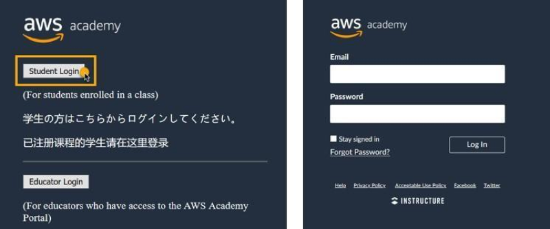
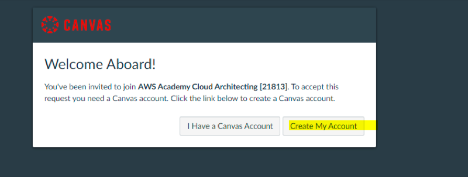
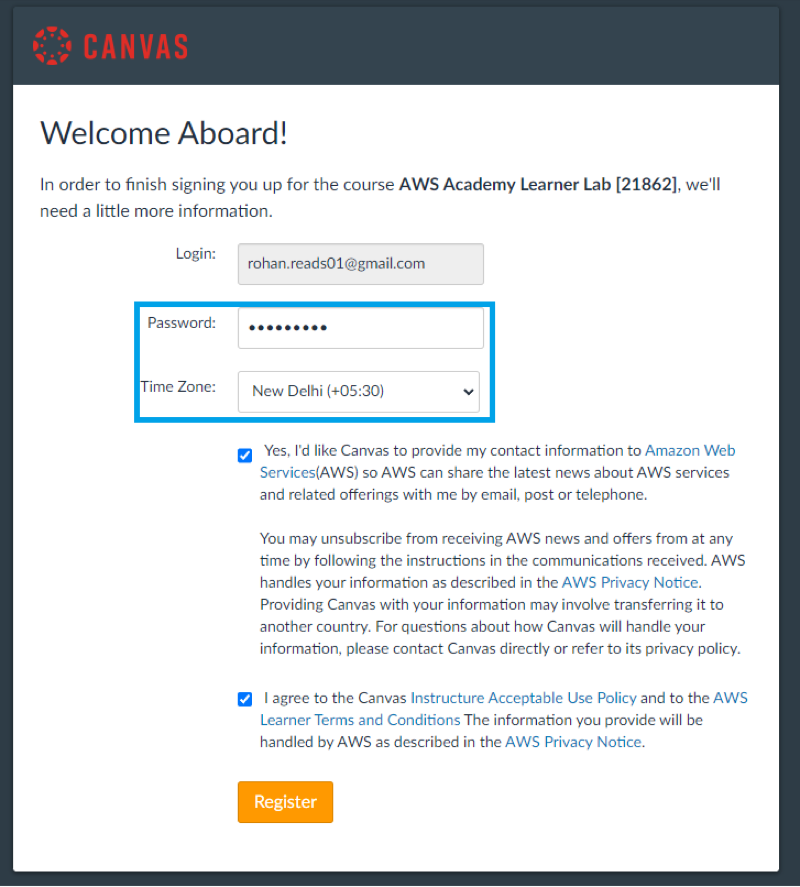
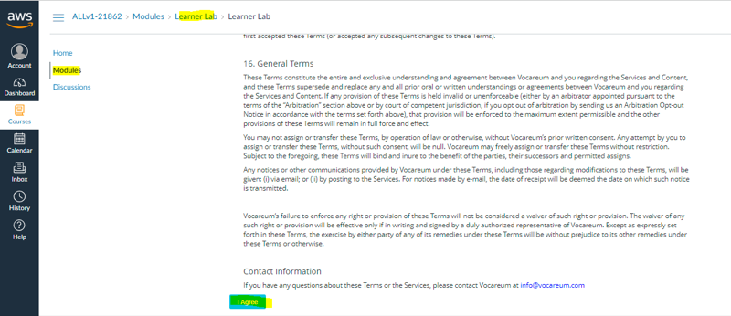
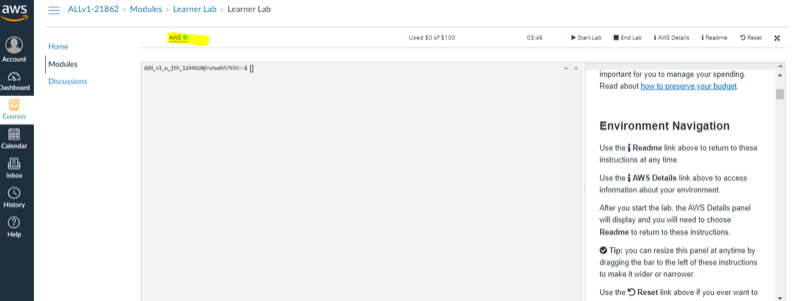
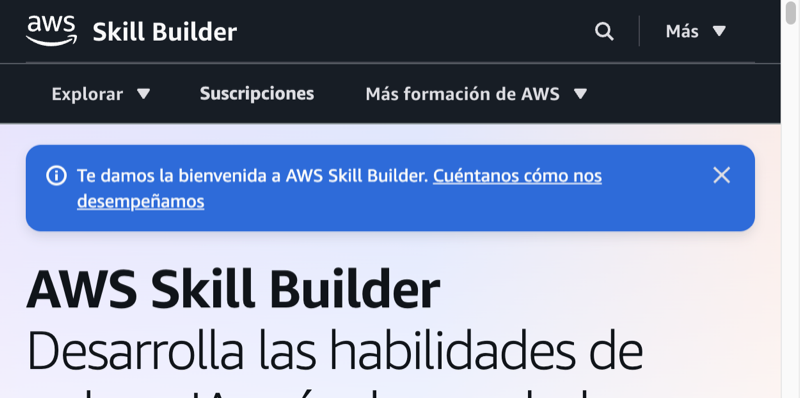
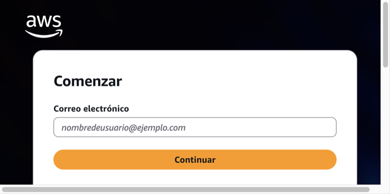

# Acceso

Aquí solo el **cómo entrar** a las plataformas del módulo. Cuando hayas entrado, sigue con [Fundamentos de la nube AWS](../01-fundamentos-nube-aws/tema1.md): allí está el mapa y las definiciones.

!!! tip "Antes del Tema 1"
    Completa primero el acceso a **Academy**, el **Learner Lab** y, si el curso lo usa, **Skill Builder**. Sin consola del lab, el Tema 1 se queda en lectura; con Acceso listo, la primera quincena ya puede practicar.

Ten a mano tu **correo institucional** (el mismo en todos los pasos). Lee esto **antes** del Tema 1.

## Tres sitios (no los mezcles)

| Sitio | URL | Para qué |
| --- | --- | --- |
| **AWS Academy** (LMS Canvas) | [awsacademy.instructure.com](https://awsacademy.instructure.com) | Curso *Cloud Foundations*: módulos, vídeos, knowledge checks y acceso al lab |
| **Learner Lab** / consola de prácticas | Enlace **desde el curso** Academy | Cuenta de práctica con **créditos limitados** (no es tu cuenta personal de AWS) |
| **AWS Skill Builder** | [skillbuilder.aws](https://skillbuilder.aws) | Formación digital y preparación a la certificación (cuenta **Builder ID**) |

!!! warning "No confundir con AWS Educate"
    Este módulo usa **AWS Academy** (instituto / educator). **AWS Educate** es otro programa. Si te registras en Educate «por tu cuenta», no estarás en la clase del instituto.

## 1. Acceso al LMS Academy (invitación y login)

1. El profesor te **invita por email** (correo institucional).
2. Abre el mensaje y **acepta** la invitación (enlace del correo).
3. En el portal Academy elige **Student Login** (alumnado; no *Educator Login*).
4. Entra con tu cuenta Canvas Academy o créala **con ese mismo correo**. No inventes un Gmail distinto.
5. Completa el registro (contraseña, zona horaria, términos) y comprueba que ves el curso del módulo en [awsacademy.instructure.com](https://awsacademy.instructure.com).

Si no llega el correo: revisa spam / quarantena del centro y avisa en tutoría o Aules para que se **reenvíe** la invitación.

<figure markdown="span">
{ width="800" }
<figcaption>Pantalla de entrada al LMS: Student Login (guía oficial AWS Academy Learner Lab — Student Guide).</figcaption>
</figure>

<figure markdown="span">
{ width="800" }
<figcaption>Login de Canvas Academy: email y contraseña (misma guía Student Guide).</figcaption>
</figure>

<figure markdown="span">
{ width="800" }
<figcaption>Alta tras la invitación: contraseña, zona horaria y aceptación de términos (Student Guide; el email de ejemplo es de la guía, tú usas el institucional).</figcaption>
</figure>

## 2. Entrar al Learner Lab desde el curso

En el LMS de Academy (Canvas), dentro de tu curso Foundations:

1. Abre **Modules** (o la sección equivalente del curso).
2. Sigue el orden del módulo que indique el profesor (lectura / vídeo / *knowledge check*).
3. Cuando el tema lo pida, entra en **Learner Lab** (laboratorio de prácticas). El acceso a la consola sale **desde aquí**, no desde skillbuilder.aws.
4. Pulsa **Start Lab** y espera unos minutos a que el entorno arranque.
5. Cuando el círculo junto a **AWS** pase a **verde**, pulsa el enlace **AWS** para abrir la consola de gestión en otra pestaña.
6. Respeta las **normas del lab**: créditos limitados, región del enunciado, **terminar** recursos al acabar (**End Lab** cuando cierres la sesión de práctica).

Los apuntes de este sitio van **junto** a Academy: no reemplazan los módulos ni los labs del LMS.

<figure markdown="span">
{ width="800" }
<figcaption>Pantalla del lab antes de arrancar: Start Lab (guía oficial AWS Academy Learner Lab — Student Guide).</figcaption>
</figure>

<figure markdown="span">
{ width="800" }
<figcaption>Lab listo: círculo verde junto a AWS → abre la consola (misma Student Guide).</figcaption>
</figure>

## 3. Builder ID y Skill Builder (desde Academy)

Skill Builder es **otra** plataforma. Sirve para cursos digitales y para prepararte hacia **Cloud Practitioner**. La activación de la oferta del alumnado pasa, de forma típica, **por el curso de Academy**:

1. Entra en el curso Foundations en Academy.
2. Abre el módulo o página de **recursos / términos y condiciones** (el nombre exacto puede variar; busca el enlace de activación de Skill Builder).
3. Acepta la oferta con el **mismo email** institucional. Ese correo será tu **AWS Builder ID**.
4. Espera la provisión: puede tardar **días laborables** (orientativo **3–14 días**). **No** son meses de espera.
5. Cuando esté activa, entra en [skillbuilder.aws](https://skillbuilder.aws) e inicia sesión con ese Builder ID (o créalo en el flujo de alta si aún no lo tienes).

!!! note "Caducidad de la oferta"
    El beneficio suele durar **unos 12 meses desde la activación** (luego caduca). Esos 12 meses **no** son «tiempo de espera»: son la **vigencia** una vez activado. Si el curso usará Skill Builder, conviene activarlo en las **primeras quincenas**.

<figure markdown="span">
{ width="800" }
<figcaption>Portal Skill Builder tras la activación (skillbuilder.aws).</figcaption>
</figure>

<figure markdown="span">
{ width="800" }
<figcaption>Alta / acceso con AWS Builder ID: correo institucional y Continuar (flujo oficial profile / Sign-In de AWS).</figcaption>
</figure>

## 4. Problemas frecuentes

| Síntoma | Qué revisar |
| --- | --- |
| No llega la invitación | Spam / filtros del centro; pedir **reenvío**; confirmar el email exacto |
| «No veo el curso» | Estás con **otro correo**; cierra sesión y entra con el institucional |
| Te has registrado en **Educate** | No es Academy. Usa el enlace de la invitación del profesor |
| Lab en rojo / sin créditos | Créditos agotados, clase finalizada o lab no iniciado desde el curso; avisa en tutoría |
| Skill Builder no abre tras confirmar | Puede estar en provisión (**días**, no meses); mismo email Academy ↔ Builder ID |
| Confundes Skill Builder y la consola del lab | Lab = desde Academy; Skill Builder = [skillbuilder.aws](https://skillbuilder.aws) |

## 5. Soporte oficial

- Acceso LMS Academy: [awsacademy.instructure.com](https://awsacademy.instructure.com) (ayuda / soporte desde la propia plataforma cuando esté disponible).
- Información general del programa: [AWS Academy](https://aws.amazon.com/training/awsacademy/) · [FAQ Academy](https://aws.amazon.com/training/awsacademy/faq/).
- Skill Builder: [skillbuilder.aws](https://skillbuilder.aws). Builder ID: [Sign in with AWS Builder ID](https://docs.aws.amazon.com/signin/latest/userguide/sign-in-builder-id.html).
- Si el bloqueo es de **clase del instituto** (invitación, lab de la class): escribe en **Aules** o coméntalo en la **tutoría quincenal** antes de abrir tickets genéricos.

Cuando tengas Academy y (si aplica) Skill Builder en marcha, pasa al [Tema 1 — Fundamentos de la nube AWS](../01-fundamentos-nube-aws/tema1.md): ahí empieza la teoría del módulo. La preparación del examen **Cloud Practitioner** no vive en esta página; está en [Certificación](../99-certificacion/certificacion.md).
