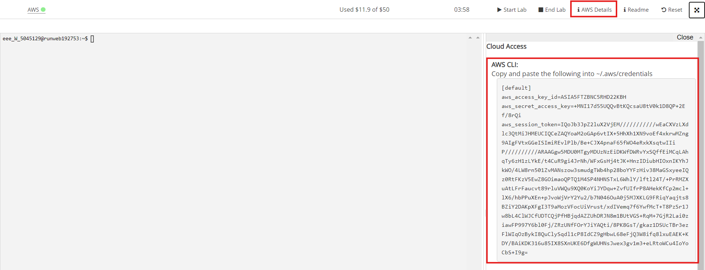
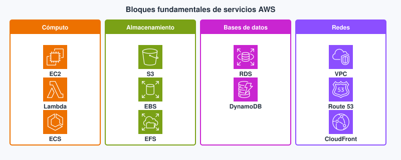
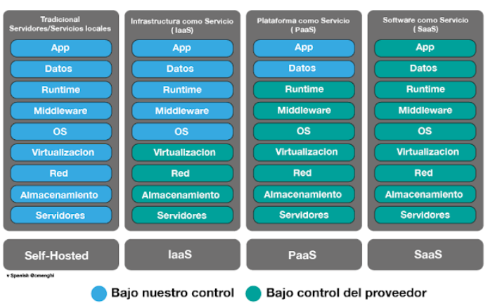
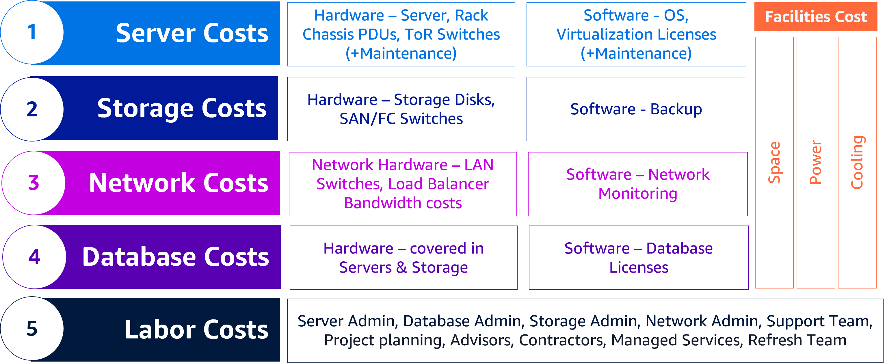
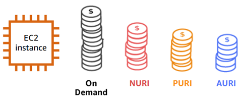
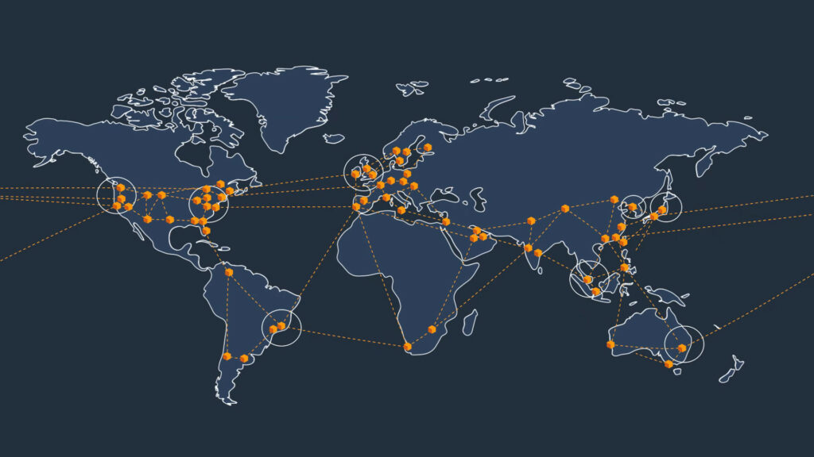
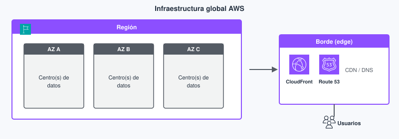

# Tema 1. Fundamentos de la nube AWS

En este tema construimos el mapa que el resto del módulo da por sentado: qué es la **nube pública**, por qué una aplicación web deja el CPD propio, cómo se **paga**, y **dónde** viven realmente los recursos ([región](#region), [zona de disponibilidad](#zona-de-disponibilidad), consola).

El núcleo es **AWS Academy Cloud Foundations**: *Introducción al curso* y módulos **1–3**. La ampliación apunta al vocabulario del **CLF-C02**, sin convertir el tema en un plan de migración de empresa.

!!! tip "Primera clase"
    Empieza por el [cuestionario inicial](#cuestionario-inicial). No hace falta haber leído el tema entero: sirve para ver qué traes (VPS vs nube, IaaS/PaaS, región y factura) antes de Foundations.

!!! tip "Cómo leerlo"
    No hace falta memorizar el catálogo de servicios. Sí hace falta poder **explicar** un caso (tienda online, API de un TFG, front estático) eligiendo modelo, región y una estimación de coste razonable. Los términos marcados enlazan al [glosario](#glosario) al final del tema.

En semipresencial la tutoría (~1 h) no «explica el tema entero»: presenta el mapa, señala los labs y resuelve dudas del bloque anterior. El grueso es lectura + práctica autónomas. Si solo lees las tablas, el autocheck se cae; si solo lees los párrafos y saltas las prácticas de consola, el RA2 c) también.

## Propuesta didáctica

Trabajamos el **RA1** y el arranque del **RA2** del módulo *Introducción a la Nube Pública*:

> **RA1.** *Comprende los fundamentos de la computación en la nube, sus ventajas frente a sistemas tradicionales, el marco de adopción, los principios de migración y los aspectos clave de facturación, como estimación y optimización de costos.*

> **RA2.** *Identifica los componentes clave de la infraestructura global de la nube, diferenciando servicios principales, regiones, zonas de disponibilidad y aplicando medidas básicas de seguridad como el modelo de responsabilidad compartida, gestión de accesos y protección de datos.*

### Criterios de evaluación

**RA1**

* **a)** Se ha comprendido los conceptos fundamentales de la computación en la nube.
* **b)** Se ha demostrado la capacidad para explicar las ventajas de la nube frente a sistemas tradicionales.
* **c)** Se ha participado en actividades relacionadas con el ecosistema de servicios en la nube.
* **d)** Se han identificado los principios básicos de la facturación y costos en la nube.
* **e)** Se ha hecho uso correcto de herramientas para estimar y gestionar presupuestos.
* **f)** Se ha participado en actividades prácticas sobre gestión de costos.

**RA2** (en este tema: infraestructura y categorías de servicio; IAM queda en el Tema 2)

* **a)** Se ha adquirido conocimiento de los componentes de una infraestructura global en la nube.
* **b)** Se ha demostrado la capacidad para explorar y describir las principales categorías de servicios disponibles.
* **c)** Se ha realizado una evaluación del uso adecuado de servicios básicos en ejercicios prácticos.

### Contenidos

* Computación en la nube frente a [*on-premises*](#on-premises); acceso por consola, CLI y API.
* Modelos de servicio ([IaaS](#iaas), [PaaS](#paas), [SaaS](#saas)) y de despliegue (pública, privada, híbrida, multicloud).
* Ventajas, límites y trade-offs (agilidad, coste variable, dependencia del proveedor).
* Adopción y migración: marco CAF y estrategias (7 R) a nivel de reconocimiento.
* Economía: [CAPEX](#capex) / [OPEX](#opex), [TCO](#tco), dimensiones de precio, calculadora y presupuestos.
* Infraestructura global: regiones, zonas de disponibilidad, *edge*; navegación por la consola.

### Programación de aula (orientativa, quincenas)

En INP la sesión de centro es **tutoría quincenal** (~1 h); el grueso es autónomo. El Tema 1 ocupa **dos** quincenas.

| Quincena | En tutoría | Trabajo autónomo / evidencias |
| --- | --- | --- |
| **Q1** | Acceso + mapa del tema + cuestionario | Lectura conceptos/modelos; **PR101**, **PR102** |
| **Q2** | Dudas Q1; facturación e infra global | **PR103**, **PR104**; Autocheck del tema |

---

## Cuestionario inicial

!!! question "Antes de Foundations — responde con lo que sepas"
    1. ¿En qué se parece y en qué no un **VPS** barato a la **nube pública** que estudia este módulo?
    2. Si despliegas una API Node y un MySQL, ¿quién parchea el SO en **IaaS** frente a un motor **PaaS**/gestionable?
    3. ¿Por qué importa la **región** además de «que la consola abra»?
    4. Nombra dos partidas de coste distintas del precio «de la VM» (pista: salida de datos, personal, facilities…).
    5. ¿Qué pasa con la factura si dejas una instancia de lab encendida el fin de semana?

Este cuestionario es solo para ti: te ayuda a ver qué dominas ya y qué te falta antes o mientras lees el tema. No se entrega en Aules; respóndelo con lo que sepas y, cuando quieras contrastar, abre el bloque **Soluciones (autoevaluación)** debajo o el índice en [Soluciones](../90-soluciones/soluciones.md).

Soluciones (autoevaluación)

1. Se parecen en que alquilas capacidad por red; se diferencian en que la **nube pública** ofrece más servicios gestionados, regiones/AZ y facturación por uso medido, no solo «una VM remota».

2. En **IaaS** (EC2) **tú** parcheas el SO; en un motor **PaaS**/gestionable (p. ej. RDS) el proveedor parchea el motor y tú sigues con datos, usuarios y configuración.

3. La **región** fija latencia, soberanía de datos y qué servicios/precios aplican; no basta con que la consola abra.

4. Ejemplos: **egress** (salida de datos), personal/operación, almacenamiento, balanceadores, facilities on-prem si comparas TCO…

5. Sigue **facturando** el tiempo encendido (y lo asociado); Free Tier no es «gratis ilimitado».

---

## Bloque Foundations (Introducción al curso y M1–M3)

### Qué es «nube» cuando desarrollas web

**Computación en la nube** es pedir capacidad de TI (CPU, disco, red, bases de datos, identidad…) a un proveedor, **por red**, **bajo demanda** y **medida**. No montas el CPD: no compras el rack, ni el SAI, ni negocias el caudal del centro de datos.

[*On-premises*](#on-premises) significa que el hardware y gran parte de la operación viven **en instalaciones de la organización** (aula, CPD propio o un hosting «caja en un rack»). Dimensionas para el **pico** (Black Friday, entrega del TFG, campaña). El resto del año esa capacidad duerme y **sigue costando**: electricidad, amortización, parches. En nube pública el coste se acerca al **uso real**, a cambio de aprender a apagar, etiquetar y no dejar un lab encendido.

!!! success "Ventajas (nube pública, a ojo de Foundations)"
    - **Escalabilidad:** más o menos CPU, disco o balanceadores sin comprar rack.
    - **Agilidad:** levantar un laboratorio o una API de prueba en minutos.
    - **Coste variable:** pagas por uso (ojo: también te castiga el olvido).
    - **Menos mantenimiento de CPD:** temperatura, SAI y cableado los asume el proveedor.

!!! warning "Desventajas / trade-offs"
    - Una mala arquitectura o un lab sin apagar **dispara la factura**.
    - Hace falta gente que conozca la plataforma (no es «gratis de operación»).
    - Datos en máquinas que no son tuyas: región, normativa y cifrado importan.

La frontera no siempre es nítida: un «VPS barato» de un hosting clásico puede parecer nube (lo pides por panel) pero sin elasticidad real ni API de inventario. Este módulo se centra en el modelo **AWS**: API, regiones, factura medible y catálogo de servicios. Si tu referencia mental es solo el panel de un hosting compartido, conviene recalibrar antes del Tema 3.

Una API Node/Java en el aula vive en un PC. En AWS esa misma API puede ser:

- una **máquina virtual** (tú parcheas el SO),
- un **contenedor**,
- una **función** que se ejecuta al llegar un HTTP.

Las tres son «nube». No son el mismo trabajo para ti: cambia quién parchea el sistema operativo y cómo pagas (hora de VM frente a invocación).

**Mini-caso.** Un TFG con API Express y front React: en el aula todo corre en un portátil. En AWS el front puede ir a objetos estáticos (S3 + CDN), la API a una VM o a funciones, y la base a un servicio gestionado. El «mismo» proyecto tiene tres facturas y tres límites de operación distintos; el error es tratarlos como un solo «servidor en la nube».

### El ecosistema AWS (mapa corto)

Antes de abrir la consola conviene situar **cuatro piezas** que se repiten en todo el módulo. No son servicios concretos (EC2, S3…): son el marco donde esos servicios viven. Un desarrollador web elige *en qué cuenta*, *en qué región* y *con qué herramienta* (clic, CLI o SDK) crea un recurso; si mezclas esas piezas, el lab «funciona» pero la factura o la latencia no.

| Pieza | Qué es | Por qué te importa en DAW |
| --- | --- | --- |
| **Cuenta** | Contenedor de factura e identidades | Cada lab tiene dueño y coste |
| **[Región](#region)** | Área geográfica con varios centros de datos | Latencia y residencia del dato |
| **Servicio** | Producto (EC2, S3, IAM…) | Eliges uno por caso de uso, no «AWS en abstracto» |
| **Consola / CLI / SDK** | Tres formas de hablar con la API | La consola enseña; el SDK es lo que usará tu código |

En un despliegue real el orden importa: primero la **cuenta** y la **región** del lab Academy; después el **servicio**; al final automatizas con CLI/SDK. Crear un bucket «porque el tutorial lo hace en `us-east-1`» mientras el resto del grupo trabaja en Europa es un clásico que mezcla latencia, precio y, a veces, residencia del dato.

<figure markdown="span">
{ width="640" }
<figcaption>CLI: misma API que la consola, en terminal.</figcaption>
</figure>

Categorías que irás viendo: cómputo, almacenamiento, bases de datos, red, seguridad, gestión, facturación. No memorices 200 nombres; sitúa **en qué cajón** está cada uno.

<figure markdown="span">
{ width="800" }
<figcaption>Mapa de cajones: servicios representativos con iconos oficiales AWS (no es el catálogo completo).</figcaption>
</figure>

### Características (cuando sí es nube)

- **Bajo demanda:** no abres un ticket de compras para un servidor de prueba.
- **Acceso por red:** HTTPS, API, no «estar en el CPD».
- **Recursos agrupados:** el hardware es del proveedor (*[multitenancy](#multitenancy)*).
- **[Elasticidad](#elasticidad):** minutos, no plazos de pedido.
- **Servicio medido:** hay métrica; lo apagado no debería facturarse igual.

Si tu «servidor» solo se puede pedir con un ticket de tres semanas y no hay factura por hora, **no** estás usando el modelo de nube pública que estudia este módulo: estás en un CPD clásico con otra etiqueta. La elasticidad sin medición es marketing.

### Modelos de servicio: ¿hasta dónde operas tú?

Los modelos **[IaaS](#iaas)**, **[PaaS](#paas)** y **[SaaS](#saas)** no clasifican «lo moderno» frente a «lo antiguo». Clasifican **hasta dónde llega lo que gestionas tú** en la pila: sistema operativo, runtime, aplicación. Para una API web la diferencia práctica es: ¿parcheas Node/Java y nginx, o solo despliegas código, o ni siquiera hosteas la app? El eje es **quién parchea qué** —y, con ello, cuánto control y cuánta operación asumes.

En un equipo DAW esto se nota el día del incidente: en IaaS alguien entra por SSH y mira logs del SO; en PaaS miras logs de plataforma y redeploy; en SaaS abres un ticket al proveedor del correo/CRM. Ninguno es «incorrecto»: cambia el contrato operativo.

| Modelo | Tú gestionas | El proveedor gestiona | Ejemplo web |
| --- | --- | --- | --- |
| **IaaS** | SO, runtime, despliegue, datos | Hardware, hipervisor | EC2 con tu WAR/JAR |
| **PaaS** | Código y datos | SO y plataforma | Entorno de despliegue gestionado |
| **SaaS** | Uso y configuración | Toda la pila | Correo o un CRM en el navegador |

<figure markdown="span">
{ width="720" }
<figcaption>Quién gestiona cada capa de la pila: de todo en casa (tradicional) hasta casi todo el proveedor (SaaS).</figcaption>
</figure>

Subir de IaaS a SaaS **reduce operación** y **reduce control**. Un front estático en almacenamiento de objetos (S3) no es IaaS: no hay SO que parchear. Una API con estado y cron pesado **tampoco** es candidata automática a una función de 15 minutos.

**Antes / después (proyecto DAW).** Antes: un VPS alquilado donde instalas nginx, Node, MySQL y renovas certificados a mano (cerca de IaaS). Después: front en hosting estático/SaaS de objetos, API en un entorno PaaS o en funciones, base en RDS. Ganas tiempo de desarrollo; pierdes el «SSH y arreglo todo» —y eso es una decisión consciente, no un fallo.

### Errores frecuentes (modelos)

- Llamar «PaaS» a cualquier cosa «en la nube» (EC2 con Docker sigue siendo IaaS a efectos de parches).
- Confundir SaaS (usas Gmail) con desplegar *tu* API en AWS.
- Elegir el modelo por moda («todo serverless») sin mirar estado, tiempo de ejecución y dependencias.

### Modelos de despliegue

Además del «qué gestionas» (IaaS/PaaS/SaaS) está el «**dónde** vive la capacidad»: ¿en un proveedor de internet, en una fábrica solo tuya, o en una mezcla? Confundir **híbrida** con **multicloud** es un error típico de examen y de diseño: la primera mezcla on-prem (o privada) con pública; la segunda usa **varias** nubes públicas a la vez.

| Tipo | Idea | Cuándo aparece en un proyecto |
| --- | --- | --- |
| **Pública** | Capacidad de un proveedor, internet | Este módulo (AWS) |
| **Privada** | Fábrica dedicada a una organización | Stack interno (p. ej. OpenStack u otro); **fuera del alcance** de este módulo más allá del nombre |
| **Híbrida** | On-prem (o privada) + pública | Datos sensibles en casa, pico en AWS |
| **Multicloud** | Varias nubes públicas | AWS + otro proveedor; más operación (este módulo se centra en AWS) |

!!! success "Ventajas (privada / multicloud — reconocer)"
    - **Privada:** más control del recurso; no compartes el host con terceros desconocidos.
    - **Multicloud:** puedes repartir riesgo o elegir el servicio más barato de cada proveedor.

!!! warning "Desventajas"
    - **Privada:** más CAPEX y más personal cualificado.
    - **Multicloud:** necesitas conocer **más de una** nube; la operación se complica (este módulo se queda en AWS).

OpenStack (u otros stacks) sirve para montar nube **privada**; en este módulo solo lo nombramos para no confundir «nube» con «marca AWS». No se instala ni se practica. Existen otros proveedores públicos (Azure, Google Cloud…): aquí el hilo práctico es **AWS**.

En semipresencial INP casi todo el trabajo del módulo es **nube pública AWS**. La híbrida aparece cuando el instituto o una empresa deja datos o un legado on-prem y solo saca a AWS el front o el pico; multicloud suele ser decisión de empresa, no de un lab de Foundations.

### Ventajas frente a sistemas tradicionales (con contras)

La nube no es «gratis» ni «siempre más barata». Es un cambio de **inversión fija** a **gasto ligado al uso**, con ventajas de velocidad y alcance global… y con contras (dependencia del proveedor, curva de aprendizaje, facturas si olvidás apagar). La tabla resume el trade-off; el ejemplo mental es una tienda con pico de un fin de semana.

| Ventaja | Causa | Trade-off |
| --- | --- | --- |
| Coste variable ([OPEX](#opex)) vs [CAPEX](#capex) | Pagas mientras el recurso existe | Una instancia 24/7 puede salir más cara que un torre ya pagado |
| Economías de escala | El proveedor compra hardware a otro precio | Precios y cuotas los marca él |
| Dejar de comprar «por si acaso» | Elasticidad | Hay que **diseñar** el apagado / el autoescalado (Temas 4 y 8) |
| Agilidad | API en minutos | Curva de aprendizaje y facturas sorpresa |
| Alcance global | Muchas regiones | Cumplimiento: el dato tiene jurisdicción |
| Alta disponibilidad | Varias zonas de disponibilidad | Cuesta más que una sola VM |

La frase «la nube es más barata» es falsa como ley. Es más **elástica**. El ahorro aparece si mides y apagas; si no, pagas el pico **y** el olvido.

Para una API de clase: el beneficio inmediato suele ser **agilidad** (montar y borrar el lab en la tutoría) y no «ahorrar dinero respecto al PC del aula». El beneficio de **alta disponibilidad** solo aparece si despliegas en más de una AZ —tema que verás en redes, bases y Well-Architected.

### Adopción y migración (reconocer, no dirigir el wave)

Migrar no es «subir un zip al bucket». Hay un **marco de adopción** (negocio, personas, gobierno, plataforma, seguridad, operaciones) y **estrategias** de movimiento. Las **7 R** son etiquetas para *cómo* mueves una carga: no hace falta dirigir un programa corporativo, pero sí reconocer si alguien está haciendo *lift-and-shift* o rediseñando la app.

El CAF (Cloud Adoption Framework) en Foundations/Practitioner es un mapa de perspectivas, no un proyecto que entregues. Te sirve para no reducir «migrar» a un único ticket de infra: sin gobierno ni seguridad, el lift-and-shift solo mueve el problema a otra factura.

| R | Idea | Ejemplo DAW |
| --- | --- | --- |
| Rehost | Lift-and-shift | La misma VM a EC2 |
| Replatform | Cambiar poco la plataforma | MySQL en servidor → RDS |
| Repurchase | Pasarse a SaaS | Wiki propia → servicio gestionado |
| Refactor | Rediseñar para nube | Monolito → API + funciones + objetos |
| Retire | Apagar | Servicio que ya no se usa |
| Retain | Dejar on-prem de momento | Legado con licencia rara |
| Relocate | Mover el hipervisor con poco cambio | Entorno virtualizado «tal cual» |

En este módulo identificas la **R** y el **porqué**. No montas un programa de migración corporativo.

**Decisión típica DAW.** Un monolito PHP+MySQL en un hosting compartido: *rehost* a EC2 es rápido y poco elegante; *replatform* de MySQL a RDS ya mejora backups y Multi-AZ; *refactor* a API + objetos + funciones es un proyecto distinto (más CE de diseño, no el primer lab). El examen CLF pregunta la etiqueta; en clase justificas el **porqué** con riesgo y tiempo.

### Economía y facturación

**[CAPEX](#capex):** inviertes antes (servidores, SAI). **[OPEX](#opex):** pagas operación continua. **[TCO](#tco):** no compares solo el precio de la VM; incluye electricidad, personal, red y el coste de **esperar** a ampliar.

<figure markdown="span">
{ width="720" }
<figcaption>TCO on-premises: el precio del servidor es solo una fila; facilities y personal pesan.</figcaption>
</figure>

Un error típico de proyecto escolar: comparar el €/mes de una `t3.micro` con «gratis en el aula» y concluir que la nube es cara. El aula ya está pagada por el centro; la nube te cobra el lab que dejas encendido. Otro error: olvidar que el tiempo de un desarrollador montando el CPD también es TCO.

Dimensiones típicas de la factura:

- Tiempo de cómputo (segundos/horas de instancia o invocaciones).
- Almacenamiento (GB-mes) y a veces peticiones.
- **Salida** de datos (*egress*). La entrada suele ser barata o nula.
- Licencias incluidas frente a **BYOL**.

Herramientas que debes saber **usar**, no solo nombrar. La [AWS Pricing Calculator](https://calculator.aws/) estima *antes*; Budgets avisa *durante*; Cost Explorer explica *después*. Free Tier son cuotas de prueba, no un cheque en blanco.

En una API de prácticas el coste dominante suele ser **cómputo encendido** (o el olvido), no el GB del front. La **salida** (*egress*) duele cuando sirves vídeos o descargas grandes desde la región hacia internet; un SPA pequeño casi no se nota. Por eso la calculadora pide supuestos explícitos: horas/semana, GB almacenados, GB de salida.

| Herramienta | Momento |
| --- | --- |
| [**AWS Pricing Calculator**](https://calculator.aws/) | Antes de montar |
| **AWS Budgets** | Aviso cuando te sales |
| **Cost Explorer** | Después: qué ha costado |
| **Free Tier** | Cuotas de prueba, no «todo vale 0 €» |
| **Tags** | Repartir coste por proyecto |

Planes de **Support** (básico incluido frente a planes de pago) y **Trusted Advisor** (comprobaciones de coste/seguridad según el plan): existen; no sustituyen apagar el lab.

Modelos de compra de cómputo (reconocer): **On-Demand** (flexibilidad), **Savings Plans / Reserved** (compromiso → descuento), **Spot** (barato e interrumpible).

<figure markdown="span">
{ width="640" }
<figcaption>On-Demand es lo habitual en lab; Reserved/Savings Plans bajan el €/hora a cambio de compromiso.</figcaption>
</figure>

En labs Academy casi siempre trabajarás en **On-Demand** (o Free Tier). Spot encaja en batch interrumpible, no en el checkout de una tienda. Reserved/Savings Plans son compromiso a largo plazo: no los «actives» en una cuenta de clase sin criterio.

**Checklist de lab (coste).** Antes de crear: región del enunciado. Durante: tags si el lab lo pide. Al terminar: **terminar** instancias, borrar volúmenes y balanceadores de prueba. La calculadora no sustituye el apagado.

### Infraestructura global y consola

Una **[región](#region)** es un área geográfica con varios centros de datos. Eliges región por latencia, **residencia del dato**, servicios disponibles y precio. En los labs usa la región que indique Academy; no «pruebes» en `us-east-1` por costumbre de tutoriales.

Una **[zona de disponibilidad (AZ)](#zona-de-disponibilidad)** es uno o más edificios con energía y red propias, enlazados con baja latencia a otras AZ de la **misma** región. Por eso un fallo de planta no tiene por qué tumbar el servicio **si tú despliegas en más de una AZ**. Alta disponibilidad típica ≠ una VM gorda. Región y AZ no son sinónimos: la región es el «país/área»; la AZ es el edificio (o cluster) dentro de esa área.

<figure markdown="span">
{ width="720" }
<figcaption>Regiones repartidas y enlazadas: eliges dónde viven tus recursos (latencia, dato, precio).</figcaption>
</figure>

**Ejemplo DAW.** Despliegas la API solo en `eu-west-1a`. Un mantenimiento o un fallo en esa AZ tumba el TFG aunque la «región Irlanda» siga existiendo. Con ALB + instancias (o tareas) en `1a` y `1b`, el usuario puede seguir entrando. Eso cuesta más (doble mínimo de capacidad) y es el trade-off que Well-Architected llama **fiabilidad**.

Las ubicaciones de **borde** (*edge*) acercan **contenido** (CDN, parte del DNS), no tu base de datos transaccional. **Local Zones** y **Wavelength** son nombres de examen: extensión metropolitana / 5G; no se configuran aquí.

La consola agrupa servicios. El buscador es el atajo. Distingue servicios **regionales** (EC2, VPC) de otros de alcance **global** (IAM, en buena parte).

En el lab de Academy, mira la barra superior: **AWS** en verde, presupuesto y región. Si el círculo sigue en rojo, la consola aún no está lista; no inventes otra cuenta «por si acaso».

<figure markdown="span">
{ width="800" }
<figcaption>Lab listo: círculo verde junto a AWS y región del enunciado. Fuente: AWS Academy Learner Lab — Student Guide (AWS).</figcaption>
</figure>

Si despliegas la API en Irlanda y el bucket de fotos en Oregón «porque el tutorial lo hacía ahí», sumas latencia, coste de transferencia entre regiones y un mapa mental confuso. Empieza **todo** el lab en la misma región salvo que el enunciado diga lo contrario.

<figure markdown="span">
{ width="800" }
<figcaption>La región agrupa AZ; el borde (CloudFront / Route 53) acerca contenido, no la base de datos transaccional.</figcaption>
</figure>

El flujo típico de un primer recurso de cómputo (AMI → instancia → SG → conectar) es el que verás en Foundations con EC2; aquí solo sitúalo en el mapa región/AZ.

<figure markdown="span">
{ width="800" }
<figcaption>Primeros pasos con EC2: instancia en una AZ, con security group. Fuente: Amazon EC2 User Guide — Get started (AWS).</figcaption>
</figure>

### Relación con el resto del módulo

Este tema no cierra la nube: fija el vocabulario con el que se entiende el resto. Cuando aquí tengas claros región, modelo de servicio y factura, el Tema 2 (identidades) deja de ser una lista de logos, el Tema 3 (VPC) deja de parecer «redes por magia» y el cómputo, el almacenamiento y los datos (Temas 4–6) se eligen con criterio. Los Temas 7 y 8 usan ese mismo mapa para trade-offs de diseño y para escalar sin volar la cuenta del lab.

---

## Bloque Ampliación Practitioner (CLF-C02)

Los dominios *Cloud Concepts* y *Billing*, más región, AZ y edge, son el marco del examen en este bloque. El CLF-C02 pide **identificar** un beneficio o un servicio; no diseñar un *landing zone* de empresa.

!!! tip "Para el CLF"
    En el examen importa la **causa** (OPEX, varias AZ, Spot como modelo de precio), no el eslogan. Las etiquetas CAF o las 7 R solo cuentan si las anclas a un ejemplo concreto. El borde (CDN o DNS) acerca contenido; no mueve tu base de datos transaccional. Ampliación, trucos y **autocheck certificación** en [Certificación § Tema 1](../99-certificacion/certificacion.md#tema-1).

**Videotutorial (Practitioner).** [Sesión 1 Cloud Practitioner 2026](https://www.youtube.com/watch?v=Z3yNbQXz_bI) (~1 h 52 min). Salta al tramo de conceptos / valor / modelos. Vídeo: Profe Santos Cloud (YouTube).

**Serie y tests** → [serie Santos](../99-certificacion/certificacion.md#serie-santos) · [tests](../99-certificacion/certificacion.md#tests).

---

## Videotutorial

**Principal (Foundations).** [ATTA AWS Academy 01 Intro](https://www.youtube.com/watch?v=dxWV4pvGZmU) (~21 min).

<iframe src="https://www.youtube.com/embed/dxWV4pvGZmU" title="ATTA AWS Academy 01 Intro — Profe Santos Cloud" style="width:100%;max-width:840px;aspect-ratio:16/9;border:0;display:block;margin:0.8em auto" allow="accelerometer;clipboard-write;encrypted-media;gyroscope;picture-in-picture" allowfullscreen loading="lazy"></iframe>

Vídeo: Profe Santos Cloud (YouTube). Qué mirar: cómo se organiza Academy y qué vas a tocar en Foundations (sin crear recursos de pago todavía).

**Extra (opcional).** [AWS Academy · Skill Builder](https://www.youtube.com/watch?v=ce_5LCWjzGs) (~16 min) — cuándo activar Skill Builder frente al LMS. Vídeo: Profe Santos Cloud (YouTube).

Los módulos en vídeo del LMS Academy (*Introducción al curso* y M1–M3) se indican en clase / Aules.

---

## Actividad / práctica

### PR101 — Consola y ecosistema

* :simple-neutralinojs: **PR101**. (RA1 // c // RA2 // b, c // **PR 0–10**). Entras en la *class* de Cloud Foundations y reconoces el mapa de servicios en la consola learner **sin** crear recursos de pago.

  **Tareas:** completa la **Introducción al curso** del LMS (encuesta previa, vídeo de introducción, *¿Cómo completar los ejercicios de laboratorio?* y Student Guide); anota la región activa y usa el buscador de servicios; elige **cinco** servicios, cada uno con categoría y una frase de para qué sirve en una app web.

  **Entrega:** según [Cómo entregar las prácticas](../index.md#entrega) — fichero `PR101.md` (o ZIP + `img/` si hay capturas).

  Guía de apoyo: [Soluciones · PR101](../90-soluciones/pr/PR101.md).

| Criterio | Descripción | Puntos |
| --- | --- | --- |
| Acceso e Introducción al curso | Class + encuesta previa completada | 0–2 |
| Consola sin coste | Región anotada; sin recursos de pago | 0–2 |
| Cinco servicios | Categoría + caso web claro | 0–4 |
| Claridad del `.md` | Estructura legible, sin catálogo interminable | 0–2 |
| **Total** | | **/10** |

### PR102 — Modelos

* :simple-neutralinojs: **PR102**. (RA1 // a, b, c // **PR 0–10**). Clasificas cuatro situaciones de una app o centro educativo eligiendo modelo de servicio y de despliegue, y justificas la ventaja frente a comprar hardware.

  - Situaciones: correo del centro; API de un proyecto DAW; front estático; backup.

  **Tareas:** para cada situación, indica IaaS/PaaS/SaaS y pública/privada/híbrida/multicloud; una frase de ventaja frente a hardware propio; knowledge check del **Módulo 1 - Información general sobre los conceptos de la nube** si está activo en Academy.

  **Entrega:** según [Cómo entregar las prácticas](../index.md#entrega) — fichero `PR102.md`.

  Guía de apoyo: [Soluciones · PR102](../90-soluciones/pr/PR102.md).

| Criterio | Descripción | Puntos |
| --- | --- | --- |
| Cuatro situaciones | Todas clasificadas | 0–4 |
| Modelos coherentes | Servicio y despliegue encajan | 0–3 |
| Justificación | Ventaja vs hardware (no eslogan) | 0–3 |
| **Total** | | **/10** |

### PR103 — Estimación

* :simple-neutralinojs: **PR103**. (RA1 // d, e, f // **PR 0–10**). Usas **AWS Pricing Calculator** para comparar coste 24/7 frente a uso parcial y dejas claros los supuestos.

  **Tareas:** estima un mes en región europea con instancia pequeña 24/7 + 50 GB de objetos + 10 GB de salida; repite la instancia a **40 h/sem**; documenta supuestos y desglose; completa el lab de costes de Academy M2 si está activo.

  **Entrega:** según [Cómo entregar las prácticas](../index.md#entrega) — fichero `PR103.md` (capturas de la calculadora dentro del desarrollo si las usas).

  Guía de apoyo (no sustituye el enunciado): [Soluciones · PR103](../90-soluciones/pr/PR103.md).

| Criterio | Descripción | Puntos |
| --- | --- | --- |
| Escenario 24/7 | Supuestos y desglose | 0–3 |
| Escenario 40 h/sem | Comparación coherente | 0–3 |
| Lectura de coste | Se entiende qué dispara la factura | 0–2 |
| Lab M2 (si aplica) / claridad | Evidencia o nota de no disponible | 0–2 |
| **Total** | | **/10** |

### PR104 — Fábrica global

* :simple-neutralinojs: **PR104**. (RA2 // a, b, c // **PR 0–10**). Relacionas región, AZ y mapa global sin crear recursos: dónde vive la carga y por qué importa la elección.

  **Tareas:** compara dos regiones en consola (solo lectura); localiza en el mapa público de infraestructura una región europea con varias AZ; knowledge check del **Módulo 3**; en el `.md`, explica en pocas frases región frente a AZ.

  **Entrega:** según [Cómo entregar las prácticas](../index.md#entrega) — fichero `PR104.md` (o ZIP + `img/` si hay capturas).

  Guía de apoyo (no sustituye el enunciado): [Soluciones · PR104](../90-soluciones/pr/PR104.md).

| Criterio | Descripción | Puntos |
| --- | --- | --- |
| Comparación de regiones | Evidencia sin recursos de pago | 0–3 |
| Región europea + AZ | Localización correcta | 0–3 |
| Conceptos | Región ≠ AZ explicado | 0–2 |
| Knowledge check / claridad | Completado o justificado | 0–2 |
| **Total** | | **/10** |

!!! tip "Calidad del entregable"
    Prioriza supuestos claros y capturas con leyenda frente a listas interminables de servicios. Apaga lo que crees en el lab.

---

### Lectura recomendada en dos pasadas

**Primera pasada (Foundations):** nube vs on-premises, IaaS/PaaS/SaaS, pública/híbrida/multicloud, CAPEX/OPEX, región/AZ, herramientas de coste. Sin esto, el resto del módulo parece una lista de marcas.

**Segunda pasada (Practitioner):** 7 R, CAF a alto nivel, On-Demand vs Spot vs Savings Plans, por qué edge ≠ base de datos. El examen premia la etiqueta correcta *con* una causa de una frase.

Si en tutoría solo da tiempo a una duda, prioriza **factura + región + modelo de servicio**: son las tres que más veces reaparecen en labs posteriores.

---

## Autocheck del tema

Comprueba lo de esta quincena (Foundations). Para estilo examen CLF: [Certificación § Tema 1](../99-certificacion/certificacion.md#tema-1).

1. **V/F.** En PaaS tú sigues parcheando el sistema operativo de la máquina.
2. Empareja: **CAPEX** · **OPEX** · **IaaS** · **SaaS** con: (a) factura variable de recursos · (b) comprar torres · (c) VM donde instalas el stack · (d) usas la app lista (correo, CRM).
3. Una app con BD en el CPD del cliente y front en AWS: ¿**híbrida** o **multicloud**?
4. **V/F.** El Free Tier garantiza 0 € en un lab de tres semanas si dejas instancias encendidas.
5. Elige la correcta: una **AZ** es…  
   a) otra región · b) un edificio/datacenter dentro de una región · c) un edge de CloudFront
6. Nombra tres formas de hablar con AWS que hemos visto (sin inventar productos).

Soluciones

1. **Falso** — en PaaS el proveedor gestiona el SO/plataforma; tú el código/datos.

2. **CAPEX** encaja con (b) comprar torres; **OPEX**, con (a) factura variable de recursos; **IaaS**, con (c) VM donde instalas el stack; **SaaS**, con (d) usar la app lista.

3. **Híbrida** (on-prem + nube). Multicloud sería varios proveedores cloud.

4. **Falso** — Free Tier tiene límites; recursos fuera de cuota o mal apagados facturan.

5. **b**.

6. Consola, CLI, SDK/API (IaC/CloudFormation como idea vale como ampliación).

---

## Glosario

**on-premises**{: #on-premises}
Infraestructura y operación en instalaciones de la organización (o un rack dedicado), no en la nube pública del proveedor. Suele implicar más CAPEX y dimensionar para el pico. En DAW el contraste útil es «el servidor del aula o del CPD del cliente» frente a recursos que creas y borras en la consola AWS.

**IaaS**{: #iaas}
*Infrastructure as a Service*: alquilas capacidad de cómputo, disco y red virtual; tú instalas y parcheas el sistema operativo y la aplicación (p. ej. una VM en EC2). Ganas control (puedes instalar casi cualquier stack); asumes parches, hardening y buena parte de la alta disponibilidad.

**PaaS**{: #paas}
*Platform as a Service*: el proveedor gestiona SO y plataforma de ejecución; tú aportas código y datos. Menos operación, menos control fino del entorno. Encaja cuando aceptas las restricciones de la plataforma a cambio de no administrar nginx ni el runtime a mano.

**SaaS**{: #saas}
*Software as a Service*: usas una aplicación completa por red (correo, CRM…). No hosteas la pila; configuras y consumes. En un proyecto DAW suele ser una dependencia (auth, correo, pagos), no el sitio donde despliegas *tu* API.

**región**{: #region}
Área geográfica de AWS con varios centros de datos. Eliges región por latencia, residencia del dato, precio y servicios disponibles. Los labs Academy indican cuál usar; no mezcles regiones «por costumbre de tutoriales».

**zona de disponibilidad**{: #zona-de-disponibilidad}
Uno o más centros de datos aislados dentro de una región, con energía y red propias. Desplegar en varias AZ mejora la tolerancia a fallos de un edificio. Una sola VM «gorda» en una AZ no es el mismo diseño que un balanceador delante de dos AZ.

**CAPEX**{: #capex}
Gasto de capital: inviertes *antes* (comprar servidores, SAI, licencias perpetuas). En on-premises domina; en nube pública el discurso habitual pasa a OPEX, aunque sigan existiendo compromisos (Reserved, Savings Plans).

**OPEX**{: #opex}
Gasto operativo: pagas de forma continua por uso o suscripción (horas de instancia, GB-mes, etc.). Facilita probar y tirar un lab, pero castiga el olvido: un recurso encendido sigue facturando.

**TCO**{: #tco}
*Total cost of ownership*: coste total de poseer y operar un sistema, no solo el precio visible de la VM (personal, energía, red, tiempo de espera). Comparar «€/hora de EC2» con «torre ya amortizada» sin TCO es un error de examen y de proyecto.

**elasticidad**{: #elasticidad}
Capacidad de subir o bajar recursos en minutos según la demanda, en lugar de comprar hardware «por si acaso». En Foundations se concreta después con Auto Scaling y con apagar entornos de desarrollo (Tema 8).

**multitenancy**{: #multitenancy}
Varios clientes comparten la fábrica física del proveedor, aislados lógicamente. Es la base económica de la nube pública. No implica que tus datos sean visibles a otros tenants: el aislamiento es responsabilidad conjunta (AWS + tu configuración IAM/red).

