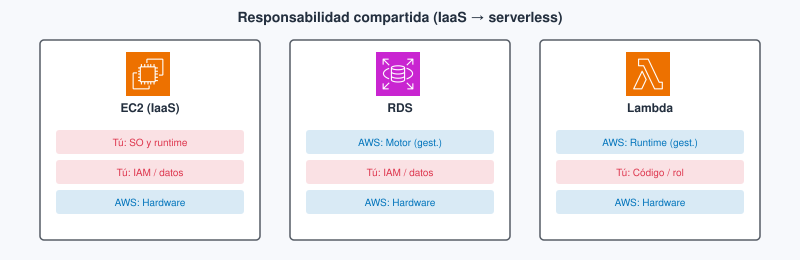
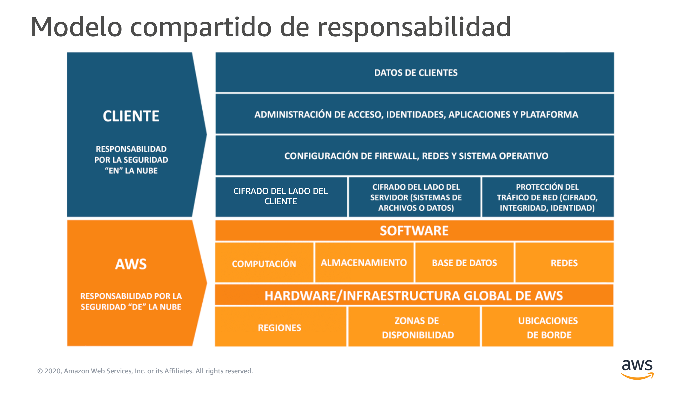
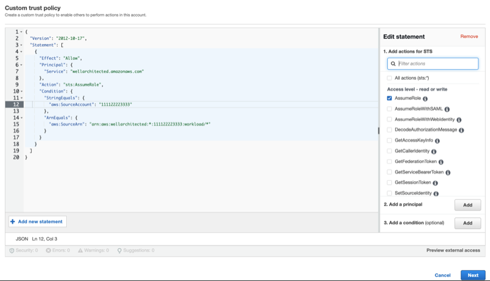
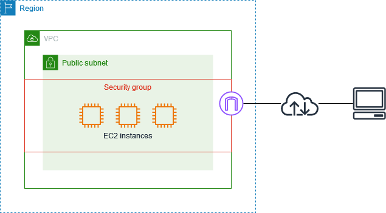

# Tema 2. Seguridad, IAM y responsabilidad compartida

Una API (interfaz de programación de aplicaciones) en la nube no «hereda» la seguridad del proveedor. AWS protege los centros de datos y el hipervisor; **tú** decides quién puede llamar a `s3:GetObject`, si el [usuario raíz](#usuario-raiz) tiene [MFA](#mfa) (autenticación multifactor, *multi-factor authentication*) y si el secreto del JWT vive en el código o fuera de Git. Este tema corresponde al **Módulo 4** de *AWS Academy Cloud Foundations* y es el bloque que más se parece al dominio más pesado del examen **CLF-C02** (*AWS Certified Cloud Practitioner*, Cloud Practitioner). Los términos clave están en el [glosario](#glosario).

!!! tip "Al empezar"
    Empieza por el [cuestionario inicial](#cuestionario-inicial). Si vienes del Tema 1, confirma [Acceso](../00-acceso/acceso.md): aquí el eje es **quién puede hacer qué** ([IAM](#iam) —*Identity and Access Management*, gestión de identidades y accesos— y [responsabilidad compartida](#responsabilidad-compartida)). El lab de este tema se abre en el **Módulo 4** de Foundations.

## Propuesta didáctica

> **RA2.** *Identifica los componentes clave de la infraestructura global de la nube, diferenciando servicios principales, regiones, zonas de disponibilidad y aplicando medidas básicas de seguridad como el modelo de responsabilidad compartida, gestión de accesos y protección de datos.*

### Criterios de evaluación (RA2)

* **d)** Se ha comprendido el modelo de responsabilidad compartida en la nube.
* **e)** Se ha aplicado medidas de seguridad básicas mediante herramientas de gestión de acceso.
* **f)** Se han realizado ejercicios sobre gestión de usuarios y políticas de seguridad.

### Contenidos

* Seguridad **de** la nube frente a seguridad **en** la nube; el límite cambia con IaaS, PaaS y SaaS.
* [IAM](#iam): usuario raíz, usuarios, grupos, roles, políticas; [mínimo privilegio](#minimo-privilegio); [MFA](#mfa).
* Cifrado en tránsito y en reposo; **AWS Artifact** (portal de informes de cumplimiento de AWS) y conformidad (el RGPD —Reglamento General de Protección de Datos— no se cumple solo eligiendo región).
* Servicios de detección y auditoría a nivel de reconocimiento (CloudTrail, GuardDuty, WAF…).

### Programación de aula (orientativa)

| Quincena | En tutoría | Trabajo autónomo / evidencias |
| --- | --- | --- |
| **Q3** | Responsabilidad compartida + IAM | **PR201**; Autocheck del tema |

---

<a id="cuestionario-inicial"></a>

## Cuestionario inicial

!!! question "Responde con lo que sepas"
    1. En una API en **EC2** con MySQL en la misma máquina, ¿quién aplica los parches de seguridad del sistema operativo (SO) de la máquina virtual? ¿Y si pasas el motor a **RDS**?
    2. ¿Para qué sirve el usuario **root** de la cuenta AWS y por qué no lo usarías a diario?
    3. ¿Qué aporta el **MFA** frente a solo usuario y contraseña?
    4. ¿Por qué es mala idea pegar **access keys** en el repositorio de una app Node?
    5. Da un ejemplo de **mínimo privilegio**: una acción permitida sobre un recurso concreto (no «AdministratorAccess»).

Este cuestionario es solo para ti: te ayuda a ver qué dominas ya y qué te falta antes o mientras lees el tema. No se entrega en Aules; respóndelo con lo que sepas y, cuando quieras contrastar, abre el bloque **Soluciones (autoevaluación)** debajo o el índice en [Soluciones](../90-soluciones/soluciones.md).

<details markdown="1">
<summary>Soluciones (autoevaluación)</summary>

1. En **EC2**, **tú** aplicas los parches de seguridad del SO de la máquina virtual. Si el motor pasa a **RDS**, AWS mantiene y actualiza el motor; tú sigues con usuarios, datos, cifrado y el security group.

2. El **root** es la identidad de la cuenta (facturación, cierre, Support…). No lo uses a diario: trabaja con usuarios o roles con mínimo privilegio (en el lab del Módulo 4, con los usuarios que ya vienen creados).

3. El **MFA** añade un segundo factor: aunque filtren la contraseña, hace falta el dispositivo o el código.

4. Las **access keys** en el repo se filtran (GitHub, forks, capturas); quien las tenga actúa como tu cuenta. Mejor rol de instancia o de función, o credenciales fuera de Git.

5. Ejemplo: `s3:GetObject` solo sobre `arn:aws:s3:::mi-bucket-lab/*` para un rol de la API — no `AdministratorAccess`.

</details>

---

## Bloque Foundations (Módulo 4)

### Responsabilidad compartida

El modelo de **[responsabilidad compartida](#responsabilidad-compartida)** reparte quién asegura qué. AWS es responsable de la seguridad **de** la nube: instalaciones, hardware, red global del proveedor e hipervisor, y también de lo que mantiene en un servicio gestionado. Tú eres responsable de la seguridad **en** la nube: identidades, datos, configuración, puertos que abres, cifrado que activas y los parches de seguridad del sistema operativo cuando corres una máquina virtual.

Esa frontera **no es fija**: se mueve con el modelo de servicio que vimos en el Tema 1 ([IaaS](../01-fundamentos-nube-aws/tema1.md#iaas) —infraestructura como servicio—, [PaaS](../01-fundamentos-nube-aws/tema1.md#paas) —plataforma como servicio—, [SaaS](../01-fundamentos-nube-aws/tema1.md#saas) —software como servicio—). En un proyecto DAW no es lo mismo una API Node en [EC2](../01-fundamentos-nube-aws/tema1.md#ec2) que una base de datos (BD) en [RDS](../01-fundamentos-nube-aws/tema1.md#rds) o un correo SaaS del centro.

#### En IaaS (API en EC2 con tu stack)

**Qué es en este caso.** Alquilas la máquina virtual y montas tú el sistema operativo, nginx, Node y, a veces, MySQL en el mismo disco.

**En la práctica.** AWS garantiza que el hipervisor y el centro de datos están protegidos; **tú** aplicas los parches de seguridad del SO, mantienes y actualizas Node y nginx, endureces la instancia, gestionas usuarios del sistema, eliges el [SG](#security-group) (*security group*, el cortafuegos de la instancia) y cuidas de que el `.env` no acabe en un repo público. Si alguien compromete tu API porque dejaste el puerto 22 abierto a `0.0.0.0/0`, la falla es **en** la nube (tu configuración), no del edificio de AWS.

#### En PaaS (motor en RDS)

**Qué es en este caso.** Mueves MySQL a un motor gestionado: AWS mantiene y actualiza el motor de base de datos.

**En la práctica.** Dejas de mantener y actualizar MySQL a mano, pero **sigues** siendo dueño de los usuarios de la base, de los datos, del cifrado que actives y del security group que deja entrar a la API. «Pasé a gestionado» no te quita la responsabilidad si alguien obtiene la contraseña del usuario `app` porque la pegaste en Discord.

#### En SaaS (correo o CRM del centro)

**Qué es en este caso.** Consumes una aplicación completa: correo, wiki, CRM.

**En la práctica.** AWS (o el proveedor del SaaS) mantiene casi toda la pila; tú configuras cuentas, permisos de buzón y qué datos metes. En un proyecto de DAW el SaaS suele ser dependencia (inicio de sesión, correo), no el sitio donde despliegas tu API —pero si compartes la contraseña del correo del proyecto, el incidente sigue siendo tuyo.

| Recurso / modelo | Mantener y actualizar SO o motor | Identidades y datos de la app | Hardware y centros de datos |
| --- | --- | --- | --- |
| EC2 + tu stack (IaaS) | Tú: parches del SO; tú mantienes Node, nginx… | Tú | AWS |
| RDS (plataforma gestionada) | AWS mantiene el motor | Tú (usuarios de BD, datos, cifrado, SG) | AWS |
| Lambda (entorno de ejecución gestionado) | AWS | Tú (rol de ejecución, código, datos) | AWS |
| Correo / CRM (SaaS) | Proveedor | Tú (cuentas y configuración) | Proveedor |

<figure markdown="span">
{ width="800" }
<figcaption>El límite se mueve con el modelo de servicio: en rojo lo que asumes tú; en azul lo que mantiene AWS.</figcaption>
</figure>

<figure markdown="span">
{ width="720" }
<figcaption>Misma idea en el diagrama oficial de AWS: datos e identidades son tuyos; regiones, zonas de disponibilidad (AZ) y hardware son del proveedor.</figcaption>
</figure>

**Antes / después.** Al principio sueles tener la API y MySQL en la misma EC2: tú aplicas los parches del SO y además mantienes y actualizas Node y MySQL. Cuando pasas la base a RDS y dejas la API en EC2 (o en Lambda), AWS mantiene y actualiza el motor, pero **tú** sigues siendo dueño de los usuarios de la base de datos, de los datos, del cifrado y del security group que abre el puerto. Si subes un `.env` con la clave de Stripe a un repo público, eso no es «fallo de AWS». Si alguien entra físicamente en el centro de datos del proveedor, ese tramo sí es su responsabilidad.

| Examen CLF | Clase DAW / empresa |
| --- | --- |
| Distinguir seguridad *de* la nube (AWS) frente a *en* la nube (cliente) | Ante un incidente, razonar si falló un parche del SO, una política IAM, un SG o el proveedor |
| Reconocer que el límite cambia con EC2 / RDS / Lambda / SaaS | En el lab, no culpar a AWS por access keys en GitHub o por un bucket público |

### Cuándo NO echar la culpa a AWS

Cada uno de estos fallos es seguridad **en** la nube: configuración o hábitos tuyos (o del equipo).

**Access keys en un repo o en capturas del lab.** Quien encuentre la clave puede llamar a la API como si fueras tú. Para evitarlo, no pegues `AKIA…` en el `.md`, en el chat ni en el front: asigna un [rol](#rol) al servicio o guarda las credenciales fuera de Git, y bórralas al terminar el lab.

**Bucket público «para que se vea la foto del ejercicio».** Abres el objeto al mundo y scrapers o bots pueden indexarlo. Para evitarlo, usa una URL firmada, una política de lectura mínima o deja que solo la API sirva el fichero; no marques el bucket entero como público «un rato».

**Usuario raíz compartido por el grupo de clase.** Cualquiera del grupo podría cerrar la cuenta, cambiar la facturación o borrar recursos. Para evitarlo, cada persona trabaja con su identidad del lab; el root queda con MFA y fuera del día a día.

**SSH o `0.0.0.0/0` «solo un rato» y olvido.** Dejas la instancia expuesta a internet. Para evitarlo, restringe el [security group](#security-group) a la IP del lab o del aula y ciérralo al terminar.
### IAM: quién puede hacer qué

**[IAM](#iam)** (*Identity and Access Management*, gestión de identidades y accesos) es el servicio con el que decides **quién** puede hacer **qué** sobre **qué recurso**. Sin IAM bien pensado, o dejas la cuenta abierta o bloqueas al equipo. En una API Node el patrón sano es: la persona entra con su identidad (en el lab del Módulo 4, con `user-1`…; en otros labs, con la sesión del entorno); la instancia o la función **asume un rol** con la política justa. Si pegas [access keys](#access-key) en el repo, has saltado ese diseño y has creado un incidente.

#### Usuario raíz (root)

**Qué es en este caso.** El [usuario raíz](#usuario-raiz) es la identidad propietaria de la cuenta AWS: facturación, cierre de cuenta, cambio de plan de Support y otras acciones de cuenta.

**En la práctica.** No lo uses para desarrollar ni para el lab diario. Activa [MFA](#mfa), guarda esas credenciales fuera del grupo de clase y, en el ejercicio del Módulo 4, trabaja con los usuarios que ya vienen creados. El examen asocia el root a acciones de cuenta, no a desplegar la API de un proyecto de DAW.

#### Usuario IAM

**Qué es en este caso.** Un [usuario IAM](#usuario-iam) es una identidad permanente pensada para una persona (o, a veces, para una aplicación antigua). Puede tener contraseña de consola y, si se generan, access keys.

**En la práctica.** En empresas a menudo se sustituye por federación o Identity Center. En el **lab de IAM del Módulo 4** de Foundations **no creas** usuarios nuevos: ese ejercicio se lanza con su propio *Start Lab* dentro del módulo del curso *Cloud Foundations* y ya trae creados `user-1`, `user-2` y `user-3`, y los grupos `S3-Support`, `EC2-Support` y `EC2-Admin`. Tú añades cada usuario a su grupo, entras como cada uno y compruebas qué puede hacer y qué le deniega la política. Un usuario no es lo mismo que un **rol**: el usuario es «alguien con credenciales de persona»; el rol se **asume** un rato, casi siempre por un servicio.

#### Grupo IAM

**Qué es en este caso.** Un [grupo](#grupo-iam) agrupa usuarios para aplicarles las mismas [políticas](#politica) (*policies* en inglés). En el lab del Módulo 4, `S3-Support`, `EC2-Support` y `EC2-Admin` son esos paquetes de permisos.

**En la práctica.** El grupo no «hereda magia»: solo es un atajo para adjuntar las mismas políticas a varias personas. Si cambias la política del grupo, cambia el permiso de todos sus miembros. Por eso el lab te hace entrar como `user-1` en un grupo y como `user-2` en otro: ves la diferencia en lo que la consola te deja hacer.

#### Rol IAM

**Qué es en este caso.** Un [rol](#rol) es una identidad que **se asume** temporalmente: una instancia EC2, una función Lambda, otro servicio o una persona con permiso para *AssumeRole*. Lleva una política de confianza (*trust policy*: quién puede asumirlo) y políticas de permisos (qué puede hacer después).

**En la práctica.** Es la forma correcta de que tu API lea un bucket de imágenes sin llevar `AKIA…` en el disco. En el Learner Lab, el rol típico se llama **LabRole** (con el perfil de instancia **LabInstanceProfile**): lo asignas a una EC2 o a una Lambda para que el código llame a S3 u otros servicios. No lo «asumes tú» al entrar al lab; lo asume el **servicio**.
<figure markdown="span">
{ width="800" }
<figcaption>Trust policy de un rol: quién puede hacer sts:AssumeRole. Fuente: AWS Well-Architected Tool User Guide (AWS).</figcaption>
</figure>

#### Dos entornos de Academy: lab del Módulo 4 y Learner Lab

Conviene no mezclarlos. El **lab de IAM del Módulo 4** se abre **dentro** del curso *Cloud Foundations*: entras al módulo, pulsas su *Start Lab* y trabajas con los usuarios y grupos que ese ejercicio ya trae creados. El **Learner Lab** es **otro** curso de Academy: es el entorno libre para practicar EC2, S3 y el resto. Ahí entras con una **sesión federada**, **no** puedes crear usuarios, grupos ni roles IAM propios, y **LabRole** / **LabInstanceProfile** se asignan a servicios (una EC2 o una Lambda) para que el código llame a la API sin access keys. Que el Módulo 4 traiga `user-1`… no es «porque el Learner Lab lo imponga»: son entornos distintos, cada uno con su propio *Start Lab*.

#### Política (*policy*)

**Qué es en este caso.** Una [política](#politica) (*policy* en inglés) es el documento (casi siempre JSON) que **permite o deniega** acciones sobre recursos. Se adjunta a usuarios, grupos o roles.

**En la práctica.** El [principio de mínimo privilegio](#minimo-privilegio) dice: solo lo necesario para la tarea. `s3:GetObject` sobre *un* bucket de lab, no `AdministratorAccess` «para que funcione». Hay políticas **gestionadas** por AWS (p. ej. `ReadOnlyAccess`) y políticas **insertadas** (*inline*) pegadas a una sola identidad; en Foundations reconoces ambas. En el lab del Módulo 4 las políticas ya vienen ligadas a los grupos: tu trabajo es ver el efecto al entrar como cada usuario.

##### Ejemplo de política JSON (línea a línea)

Imagina una política que solo permite **leer** objetos de un bucket de imágenes del lab (la idea es la misma que verás en los grupos del ejercicio):

```json
{
  "Version": "2012-10-17",
  "Statement": [
    {
      "Sid": "LeerImagenesLab",
      "Effect": "Allow",
      "Action": "s3:GetObject",
      "Resource": "arn:aws:s3:::mi-bucket-lab/*"
    }
  ]
}
```

- **`Version`:** formato del lenguaje de políticas que espera IAM (en Foundations lo dejas como en el ejemplo del lab o de la documentación).
- **`Statement`:** lista de reglas; aquí hay una.
- **`Sid`:** etiqueta opcional para reconocer la regla en consola.
- **`Effect`:** `Allow` permite; `Deny` deniega. Un *deny* explícito gana a un *allow* cuando se evalúan varias políticas.
- **`Action`:** la acción de la API de AWS (`s3:GetObject`). Sin esto, no hay permiso concreto.
- **`Resource`:** sobre qué recurso aplica, en forma de [ARN](#arn) (*Amazon Resource Name*, nombre de recurso de Amazon: `arn:aws:s3:::mi-bucket-lab/*` = objetos dentro del bucket). Un `*` sobre todos los buckets sería lo contrario del mínimo privilegio.

En Foundations no memorizas el JSON entero; sí reconoces *Effect*, *Action*, *Resource* y, cuando aparezca, *Condition* (por ejemplo limitar por IP). El lab del Módulo 4 te hace vivir el allow/deny al cambiar de usuario.

!!! tip "Ideas de política (S3) que conviene reconocer"
    - Lectura solo para un **usuario IAM** concreto (`s3:GetObject` sobre `arn:aws:s3:::mi-bucket/*`).
    - Lectura/escritura para un **rol** de la app (`GetObject` + `PutObject`).
    - **Deny** si la IP de origen no es la del aula u oficina (`NotIpAddress`).
    - Condicionar por **etiqueta** del objeto (p. ej. solo `Access=public`).
    - Limitar a tráfico que entra por un **punto de enlace de VPC** (`aws:SourceVpce`).

#### Access keys y por qué no van a GitHub

Las [access keys](#access-key) son un par de credenciales de larga duración asociadas a un usuario IAM (identificador que suele empezar por `AKIA…` más un secreto). Quien las tenga puede firmar llamadas a la API **como ese usuario**, desde cualquier sitio con red.

Si las pegas en el repositorio de una app Node —en el `.env` subido, en un commit «temporal» o en una captura del `.md`—, GitHub, forks, bots y compañeros del grupo pueden acabar usándolas. La factura y los borrados corren a nombre de tu cuenta (o del lab). El patrón sano es:

- En **EC2** o **Lambda**, el SDK asume el **rol** de la instancia o de la función (credenciales temporales).
- En el **portátil**, un perfil local o variables de entorno **fuera de Git**.
- En el lab Academy, trata cualquier clave como material sensible: no la pegues en Aules ni en el chat.

Un `AccessDenied` en consola no es «AWS roto»: es la política haciendo su trabajo. Lee el mensaje (acción + recurso) antes de pedir `AdministratorAccess`.

#### Security group frente a IAM

El cortafuegos de la instancia ([security group](#security-group)) **no es IAM**, pero en clase suele ir junto: IAM decide *quién* llama a la API de AWS; el SG decide *qué tráfico de red* entra a la interfaz de red de la instancia (ENI, *elastic network interface*). Abrir el puerto 3306 al mundo es un fallo de red; dar `s3:*` sobre `*` es un fallo de IAM. Los dos pueden tumbar un proyecto de DAW.

<figure markdown="span">
{ width="800" }
<figcaption>Security groups a nivel de instancia o interfaz de red. Fuente: Amazon EC2 User Guide (AWS).</figcaption>
</figure>

### Errores frecuentes (IAM)

**Pedir `AdministratorAccess` «para que el lab funcione».** En el Learner Lab no puedes crear ese permiso a tu aire, y en una cuenta propia ensanchar permisos «porque sí» deja la puerta abierta si se filtra la identidad. Para evitarlo, trabaja con las políticas del ejercicio, captura la denegación y no intentes saltarte el mínimo privilegio ([PR201](#pr201-usuarios-y-politicas)).

**Confundir usuario con rol.** El usuario es persona (en el lab del Módulo 4, `user-1`…); el rol lo asume EC2, Lambda u otro servicio. Si pegas access keys de un usuario en la instancia «porque el rol es complicado», vuelves al antipatrón: LabRole existe precisamente para ese caso.

**Pensar que el grupo hereda permisos mágicos.** El grupo solo agrupa políticas. Si el usuario no está en el grupo correcto, no tiene esos permisos: por eso el lab te hace añadir `user-1` a un grupo y probar.

**Olvidar que *deny* explícito gana a *allow*.** Puedes tener una política amplia y un deny por IP o por etiqueta que te bloquea. Lee el mensaje de error antes de ensanchar permisos a ciegas.

| Examen CLF | Clase DAW / empresa |
| --- | --- |
| Root con MFA; mínimo privilegio; rol frente a access keys | En el lab del Módulo 4: no root; evidencia de AccessDenied con user-1… |
| App comprometida que lista buckets → falla *en* la nube | Revisar el rol del servicio (p. ej. LabRole en el Learner Lab) y la política de S3 |

### Cuentas, datos y red

**[MFA](#mfa)** (autenticación multifactor, *multi-factor authentication*) añade un segundo factor (app o dispositivo) además de la contraseña. En el usuario raíz es obligatorio en la práctica seria; en cualquier humano que pueda crear recursos de pago, muy recomendable. Aunque filtren la contraseña, falta el código del dispositivo.

**Cifrado en tránsito** protege los datos mientras viajan (TLS hacia el usuario, hacia el ALB —*Application Load Balancer*, balanceador de aplicación— o hacia CloudFront). **Cifrado en reposo** protege lo que está parado en disco u objeto (volumen, bucket S3). Son capas distintas: una API «con HTTPS» puede seguir guardando datos personales en claro en un volumen sin cifrar. [KMS](#kms) (*Key Management Service*, servicio de gestión de claves) crea y controla las claves de cifrado; una **CMK** (*customer master key*, clave maestra del cliente) es una clave que administras tú en KMS para cifrar datos o otras claves. En Foundations basta reconocer KMS y CMK; no montamos un lab de criptografía.

**Security groups** (con estado, a nivel de interfaz de la instancia) y **NACL** (*network access control list*, lista de control de acceso de red; sin estado, a nivel de subred) son control de acceso de **red**. Se profundizan en el Tema 3; aquí conviene dejar claro que **abrir puertos** es decisión tuya, no de AWS.

**AWS Artifact** es el portal de AWS donde descargas informes y acuerdos de cumplimiento del proveedor (auditorías, certificaciones). Elegir una región europea no «cumple el RGPD» solo: hay que configurar quién accede, qué datos guardas y dónde se replican.

### Relación con otros temas

La red (SG y NACL) se profundiza en el Tema 3: aquí basta entender que abrir puertos es decisión tuya. El cómputo (Tema 4) decide *dónde* corre el código que asume el rol (por ejemplo LabRole en una EC2). Well-Architected (Tema 7) pone la seguridad como **pilar**, no como lista suelta de consejos.

---

## Bloque Ampliación Practitioner (CLF-C02)

En Foundations practicas IAM en el lab; el examen te pide **reconocer** el modelo de responsabilidad compartida, el papel del usuario raíz y qué audita cada servicio. [CloudTrail](#cloudtrail) registra llamadas a la API (quién hizo qué); no mide la CPU de la instancia —eso es CloudWatch (Tema 8).

!!! tip "Para el CLF"
    Si una app comprometida lista buckets, la falla suele ser *en* la nube (tu cuenta), no del centro de datos de AWS. El root lleva MFA; CloudTrail no es CloudWatch. Ampliación, tabla de logos y **autocheck certificación** en [Certificación § Tema 2](../99-certificacion/certificacion.md#tema-2).

**Videotutorial (Practitioner).** [Sesión 2 Cloud Practitioner 2026](https://www.youtube.com/watch?v=XfFq9lKYDPc) (~1 h 53 min). Prioriza seguridad / IAM. Vídeo: Profe Santos Cloud (YouTube).

---

## Videotutorial

**Principal (Foundations).** [IAM en Academy](https://www.youtube.com/watch?v=rEnenbxjOGo) (~9 min).

<iframe src="https://www.youtube.com/embed/rEnenbxjOGo" title="IAM en Academy — Profe Santos Cloud" style="width:100%;max-width:840px;aspect-ratio:16/9;border:0;display:block;margin:0.8em auto" allow="accelerometer;clipboard-write;encrypted-media;gyroscope;picture-in-picture" allowfullscreen loading="lazy"></iframe>

Vídeo: Profe Santos Cloud (YouTube). Conviene fijarte en usuarios, grupos y políticas en el entorno Academy, y contrastarlo con el rol que asume un servicio.

**Extra (opcional).** [IAM Cloud9](https://www.youtube.com/watch?v=M-TKRBYHWHA) (~24 min) — rol y entorno de desarrollo. Vídeo: Profe Santos Cloud (YouTube).

En tu clase de *Cloud Foundations* de Academy, abre el **Módulo 4** (seguridad e IAM) y sigue el lab que indique el LMS (sistema de gestión del aprendizaje).

---

## Actividad / práctica

### PR201 — Usuarios y políticas

* :simple-neutralinojs: **PR201**. (RA2 // d, e, f // **PR 0–10**). Practicas IAM con mínimo privilegio usando el lab del Módulo 4: usuarios y grupos ya creados, políticas distintas y evidencia de una denegación, sin usar el root a diario.

  - **Preferente:** lab de IAM de Academy en el **Módulo 4** (`user-1` / `user-2` / `user-3` y grupos `S3-Support`, `EC2-Support`, `EC2-Admin`).
  - **Alternativa** (si el lab no está disponible): **no** crees usuarios en el Learner Lab (el entorno no lo permite). Analiza las políticas de esos grupos en la documentación o captura del lab, o lee una política JSON dada y explica qué permite y qué deniega, con un ejemplo de acción que fallaría.

  **Tareas:** confirma que no trabajas como root; en el lab, añade cada usuario a su grupo según el enunciado; entra como cada usuario y anota qué puede hacer; captura o describe una acción denegada; cierra sesión de esos usuarios al terminar (no hace falta borrar identidades que Academy ya traía).

  **Entrega:** según [Cómo entregar las prácticas](../index.md#entrega) — fichero `PR201.md` (o ZIP + `img/` si hay capturas).

  Guía de apoyo: [Soluciones · PR201](../90-soluciones/pr/PR201.md).

| Criterio | Descripción | Puntos |
| --- | --- | --- |
| Lab / usuarios | Uso correcto de user-1… y grupos del Módulo 4 (o análisis alternativo) | 0–3 |
| Mínimo privilegio | Evidencia de denegación o explicación de qué deniega la política | 0–3 |
| Buenas prácticas | Sin root diario; sin access keys en el entregable | 0–2 |
| Claridad del `.md` | Nombres, capturas o razonamiento legible | 0–2 |
| **Total** | | **/10** |

---

### En la práctica de desarrollo web

Cuando tu API en Node usa el SDK de AWS (S3, SES, etc.), las credenciales **no** van en el front ni en el repositorio. En EC2 o Lambda el SDK toma el **rol** de la instancia o de la función. En el portátil de desarrollo usas un perfil local o variables de entorno **fuera de Git**. Si el lab Academy te da un usuario IAM, trátalo como material sensible: no pegues claves ni capturas con secretos en el `.md` de la práctica, ni en el chat del grupo.

---

## Autocheck del tema

Comprueba IAM y responsabilidad compartida de este tema. CLF: [Certificación § Tema 2](../99-certificacion/certificacion.md#tema-2).

1. ¿Quién aplica los parches de seguridad del SO de una **EC2** donde corre tu API Node?
2. ¿Dónde encaja mejor el permiso «leer el bucket S3» de la API: **access keys** de un usuario en el disco, o **rol** de la instancia o función (p. ej. LabRole)?
3. **V/F.** CloudTrail te dice la CPU de la instancia.
4. Elige dos acciones típicas del **root** (no del trabajo diario de despliegue):  
   a) `s3:GetObject` en un bucket de lab · b) cerrar la cuenta · c) cambiar el plan de Support · d) lanzar un `t3.micro`
5. Empareja: **política** · **grupo** · **MFA** con: (a) documento JSON de permisos · (b) segundo factor · (c) conjunto de usuarios con políticas comunes.

<details markdown="1">
<summary>Soluciones</summary>

1. **Tú** (cliente) aplicas los parches del SO en EC2; Node lo mantienes y actualizas tú también.

2. **Rol** asumido por la instancia o la función (evita keys permanentes en disco).

3. **Falso** — CloudTrail audita llamadas a la API; la CPU se mira en CloudWatch.

4. **b** y **c** (el examen asocia root a cuenta, facturación y Support, no al despliegue rutinario).

5. La **política** es (a) el documento JSON de permisos; el **MFA**, (b) el segundo factor; el **grupo**, (c) el conjunto de usuarios con políticas comunes.

</details>

---


## Glosario

**responsabilidad compartida**{: #responsabilidad-compartida}
Reparto de deberes de seguridad entre AWS (seguridad *de* la nube) y el cliente (seguridad *en* la nube). El límite cambia según uses EC2, RDS, Lambda, etc. En una app DAW: AWS no revisa tu `.env`; tú no proteges el edificio del centro de datos.

**IAM**{: #iam}
*Identity and Access Management*: servicio para gestionar identidades y permisos sobre recursos AWS (usuarios, grupos, roles y políticas). Es el control de acceso de casi todo lo que harás en Foundations: sin IAM coherente, o abres demasiado o bloqueas el lab.

**usuario raíz**{: #usuario-raiz}
También llamado *root*: identidad propietaria de la cuenta AWS. Tiene privilegios totales; no debe usarse para el trabajo diario y debe protegerse con MFA. El examen suele asociarla a acciones de cuenta (cambiar plan de soporte, cerrar la cuenta), no a desplegar la API de un proyecto de DAW.

**root**{: #root}
Sinónimo de [usuario raíz](#usuario-raiz) en la documentación y en el examen. Misma idea: dueño de la cuenta, no identidad de desarrollo diario.

**usuario IAM**{: #usuario-iam}
Identidad IAM pensada para una persona (contraseña de consola y, si se generan, access keys). En el lab del Módulo 4 ya existen `user-1`, `user-2` y `user-3`; en empresas a menudo se sustituye por federación.

**grupo IAM**{: #grupo-iam}
Conjunto de usuarios IAM que comparten las mismas políticas. No concede permisos por sí solo: hay que adjuntarle policies.

**rol**{: #rol}
Identidad IAM que se *asume* temporalmente (por una persona, una instancia EC2 o un servicio). Evita pegar access keys permanentes en el disco. En desarrollo web es la forma correcta de que la API lea un bucket o escriba logs.

**política**{: #politica}
Documento (suele ser JSON) que permite o deniega acciones sobre recursos (`Effect`, `Action`, `Resource`). Se adjunta a usuarios, grupos o roles. Una policy mal acotada (`*` sobre `*`) convierte un lab en un incidente.

**policy**{: #policy}
Nombre en inglés de [política](#politica). En consola y en el examen verás *policy* / *policies*.

**mínimo privilegio**{: #minimo-privilegio}
Principio de dar solo los permisos necesarios para la tarea, ni más. Reduce el daño si se compromete una identidad. En clase: empieza por denegación y añade lo mínimo para que el lab pase.

**MFA**{: #mfa}
*Multi-factor authentication*: segundo factor (app, hardware…) además de usuario y contraseña. Obligatoria en la práctica seria para el usuario raíz; muy recomendable en cualquier humano que pueda crear recursos de pago.

**access key**{: #access-key}
Par de credenciales de larga duración de un usuario IAM (identificador + secreto) para firmar llamadas a la API. No deben subirse a GitHub ni pegarse en entregas; preferible rol con credenciales temporales.

**ARN**{: #arn}
*Amazon Resource Name*: identificador único de un recurso AWS (por ejemplo `arn:aws:s3:::mi-bucket-lab/*`). Las políticas lo usan en el campo `Resource`.

**política gestionada**{: #politica-gestionada}
Policy creada y mantenida por AWS (o por ti como *customer managed*) que puedes adjuntar a varias identidades. Ejemplo habitual en labs: `ReadOnlyAccess`.

**política insertada**{: #politica-insertada}
Policy *inline* pegada a un solo usuario, grupo o rol. Sirve para permisos muy concretos de esa identidad; si borras la identidad, suele irse con ella.

**cifrado en tránsito**{: #cifrado-en-transito}
Protección de los datos mientras viajan por la red (típicamente TLS/HTTPS). No implica por sí solo que el dato esté cifrado en disco.

**cifrado en reposo**{: #cifrado-en-reposo}
Protección de los datos almacenados (volumen, objeto S3, etc.). Complementa el cifrado en tránsito; son capas distintas.

**security group**{: #security-group}
Cortafuegos con estado asociado a la interfaz de red de una instancia (u otro recurso). Controla qué tráfico de red entra o sale; es otra capa distinta de IAM.

**KMS**{: #kms}
*Key Management Service* (servicio de gestión de claves): crea y controla claves de cifrado. Una **CMK** (*customer master key*, clave maestra del cliente) es una clave que administras en KMS. En Foundations basta reconocer ambos nombres.

**CloudTrail**{: #cloudtrail}
Servicio que registra llamadas a la API de AWS (quién hizo qué, cuándo). Es auditoría, no un monitor de CPU. Si necesitas latencia o uso de CPU, miras CloudWatch (Tema 8), no CloudTrail.
