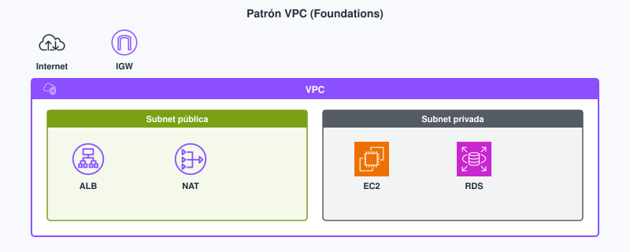

# Tema 3. Redes, VPC y entrega de contenido

Tu front y tu API no «salen a internet» por arte de magia: viven en una **[VPC](#vpc)**, en **[subredes](#subnet)** atadas a una AZ, con tablas de rutas y cortafuegos. **Foundations M5** es el mínimo para publicar un servidor web sin abrir SSH al mundo. No sustituye a un módulo de redes locales: aquí el CIDR cabe en una servilleta y el trade-off es **exposición vs salida**. Ver [glosario](#glosario).

!!! tip "Al empezar"
    Empieza por el [cuestionario inicial](#cuestionario-inicial). Trae claro el mapa región/AZ del Tema 1: aquí dibujas el **barrio** de la app (público, privado, security group).

## Propuesta didáctica

> **RA3.** *Diseña y configura redes virtuales y servicios de cómputo en la nube, aplicando buenas prácticas de seguridad, estrategias de balanceo de carga, escalado automático y aprovechando tecnologías serverless, contenedores y máquinas virtuales según casos de uso específicos.*

### Criterios de evaluación (RA3)

* **a)** Se ha realizado el diseño y configuración de redes virtuales privadas.
* **b)** Se ha aplicado buenas prácticas de seguridad en redes y arquitecturas.
* **c)** Se ha participado activamente en la creación y configuración de una red funcional.

Cómputo (tipos de instancia, Lambda) es el Tema 4. Balanceo y autoescalado: Tema 8.

### Contenidos

* VPC, CIDR, subredes (una AZ cada una), tablas de rutas, IGW, NAT.
* [Security groups](#security-group) frente a [NACL](#nacl); subred pública frente a privada.
* Route 53 y CloudFront: DNS y CDN.
* VPN frente a Direct Connect (cuándo merece un enlace dedicado).

### Programación de aula (orientativa)

| Quincena | En tutoría | Trabajo autónomo / evidencias |
| --- | --- | --- |
| **Q4** | VPC pública/privada + SG | **PR301**; Autocheck del tema |

---

## Cuestionario inicial

!!! question "Responde con lo que sepas"
    1. ¿Qué es una **VPC** en una frase, sin inventar CIDR todavía?
    2. ¿En qué se diferencia una subred **pública** de una **privada** (ruta a internet)?
    3. ¿Security group o NACL: cuál usas casi siempre en el lab de una API web, y por qué?
    4. ¿Por qué abrir **3306** o **22** a `0.0.0.0/0` es un anti-patrón aunque «así conectas desde casa»?
    5. ¿CloudFront acerca el **contenido** al usuario o replica tu base de datos al borde?

Este cuestionario es solo para ti: te ayuda a ver qué dominas ya y qué te falta antes o mientras lees el tema. No se entrega en Aules; respóndelo con lo que sepas y, cuando quieras contrastar, abre el bloque **Soluciones (autoevaluación)** debajo o el índice en [Soluciones](../90-soluciones/soluciones.md).

Soluciones (autoevaluación)

1. Una **VPC** es tu red virtual en **una** región AWS: el barrio donde colocas front, API y datos.

2. **Pública:** tiene ruta al Internet Gateway (entrada/salida según diseño). **Privada:** no; sale con NAT si necesita internet sin aceptar entradas no solicitadas.

3. Casi siempre el **security group** (con estado, atado a ENI/instancia). La NACL es filtro de subnet sin estado y más fácil de romper en el lab.

4. Expone SSH o el motor de BD a **todo internet**: escaneo, fuerza bruta e incidentes. Mejor bastion, VPN o SG desde el SG de la API.

5. CloudFront acerca **contenido** cacheable (estáticos, respuestas cacheables); **no** replica tu base de datos al borde.

---

## Bloque Foundations (M5)

### VPC

Una **[VPC](#vpc)** (*Virtual Private Cloud*) es tu red virtual en **una** región AWS: eliges un rango de direcciones (**[CIDR](#cidr)**, p. ej. `10.0.0.0/16`) y la partes en **[subredes](#subnet)**. Cada subnet vive en **una** AZ: por eso «alta disponibilidad» implica al menos dos subnets, no un `/24` enorme. Para un desarrollador web, la VPC es el «barrio» donde colocas el front, la API y la base de datos, y decides qué queda expuesto a internet.

!!! note "IPs que AWS se reserva en cada subnet"
    En un CIDR de subnet, AWS reserva **cinco** direcciones (no las uses para EC2):
    red, *gateway* virtual, DNS de la VPC, una reservada y *broadcast*.
    Ejemplo en `10.0.0.0/24`: `.0`, `.1`, `.2`, `.3` y `.255` no son tuyas para instancias.

| Pieza | Función | Error típico |
| --- | --- | --- |
| **Subnet** | Trozo de CIDR en una AZ | Pensar que cruza dos AZ |
| **Route table** | A dónde va el paquete (local, [IGW](#igw), [NAT](#nat-gateway)) | Subnet «privada» con ruta al IGW |
| **Internet Gateway** | Entrada/salida a internet para IPs públicas | Poner la BD con IP pública «porque así conecto desde casa» |
| **NAT Gateway** | Salida desde subnet **privada** (parches, npm) sin inbound | Confundirlo con un load balancer |
| **Security group** | Cortafuegos **con estado** en la ENI | `0.0.0.0/0` en el puerto 22 |
| **NACL** | Cortafuegos **sin estado** en la subnet | Olvidar la regla de retorno |

Patrón razonable para una app web: ALB o front en subnet **pública** (ruta al IGW); API y datos en **privada** (salen con NAT si necesitan npm o parches). El primer lab de Academy a menudo deja un único HTTP en pública: vale para aprender; no es el diseño de un TFG en producción.

**Antes / después.** Antes: una EC2 con IP pública, Node en el 3000 abierto al mundo y MySQL en el mismo host. Después: ALB en pública, API y RDS en privada, NAT solo para salir a internet (parches/`npm`). El usuario sigue llegando por HTTPS; tú dejas de exponer SSH y 3306.

<figure markdown="span">
{ width="800" }
<figcaption>Patrón didáctico Foundations: exposición controlada en pública; API y datos en privada.</figcaption>
</figure>

En la guía oficial el mismo idea aparece con subnets privadas y salida controlada: sitúa dónde queda la API y dónde la base antes de abrir el lab.

<figure markdown="span">
{ width="800" }
<figcaption>VPC con subnets privadas (patrón de la guía). Fuente: Amazon VPC User Guide (AWS).</figcaption>
</figure>

El security group es la regla que más veces romperás (y arreglarás) en el lab: puerto 80/443 desde internet al ALB; SSH o admin **no** a `0.0.0.0/0` si el enunciado lo evita.

<figure markdown="span">
{ width="800" }
<figcaption>SG a nivel de ENI: allow explícito, resto denegado. Fuente: Amazon EC2 User Guide (AWS).</figcaption>
</figure>

### Security groups frente a NACL (detalle DAW)

En la práctica diaria del módulo casi todo se decide con **security groups**: permiten el 443 desde internet hacia el ALB, y desde el SG del ALB hacia el SG de la API. La NACL es la «segunda línea» a nivel de subnet; es más torpe (sin estado) y fácil de romper en un lab. Si el enunciado no pide NACL, no inventes reglas simétricas «por completar».

### DNS y contenido

Cuando el usuario escribe `midominio.es`, alguien tiene que traducir el nombre a una IP o a un balanceador. **Route 53** es el DNS de AWS (autoritativo, *health checks*, políticas básicas). **[CloudFront](#cloudfront)** es la CDN: cachea contenido cerca del usuario en el *borde*. No confundas «acercar el HTML/JS» con «replicar la base de datos a Tokio».

En Foundations el flujo habitual es: el dominio en Route 53 apunta a un ALB o a CloudFront; CloudFront origina en S3 (SPA) o en el balanceador y reduce latencia de **estáticos**. Global Accelerator (IPs anycast) aparece como nombre de examen; no lo necesitas para el lab M5.

**Cuándo NO usar CloudFront.** Si tu «contenido» es una consulta SQL con datos personales en cada request, la CDN no sustituye a la API ni replica RDS. CloudFront brilla con estáticos, imágenes y respuestas cacheables; el checkout dinámico sigue golpeando el origen.

### Híbrido

Si el backend del instituto sigue en un CPD y la API nueva está en AWS, hace falta un enlace. **VPN** sitio a sitio: cifrado por internet, rápido de entender. **Direct Connect:** enlace dedicado cuando el caudal y la estabilidad importan más que el lab del aula.

En un TFG casi nunca montarás Direct Connect; sí debes saber **reconocer** el escenario del examen («mucho tráfico estable al CPD» → Direct Connect; «prueba rápida y cifrada» → VPN).

### Relación con cómputo y balanceo

La VPC es el escenario; EC2/Lambda (Tema 4) son los actores; el ALB y el Auto Scaling (Tema 8) reparte y escala *dentro* de esa red. Sin CIDR y subnets claras, el resto de labs «falla raro» (timeouts, sin ruta al IGW, SG que no cuadra).

---

## Bloque Ampliación Practitioner (CLF-C02)

El examen insiste en **dónde** publicas (ALB o CloudFront frente a base en privada), qué hace una CDN y la diferencia de estado entre security group y NACL. VPN y Direct Connect solo hay que reconocerlos.

!!! tip "Para el CLF"
    Publica el tráfico en el borde o en el balanceador; deja la base en subnet privada. CloudFront acerca contenido cacheable: no «mueve» RDS al borde. El security group lleva estado; la NACL, no. Ampliación y **autocheck certificación** en [Certificación § Tema 3](../99-certificacion/certificacion.md#tema-3).

**Videotutorial (CDN / DNS).** [CloudFront - S3 - Route 53 (Static Web)](https://www.youtube.com/watch?v=DgQroj70CJ0) (~19 min). Vídeo: Profe Santos Cloud (YouTube).

---

## Videotutorial

**Principal (Foundations).** [VPC](https://www.youtube.com/watch?v=u0Kh0JRK4zk) (~16 min).

<iframe src="https://www.youtube.com/embed/u0Kh0JRK4zk" title="VPC — Profe Santos Cloud" style="width:100%;max-width:840px;aspect-ratio:16/9;border:0;display:block;margin:0.8em auto" allow="accelerometer;clipboard-write;encrypted-media;gyroscope;picture-in-picture" allowfullscreen loading="lazy"></iframe>

Vídeo: Profe Santos Cloud (YouTube). Qué mirar: CIDR, subnets y salida a internet; anota qué queda público y qué privado.

**Extra (opcional).** [VPC EC2 RDS](https://www.youtube.com/watch?v=I0nL0NX4qZc) (~40 min) — demo de red con cómputo y base; útil antes del lab M5. Vídeo: Profe Santos Cloud (YouTube).

El M5 del LMS Academy se indica en clase / Aules.

---

## Actividad / práctica

### PR301 — VPC y servidor web

* :simple-neutralinojs: **PR301**. (RA3 // a, b, c // **PR 0–10**). Montas (o completas) el lab Academy M5 de VPC y servidor web: subnets, rutas y security group coherentes con una API publicada sin abrir administración al mundo.

  **Tareas:** anota CIDR de VPC y de cada subnet con su AZ; verifica la ruta al IGW solo en la subnet pública; captura el SG (puertos 80/443 y administración restringida si el lab lo permite); termina recursos en orden (instancia → volúmenes/ENI → IGW → subnets → VPC) según el lab.

  **Entrega:** según [Cómo entregar las prácticas](../index.md#entrega) — fichero `PR301.md` (o ZIP + `img/` si hay capturas).

  Guía de apoyo (no sustituye el enunciado): [Soluciones · PR301](../90-soluciones/pr/PR301.md).

| Criterio | Descripción | Puntos |
| --- | --- | --- |
| VPC / subnets | CIDR y AZ documentados | 0–3 |
| Rutas e IGW | Pública vs privada coherente | 0–2 |
| Security group | Puertos justificados; sin 0.0.0.0/0 innecesario | 0–3 |
| Limpieza | Recursos de lab terminados | 0–2 |
| **Total** | | **/10** |

---

### Flujo de una petición HTTP (mapa mental)

1. El usuario resuelve el nombre (Route 53 u otro DNS) hacia el ALB o CloudFront.
2. El balanceador/CDN habla con orígenes en tu VPC (o con S3).
3. El security group del origen solo acepta desde el SG del ALB (no desde `0.0.0.0/0` al puerto de la API).
4. La API en subnet privada consulta RDS; el puerto del motor solo acepta el SG de la API.

Si saltas al paso 4 abriendo 3306 al mundo, el resto del diagrama «bonito» no sirve. En el lab corto a veces se simplifica; en el `.md` debes **saber** qué simplificaste.

---

## Autocheck del tema

Comprueba VPC y entrega de este tema. CLF: [Certificación § Tema 3](../99-certificacion/certificacion.md#tema-3).

1. **V/F.** Una subnet puede cruzar dos AZ «para tener HA gratis».
2. El **security group**…  
   a) no tiene estado · b) recuerda conexiones establecidas · c) sustituye al IGW
3. ¿Para qué sirve un **NAT Gateway** si ya hay IGW?
4. Empareja: **IGW** · **NACL** · **CloudFront** con: (a) puerta a internet de la VPC · (b) filtro a nivel de subnet (sin estado) · (c) CDN en el borde
5. **V/F.** CloudFront «mueve» RDS a la edge location más cercana al alumno.

Soluciones

1. **Falso** — una subnet = una AZ.

2. **b**.

3. Salida a internet desde subnets **privadas** sin aceptar entradas no solicitadas (parches, `npm`…).

4. El **IGW** es (a) la puerta a internet de la VPC; la **NACL**, (b) el filtro a nivel de subnet sin estado; **CloudFront**, (c) la CDN en el borde.

5. **Falso** — cachea contenido; no traslada la base de datos.

---

## Glosario

**VPC**{: #vpc}
*Virtual Private Cloud*: red virtual aislada en una región AWS donde colocas subredes, rutas y recursos (EC2, bases de datos, etc.). Es el «barrio» de tu app web: sin VPC bien planteada, publicas de más o no sales a internet cuando toca.

**subnet**{: #subnet}
Subred: trozo del CIDR de la VPC asociado a **una** zona de disponibilidad. No cruza dos AZ. Por eso la alta disponibilidad implica al menos dos subnets (y suele implicar dos AZ), no un único `/24` enorme.

**CIDR**{: #cidr}
Notación de rango de direcciones IP (p. ej. `10.0.0.0/16`). Define el tamaño de la VPC o de cada subnet. Un `/16` da margen; un `/28` se queda corto si lanzas muchas ENI en un lab.

**IGW**{: #igw}
*Internet Gateway*: puerta de la VPC hacia internet para recursos con ruta e IP pública. Sin IGW (y sin ruta), una subnet «pública» no lo es aunque tenga la etiqueta en el diagrama.

**NAT Gateway**{: #nat-gateway}
Permite que recursos en una subnet **privada** inicien conexiones salientes a internet (parches, `npm`) sin aceptar entradas no solicitadas desde internet. No es un balanceador ni sustituye al IGW para publicar un front.

**security group**{: #security-group}
Cortafuegos **con estado** a nivel de interfaz de red (instancia). Si permites una conexión saliente, el tráfico de retorno asociado se permite. Es la herramienta habitual para controlar 80/443/SSH en labs Foundations.

**NACL**{: #nacl}
*Network ACL*: cortafuegos **sin estado** a nivel de subnet. Hay que permitir explícitamente ida y vuelta. Útil como capa extra; fácil de romper si se edita sin plan.

**CloudFront**{: #cloudfront}
CDN de AWS: cachea contenido en ubicaciones de borde cerca de los usuarios. Origina típicamente en S3 o en un balanceador. Acerca estáticos; no mueve tu base de datos transaccional al borde.
