# Tema 4. Cómputo: EC2, Lambda y contenedores

Tres maneras de «correr código» en AWS: **máquina virtual**, **contenedor** y **función**. El error de DAW no es desconocer los logos; es meter una API con WebSocket persistente en [Lambda](#lambda) «porque es serverless» o dejar un `t3.large` 24/7 para un cron de treinta segundos. **Foundations M6.** Ver [glosario](#glosario).

## Propuesta didáctica

> **RA3.** *Diseña y configura redes virtuales y servicios de cómputo en la nube, aplicando buenas prácticas de seguridad, estrategias de balanceo de carga, escalado automático y aprovechando tecnologías serverless, contenedores y máquinas virtuales según casos de uso específicos.*

### Criterios de evaluación (RA3)

* **d)** Se ha realizado la selección de servicios de computación adecuados según casos de uso.
* **f)** Se han desarrollado prácticas relacionadas con la optimización de recursos computacionales.

Balanceo y Auto Scaling: Tema 8. Aquí se *nombra* el ASG como pareja natural de EC2.

### Contenidos

* [EC2](#ec2): [AMI](#ami), familia de instancia, red, compra (On-Demand, Spot, Savings Plans).
* Lambda: evento, duración, coste por invocación.
* ECS, EKS, Fargate: contenedores con o sin nodos que parchear.
* Elastic Beanstalk, Lightsail: nombres; cuándo simplifican.

---

## Bloque Foundations (M6)

### Amazon EC2

**[Amazon EC2](#ec2)** (*Elastic Compute Cloud*) es el servicio de **máquinas virtuales** en AWS: eliges una plantilla (**[AMI](#ami)**), un **tipo** (vCPU, RAM, red), la red (VPC/subnet), el disco (EBS, Tema 5) y el security group. Para un desarrollador web es el análogo más cercano a «tengo un servidor Linux en el que instalo Node/Java».

La AMI no es «la instancia encendida»; es la receta. Si cada despliegue reinstala Node a mano, estás pagando tiempo de humano además de hora de VM.

<figure markdown="span">
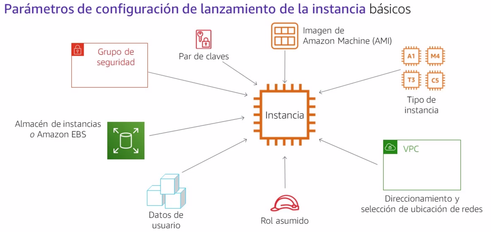{ width="720" }
<figcaption>AMI Quick Start al lanzar una instancia.</figcaption>
</figure>

!!! tip "Crear tu propia AMI (idea Foundations)"
    Cuando la instancia ya tiene el SO y el software «bien», puedes **Actions → Image and templates → Create image**. Así lanzas clones iguales sin reinstalar a mano. En el formulario conviene dejar el *reboot* para snapshot coherente.

<figure markdown="span">
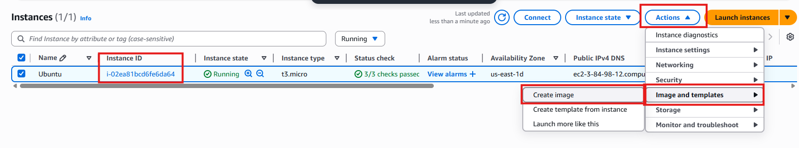{ width="720" }
<figcaption>Crear AMI desde una EC2 que ya está lista.</figcaption>
</figure>

<figure markdown="span">
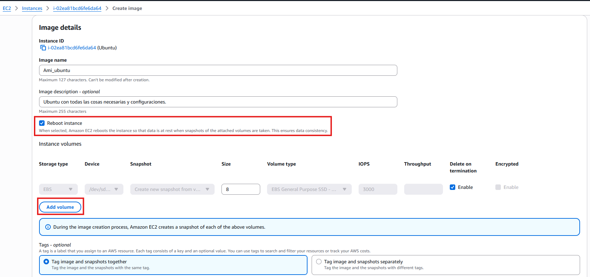{ width="720" }
<figcaption>Nombre de la AMI, reboot para consistencia y volúmenes incluidos.</figcaption>
</figure>

!!! note "Características EC2 (Foundations)"
    - Genera **máquinas virtuales** en la nube (web, correo, ficheros…).
    - El coste depende de RAM, vCPU, disco e IP pública estática.
    - Escalable: puedes cambiar tipo (con límites) según necesidad — y **apagando** cuando no hace falta.

Familias: propósito general, cómputo, memoria, almacenamiento, GPU. **Rightsizing:** no cojas `2xlarge` porque el tutorial lo traía. El modelo de **compra** (On-Demand, Savings Plans, Spot) no es una familia: Spot puede ser un `t3.micro` interrumpible.

<figure markdown="span">
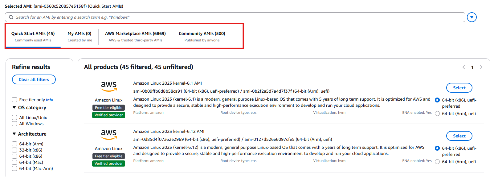{ width="720" }
<figcaption>Familia / tipo: plantilla de hardware, no el modelo de precio.</figcaption>
</figure>

!!! danger "Par de claves"
    Si generas tu propia clave, **descárgala en el momento**: es la única oportunidad. Si la pierdes, toca recrear la instancia (en Academy suele usarse `vockey` / labsuser.pem según el lab).

<figure markdown="span">
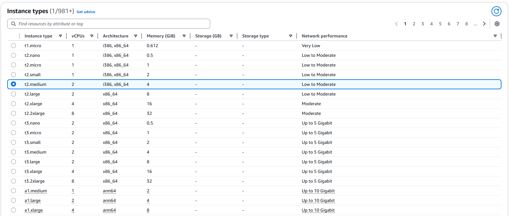{ width="640" }
<figcaption>Par de claves: sin `.pem` no entras por SSH.</figcaption>
</figure>

**Antes / después.** Antes: un `t3.large` 24/7 «porque así va holgado» para una API de prácticas con pico a las 11:00. Después: tipo más pequeño, apagado fuera de horario (o ASG a cero) y, si el workload es un cron, valorar Lambda. El ahorro no es magia: es dejar de pagar ociosidad.

### Lambda

**[AWS Lambda](#lambda)** ejecuta una **función** ante un evento (HTTP vía API Gateway, cola, cron). No gestionas SO. Pagas invocaciones y GB-segundo. Límites de tiempo y tamaño de paquete. Es *serverless* en el sentido de que no hay una VM que mantengas encendida: el proveedor arranca tu código cuando llega el evento.

Encaja: webhooks, miniaturas, workers cortos. No encaja: procesos de horas, estado en memoria de proceso, un `listen(3000)` eterno. El *cold start* existe: un front que espera 10 ms no es el mismo caso que un batch nocturno.

**Cuándo NO usar Lambda.** WebSockets largos, jobs de vídeo de 2 h, o una app que necesita librerías nativas enormes y SSH al host para depurar. En esos casos EC2 o contenedores suelen ser la hipótesis seria; «serverless» no es sinónimo de «mejor».

### Contenedores

Si ya empaquetas la API en **Docker** en clase, el siguiente paso en AWS es *dónde* corre ese contenedor. No es lo mismo orquestar con el servicio nativo de AWS, con Kubernetes gestionado, o sin nodos que parchear ([Fargate](#fargate)). La tabla resume el trade-off; el criterio de DAW es: ¿necesito SSH al host, portabilidad K8s, o solo «correr el contenedor»?

| Servicio | Idea | Trade-off |
| --- | --- | --- |
| **[ECS](#ecs)** | Orquestación AWS | Menos portable, menos operación que K8s |
| **EKS** | Kubernetes gestionado | Más control, más superficie |
| **Fargate** | Compute serverless para contenedores | No parcheas el nodo; menos «SSH al host» |

No desplegamos un cluster de producción. Sí debes poder decir: «esta API ya va en Docker en clase → ECS/Fargate; este script de 20 s → Lambda; este legado con licencia de SO → EC2».

<figure markdown="span">
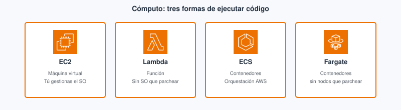{ width="800" }
<figcaption>Misma carga, distinto nivel de operación: VM, función o contenedor (con o sin nodos).</figcaption>
</figure>

En EC2 el camino de Foundations es el de siempre: lanzar en una AZ, SG y conectar. En Lambda no hay `listen`: editas el handler, **Deploy** y **Test**.

<figure markdown="span">
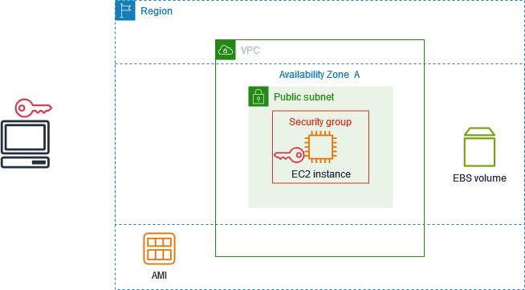{ width="800" }
<figcaption>Flujo Get started de EC2. Fuente: Amazon EC2 User Guide (AWS).</figcaption>
</figure>

<figure markdown="span">
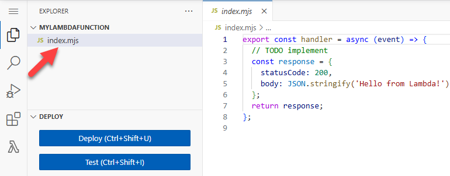{ width="800" }
<figcaption>Editor de la función: Deploy / Test en la propia consola. Fuente: AWS Lambda Developer Guide (AWS).</figcaption>
</figure>

<figure markdown="span">
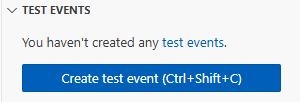{ width="800" }
<figcaption>Evento de prueba: invocas sin montar API Gateway todavía. Fuente: AWS Lambda Developer Guide (AWS).</figcaption>
</figure>

**Elastic Beanstalk** (subes código, PaaS), **Lightsail** (VPS simplificado): una línea cada uno.

### Errores frecuentes (cómputo)

- Dejar la instancia del lab encendida el fin de semana.
- Elegir Spot para el checkout o para una demo en clase que no tolera interrupción.
- Meter en Lambda una API Express «tal cual» con estado en memoria y puerto fijo.
- Montar EKS «porque Kubernetes mola» para un único contenedor de prácticas (sobreingeniería).

### Relación con red y almacenamiento

EC2 sin VPC/SG claros (Tema 3) es un servidor expuesto. El disco de la VM es EBS (Tema 5); los uploads compartidos no se improvisan en el root de la instancia. El ASG (Tema 8) escala **grupos** de EC2, no sustituye elegir bien el tipo.

---

## Bloque Ampliación Practitioner (CLF-C02)

Tipo de instancia ≠ modelo de precio. EC2 / Lambda / ECS·Fargate / EKS: elige por estado, duración y operación.

!!! tip "Para el CLF"
    Spot no es un `t3.micro`. SageMaker/Rekognition no son «un tipo de EC2». Auto Scaling escala **grupos**, no es un tipo.

    Ampliación y **autocheck certificación** → [Certificación § Tema 4](../99-certificacion/certificacion.md#tema-4).

---

## Videotutorial

**Principal (Foundations).** [ATTA AWS Academy 03 EC2 Linux](https://www.youtube.com/watch?v=vdSKZxOVX1A) (~25 min).

<iframe src="https://www.youtube.com/embed/vdSKZxOVX1A" title="ATTA AWS Academy 03 EC2 Linux — Profe Santos Cloud" style="width:100%;max-width:840px;aspect-ratio:16/9;border:0;display:block;margin:0.8em auto" allow="accelerometer;clipboard-write;encrypted-media;gyroscope;picture-in-picture" allowfullscreen loading="lazy"></iframe>

Vídeo: Profe Santos Cloud (YouTube). Qué mirar: AMI, tipo pequeño, SG y cómo apagar/terminar; eso es lo que facturas en el lab.

**Extra (opcional).** [Lambda 101](https://www.youtube.com/watch?v=TIeUbq4bCOU) (~14 min) — contraste serverless frente a EC2 24/7. Vídeo: Profe Santos Cloud (YouTube).

**Extra.** [Creación y gestión de EC2](https://www.youtube.com/watch?v=ts9izrtvrqg) — lanzar instancia: AMI, tipo, par de claves y acceso.

<iframe src="https://www.youtube.com/embed/ts9izrtvrqg" title="Creación y gestión de EC2" style="width:100%;max-width:840px;aspect-ratio:16/9;border:0;display:block;margin:0.8em auto" allow="accelerometer;clipboard-write;encrypted-media;gyroscope;picture-in-picture" allowfullscreen loading="lazy"></iframe>

<figure markdown="span">
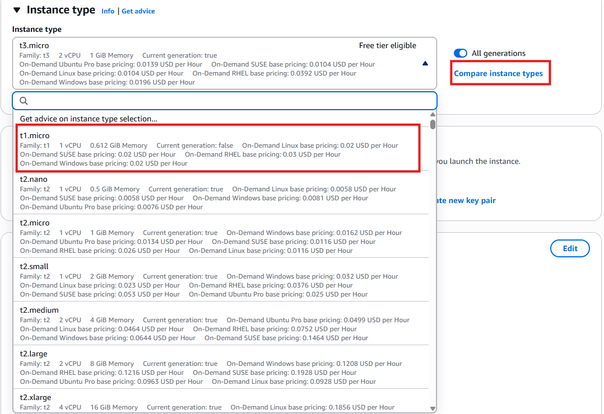{ width="640" }
<figcaption>Par de claves al lanzar la instancia.</figcaption>
</figure>

<figure markdown="span">
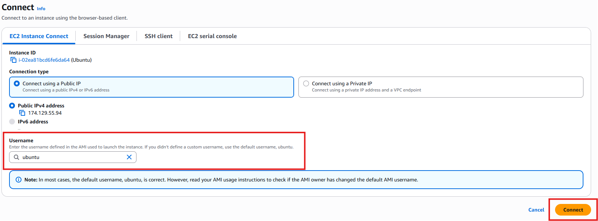{ width="720" }
<figcaption>Conectar desde consola (Instance Connect): el usuario suele venir de la AMI (`ubuntu`, `ec2-user`…).</figcaption>
</figure>

<figure markdown="span">
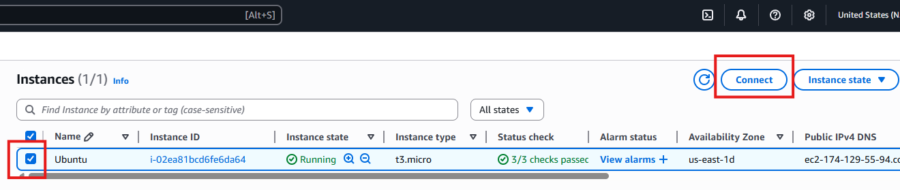{ width="640" }
<figcaption>Instancia en consola tras el lanzamiento.</figcaption>
</figure>

El M6 del LMS Academy se indica en clase / Aules.

---

## Actividad / práctica

**PR401 — Lanzar y comparar cómputo** (RA3 d, f)

1. Lab Academy M6 (EC2 / AMI).
2. En el `.md`: ¿este workload seguiría igual de bien en **Lambda**? Estado, tiempo, puerto persistente, coste 24/7.
3. **Termina** las instancias. Captura de la lista vacía o parada.

**Checklist de lab.** AMI/región del enunciado → tipo pequeño → SG mínimo → evidencias → **terminate**. Si comparas con Lambda, escribe en el `.md` *estado*, *duración* y *coste 24/7*, no solo el logo.

---

### Despliegue: de `npm start` al servicio

En clase `node server.js` abre el puerto 3000 en tu máquina. En EC2 necesitas AMI, SG, IP/ALB y un proceso que sobreviva al logout (systemd, PM2…). En Lambda no hay `listen`: exportas un handler y API Gateway (u otro evento) invoca. En ECS/Fargate empaquetas la misma idea de proceso en una imagen y defines CPU/memoria del *task*.

El criterio de DAW no es «cuál es más moderno», sino **estado**, **duración**, **operación** y **coste**. Anótalo en el entregable PR401 aunque el lab solo te haga lanzar EC2.

---

## Autocheck del tema

Comprueba cómputo de esta quincena. CLF: [Certificación § Tema 4](../99-certificacion/certificacion.md#tema-4).

1. Una **AMI** es…  
   a) la instancia encendida · b) la plantilla para lanzar instancias · c) un tipo de precio
2. **V/F.** Spot es un tipo de instancia (`t3.micro`).
3. Un cron de 30 s cada hora: hipótesis más razonable en Foundations…  
   a) EC2 24/7 · b) Lambda · c) EKS obligatorio
4. **V/F.** Con Fargate administras tú el SO de cada nodo EC2 del clúster.
5. Empareja: **EC2** · **Lambda** · **ECS+Fargate** con: (a) handler sin `listen` · (b) SSH y SO custom · (c) contenedor sin gestionar nodos

Soluciones

1. **b**.

2. **Falso** — Spot es **modelo de precio**, no familia/tipo.

3. **b** (evento corto; EC2 24/7 suele sobrar).

4. **Falso** — Fargate quita la gestión del nodo.

5. EC2→(b); Lambda→(a); ECS+Fargate→(c).

---

## Glosario

**EC2**{: #ec2}
*Elastic Compute Cloud*: servicio de máquinas virtuales en AWS. Tú eliges AMI, tipo, red y almacenamiento; sueles parchear el sistema operativo. Es el análogo más cercano a «tengo un Linux donde instalo Node/Java», con factura por tiempo de vida de la instancia.

**AMI**{: #ami}
*Amazon Machine Image*: plantilla (SO + software) a partir de la cual se lanzan instancias EC2. No es la instancia en ejecución. Si la «buena» AMI solo vive en el disco de un compañero, el despliegue no es repetible.

**Lambda**{: #lambda}
Servicio de funciones *serverless*: ejecuta código ante eventos sin mantener una VM. Se factura por invocaciones y duración. Encaja en workers cortos y webhooks; no sustituye automáticamente a una API con estado persistente en proceso.

**ECS**{: #ecs}
*Elastic Container Service*: orquestación de contenedores gestionada por AWS (propia, no Kubernetes). Útil si ya empaquetas la API en Docker y quieres quedarte en el ecosistema AWS sin montar un clúster K8s.

**Fargate**{: #fargate}
Modo de ejecución de contenedores en el que AWS gestiona los nodos: no administras el SO del host. Menos SSH y menos parches de nodo; a cambio, menos control del «hierro» subyacente.

