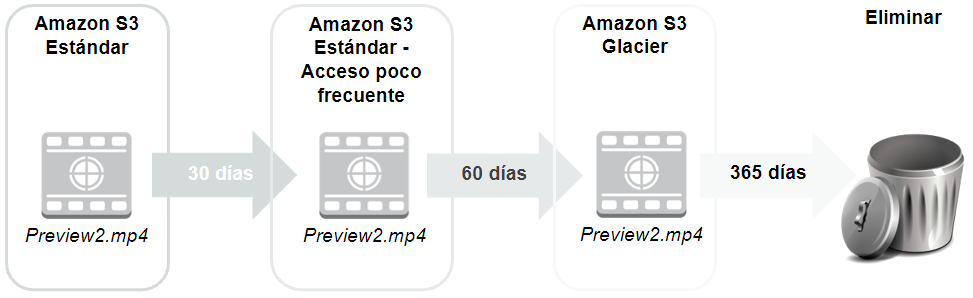
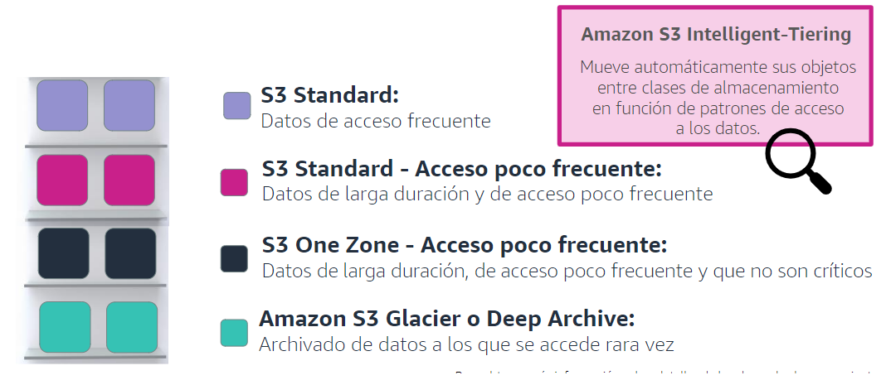
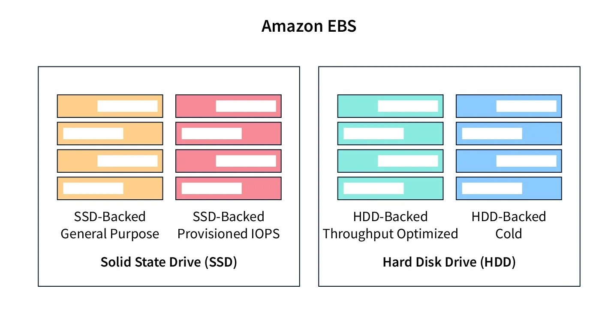
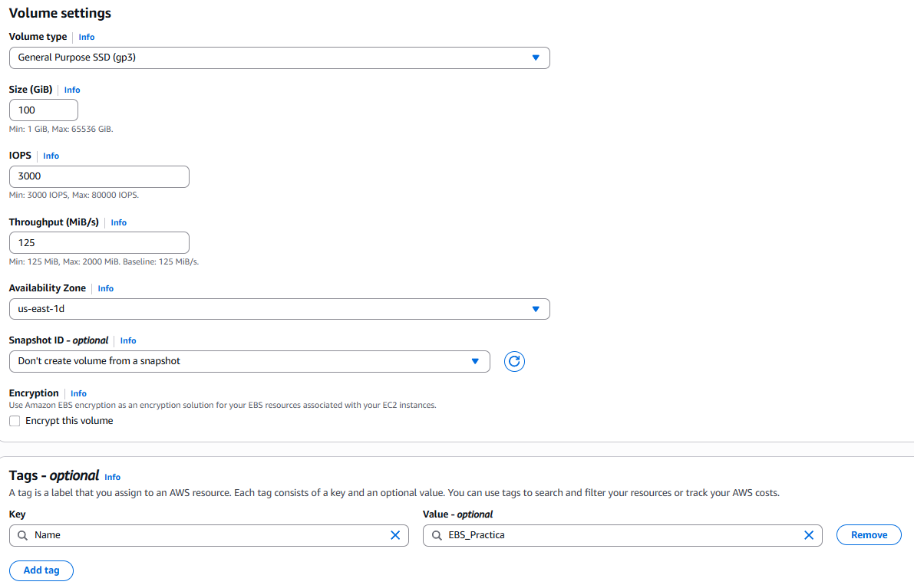
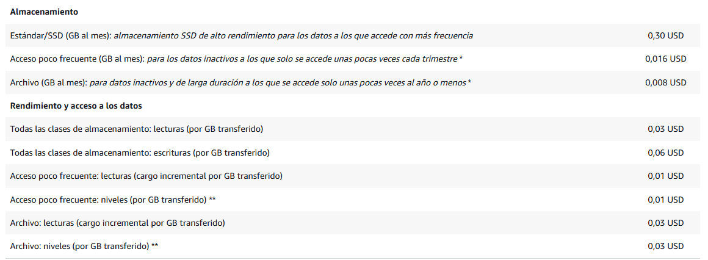
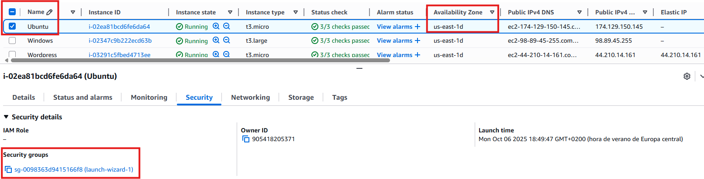
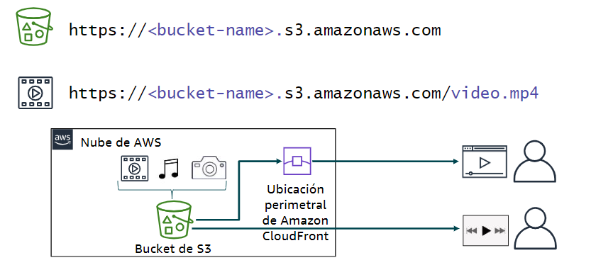
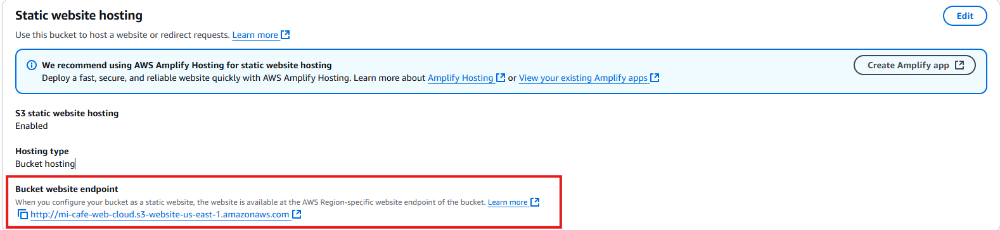

# Tema 5. Almacenamiento

En una app web hay **tres** estilos de almacenamiento que conviene no mezclar: el disco de la máquina virtual, una carpeta de red compartida y un **objeto** al que se llega por HTTP (*Hypertext Transfer Protocol*, protocolo de transferencia de hipertexto). Subir el `uploads/` de Express a [S3](#s3) (*Simple Storage Service*, servicio simple de almacenamiento) no es lo mismo que montar un volumen [EBS](#ebs) (*Elastic Block Store*, almacenamiento de bloques elástico) en la [EC2](../04-computo-serverless/tema4.md#ec2) (*Elastic Compute Cloud*, nube elástica de cómputo). Este tema corresponde al **Módulo 7** de *AWS Academy Cloud Foundations*. Los términos clave están en el [glosario](#glosario).

!!! tip "Al empezar"
    Empieza por el [cuestionario inicial](#cuestionario-inicial). Si tu API ya corre en EC2 o Lambda, aquí decides **dónde viven los ficheros** y qué pasa si borras la instancia.

## Propuesta didáctica

> **RA4.** *Gestiona servicios de almacenamiento y bases de datos en la nube, seleccionando tecnologías adecuadas para casos específicos, y diseña arquitecturas escalables y resilientes utilizando herramientas de monitoreo y optimización para mejorar el rendimiento.*

### Criterios de evaluación (RA4)

* **a)** Se ha realizado la diferenciación entre tecnologías de almacenamiento en la nube.
* **c)** Se ha trabajado en la resolución de problemas prácticos sobre almacenamiento y bases de datos.

Bases de datos: Tema 6.

### Contenidos

* Objeto ([S3](#s3)), bloque ([EBS](#ebs)), fichero ([EFS](#efs) / [FSx](#fsx)).
* Clases S3, ciclo de vida, versionado, *Block Public Access*.
* Instantáneas, *instance store*, copia de seguridad y movimiento de datos (Snow, Gateway, DataSync).

### Programación de aula (orientativa)

| Quincena | En tutoría | Trabajo autónomo / evidencias |
| --- | --- | --- |
| **Q7** | S3 vs EBS/EFS + ciclo de vida | **PR501**; Autocheck del tema |

---

## Cuestionario inicial

!!! question "Responde con lo que sepas"
    1. ¿**S3** es el disco del sistema operativo (**SO**) de la EC2, o un almacén de **objetos** por API (*Application Programming Interface*, interfaz de programación de aplicaciones) / HTTP?
    2. ¿Cuándo usarías **EBS** frente a subir ficheros a un *bucket*?
    3. Dos EC2 en **AZ** distintas (*Availability Zone*, zona de disponibilidad) necesitan la **misma carpeta** montada: ¿EBS o **EFS** (*Elastic File System*, sistema de ficheros elástico)?
    4. Si terminas la instancia, ¿qué suele pasar con los datos solo en el disco raíz si no hiciste instantánea?
    5. ¿Por qué la **transferencia de datos de salida** (lo que AWS llama *egress*) puede disparar la factura aunque el almacenamiento «parezca barato»?

Este cuestionario es solo para ti: te ayuda a ver qué dominas ya y qué te falta antes o mientras lees el tema. No se entrega en Aules; respóndelo con lo que sepas y, cuando quieras contrastar, abre el bloque **Soluciones (autoevaluación)** debajo o el índice en [Soluciones](../90-soluciones/soluciones.md).

Soluciones (autoevaluación)

1. **S3** es almacén de **objetos** (API/HTTP), no el disco del SO de la EC2.

2. **EBS** cuando el SO o la app necesitan un **volumen de bloque** montado en esa máquina virtual (disco del sistema, datos de una sola instancia).

3. **EFS** (fichero de red montable en varias EC2). EBS es de una instancia (salvo patrones avanzados fuera de este módulo).

4. Los datos del disco raíz **se pierden** al *terminate* si no hay instantánea o AMI (*Amazon Machine Image*, imagen de máquina de Amazon) que los preserve (salvo volúmenes que el enunciado diga conservar).

5. La **salida de datos** factura el tráfico que sale hacia internet o hacia los clientes; un *bucket* «barato» sirviendo mucho sin **CDN** (*Content Delivery Network*, red de distribución de contenidos) puede salir caro en red.

---

## Bloque Foundations (Módulo 7)

Antes de memorizar logos, fija el **estilo de acceso**. En un proyecto de DAW decides tres cosas distintas: ¿guardo un fichero con una URL o una API (foto de perfil, ZIP, front estático)? ¿necesito un disco que el SO vea como dispositivo de bloque (sistema de la máquina virtual, logs locales)? ¿varias instancias deben montar la **misma** carpeta a la vez (`uploads/` compartido entre dos nodos detrás del balanceador)? Esas tres preguntas apuntan a [almacenamiento de objetos](#almacenamiento-de-objetos), [de bloques](#almacenamiento-de-bloques) o [de archivos](#almacenamiento-de-archivos), y casi nunca al mismo servicio.

| Estilo | Unidad | Servicio | Cómo se accede | ¿Se comparte entre instancias? | Ámbito típico | Caso del proyecto de DAW |
| --- | --- | --- | --- | --- | --- | --- |
| **Objeto** | Objeto + metadatos | **S3** | API / SDK (*Software Development Kit*, kit de desarrollo) / HTTP (no se monta como disco) | Sí: todas las instancias hablan del mismo *bucket* | Región | Fotos de usuario, front estático, copias de seguridad de la base de datos (**BD**) exportadas |
| **Bloque** | Volumen | **EBS** | Montado en el SO de **una** EC2 | No (una instancia; misma AZ) | Una AZ | Disco del sistema, *swap*, datos locales de esa máquina virtual |
| **Archivo** | Ficheros **NFS** / **SMB** (*Network File System* / *Server Message Block*, sistemas de ficheros en red) | **EFS**, **FSx** | Carpeta de red montada | Sí (varias EC2 a la vez) | Región (varias AZ) | `uploads/` compartido si aún no pasaste a S3 |

<figure markdown="span">
{ width="720" }
<figcaption>Bloque / fichero / objeto: elige por cómo accede la app.</figcaption>
</figure>

!!! tip "Ventajas por estilo (resumen)"
    - **Bloque (EBS):** rendimiento de disco para una máquina virtual; el SO lo trata como volumen local.
    - **Objeto (S3):** integración por API y suele encajar mejor para ficheros servidos por HTTP y front estático.
    - **Archivo (EFS):** varias EC2 montan la misma carpeta sin montar una sincronización a mano.

<figure markdown="span">
{ width="800" }
<figcaption>Tres estilos de acceso: API de objetos, disco de la máquina virtual o carpeta NFS compartida.</figcaption>
</figure>

Si guardas las fotos de perfil en `public/uploads` dentro de la EC2, se pierden al terminar la instancia y no escalan a dos nodos detrás del **ALB** (*Application Load Balancer*, balanceador de carga de aplicaciones): cada máquina tiene su disco. Con subida por SDK a S3 y URL firmada o CloudFront, el código deja de tratar el disco local como almacén duradero de usuario. Ese cambio es el que más veces falla en un proyecto intermodular cuando «en mi instancia sí se veía la foto».

| Examen **CLF** (*AWS Certified Cloud Practitioner*, CLF-C02) | Clase DAW / empresa |
| --- | --- |
| Hay que distinguir almacenamiento de objetos, de bloques y de ficheros. | En el proyecto decides dónde van las fotos, el disco de la máquina virtual y un `uploads/` compartido. |
| S3 no es el disco del sistema operativo. | No montes S3 como si fuera el directorio de datos de MySQL (`/var/lib/mysql`). |
| Un volumen EBS vive en una AZ; EFS sirve a varias EC2. | Dibuja el **ASG** (*Auto Scaling group*, grupo de autoescalado) antes de elegir una carpeta solo en el disco local. |

### Amazon S3

**Qué es en este caso.** **[Amazon S3](#s3)** es [almacenamiento de objetos](#almacenamiento-de-objetos): guardas bytes con una **[clave](#clave-s3)** (*key*) dentro de un **[bucket](#bucket)** (contenedor con nombre único a escala global), y hablas con él por API o SDK (o [URL prefirmada](#url-prefirmada)), no como si fuera la unidad `C:` o un `/mnt` con rutas y permisos de fichero al estilo Unix (**POSIX**: la app espera rutas, propietarios y permisos de archivo como en Linux). Cada **[objeto](#objeto)** lleva datos y metadatos. El *bucket* vive en una **región**; no «montas» S3 en el SO de la EC2 en el sentido Foundations.

**En la práctica.** En un proyecto de DAW el controlador recibe el fichero en una petición *multipart/form-data* (el formulario envía el archivo junto con el resto de campos), el SDK hace `PutObject`, y la BD solo guarda la clave o la URL. El navegador no necesita NFS. Si mañana hay dos instancias detrás del ALB, **ambas** hablan con el mismo *bucket*: no hay divergencia de `uploads/` locales. El front estático (HTML, JS, CSS) también puede vivir en S3 y servirse con CloudFront (Tema 3). Los *dumps* de la base o los logs rotados que ya no caben en el disco de la máquina virtual suelen ir a S3 como objetos.

Según la documentación de AWS, S3 está diseñado para una **durabilidad** muy alta de los objetos (el documento oficial habla de once nueves, 99,999999999 %). Eso no es lo mismo que **disponibilidad** inmediata en todas las clases: Glacier y clases frías cambian el tiempo y el coste de **recuperar** el objeto, no «borran» la promesa de no perderlo.

<figure markdown="span">
{ width="640" }
<figcaption>Clases y ciclo de vida: Standard es lo habitual; Glacier no es «disco barato con acceso inmediato».</figcaption>
</figure>

#### Clases de almacenamiento y ciclo de vida

Una **[clase de almacenamiento](#clase-de-almacenamiento)** dice, a grandes rasgos, **con qué frecuencia** esperas leer el objeto y **cuánto te cuesta** (o cuánto tarda) recuperarlo. No memorices céntimos: entiende el equilibrio entre frecuencia de acceso y coste (o tiempo) de recuperación.

- **[S3 Standard](#s3-standard).** Acceso frecuente. Es la clase por defecto de las fotos que se muestran en la app y del front que se abre cada día.
- **[S3 Standard-IA](#s3-standard-ia)** (*Infrequent Access*, acceso poco frecuente). Objetos que se guardan mucho tiempo y se leen de vez en cuando. Suele haber un coste por recuperación: no conviene si lees el mismo objeto a cada rato.
- **[S3 Intelligent-Tiering](#s3-intelligent-tiering).** AWS mueve el objeto entre capas según el patrón de acceso. Encaja cuando no quieres decidir a mano qué es «frío».
- **[Amazon S3 Glacier](#glacier)** (y variantes de archivo). Archivo a largo plazo: copias de seguridad que casi no abres. Recuperar puede llevar minutos u horas según la opción; no sirve para servir la foto del perfil en la página de login.

El **[ciclo de vida](#ciclo-de-vida)** (*lifecycle*) es el conjunto de reglas que, pasado un tiempo, cambian de clase o expiran objetos y versiones. Sirve para enfriar lo que nadie pide y para no dejar versiones viejas creciendo sin tope. En Foundations reconoces el mecanismo; en un *bucket* de prácticas sin reglas, el «todo lo dejo en Standard por si acaso» acumula coste de almacenamiento.

Tras un `PutObject` correcto, una lectura inmediata del mismo objeto debe ver los datos nuevos: S3 ofrece consistencia fuerte de lectura tras escritura. En clase no hace falta «esperar unos segundos» a que se propague el objeto.

<figure markdown="span">
{ width="800" }
<figcaption>Lectura tras escritura en el mismo objeto. Fuente: Amazon S3 User Guide (AWS).</figcaption>
</figure>

Web estática en S3 (HTML/JS): patrón útil para una **SPA** (*Single Page Application*, aplicación de una sola página). La API sigue en otro sitio (API Gateway + Lambda, o EC2). No es un **CMS** (gestor de contenidos).

#### Versionado y borrados (por qué importa en un proyecto de DAW)

Imagina que en el *bucket* de fotos del proyecto alguien sobrescribe `avatar/user-42.jpg` con un fichero vacío o borra la clave «para limpiar». Sin **[versionado](#versionado)**, esa versión buena puede haberse ido. Con versionado activado, S3 conserva versiones anteriores: un `delete` suele crear un *delete marker* en lugar de destruir del todo el historial, y puedes recuperar la versión previa. Eso salva un borrado accidental en prácticas y también en un proyecto intermodular cuando un script de despliegue pisa objetos.

Tenerlo activado **cuesta** almacenamiento: cada versión y cada marcador ocupan (y facturan) hasta que una regla de ciclo de vida expire lo viejo. Sin *lifecycle*, el *bucket* de «pruebas» crece sin control aunque «casi no subas nada nuevo». En Foundations basta reconocer el mecanismo y lo que ganas (recuperación) frente a lo que pagas (espacio de residuales).

#### Seguridad en S3 (enlace con el Tema 2)

**[Block Public Access](#block-public-access)** (*bloqueo de acceso público*) está pensado para que, por defecto, el *bucket* **no** sea público. Un 403 al abrir la URL del objeto con BPA (*Block Public Access*) activo es el resultado **correcto** si el objeto no debe verse en abierto: no es un «fallo del lab».

La **[política de bucket](#politica-de-bucket)** es un documento JSON adjunto al *bucket* que permite o deniega acciones sobre ese recurso (como las [políticas](../02-seguridad-iam/tema2.md#politica) IAM del Tema 2, pero ancladas al *bucket*). IAM decide **quién** (usuario, rol); la política de bucket decide **qué se puede hacer sobre este *bucket***. Ambas se evalúan juntas: un *deny* explícito gana.

Para servir una **foto privada** sin abrir el *bucket* al mundo, la forma correcta es una **[URL prefirmada](#url-prefirmada)** (*presigned URL*): la API (con un rol IAM) genera un enlace con caducidad; el navegador descarga un rato y el enlace caduca. CloudFront con origen restringido es la variante a escala. Abrir el *bucket* «para que se vea el lab» es la misma mala práctica que viste en el Tema 2 con *buckets* públicos.

**Cuándo no usar S3 como «disco».** No montes S3 como si fuera `/var/lib/mysql` ni esperes bloqueos POSIX de fichero para una base embebida. Tampoco abras el *bucket* al mundo para la demo: usa URLs prefirmadas o un origen CloudFront con política clara.

Si el acceso a S3 sale «por internet» desde una EC2 en **VPC** (*Virtual Private Cloud*, nube virtual privada) privada, en arquitecturas avanzadas aparece el *endpoint* / PrivateLink. Nivel Foundations: entiende que S3 es un servicio **regional** con API, no un disco montado.

<figure markdown="span">
{ width="800" }
<figcaption>Acceso a S3 desde una VPC (patrón de la guía de consola). Fuente: AWS Management Console Getting Started Guide (AWS).</figcaption>
</figure>

<figure markdown="span">
{ width="640" }
<figcaption>Acceso a objetos: política y Block Public Access van juntos.</figcaption>
</figure>

### Amazon EBS

**Qué es en este caso.** **[Amazon EBS](#ebs)** es el [almacenamiento de bloques](#almacenamiento-de-bloques) de una instancia EC2: un **[volumen](#volumen-ebs)** que el SO monta como disco. El volumen vive en **una** AZ (ver [Tema 3](../03-redes-entrega-contenido/tema3.md)). Por eso el volumen y la instancia tienen que estar en la **misma AZ**: si no, no puedes adjuntarlo. Los tipos habituales en Foundations son **[gp3](#gp3)** (propósito general, buen equilibrio) e **[io2](#io2)** (más [IOPS](#iops) —*Input/Output Operations Per Second*, operaciones de entrada/salida por segundo— cuando la carga de disco lo exige).

**En la práctica.** El disco raíz de la EC2 donde corre tu API Node o PHP es EBS. Ahí viven el SO (que **tú** parcheas), el entorno de ejecución (Node, PHP…) y, si no has sacado las fotos a S3, los ficheros locales. Si terminas la instancia y no hay instantánea ni volumen conservado, esos datos locales desaparecen con el diseño habitual del lab. Un volumen huérfano que dejas tras *terminate* **sigue facturando**: hay que borrarlo o asociarlo a otra instancia.

<figure markdown="span">
{ width="720" }
<figcaption>EBS: volumen de bloque ligado a EC2 (misma AZ).</figcaption>
</figure>

!!! success "Ventajas EBS"
    - Replicación dentro de la AZ; el volumen puede persistir aunque pares la instancia (según configuración).
    - Cifrado sencillo; se puede **aumentar** el tamaño (no reducir).
    - Un volumen EBS solo se asocia a una instancia de **su misma AZ** (multi-attach avanzado queda fuera de Foundations).

<figure markdown="span">
{ width="720" }
<figcaption>Volumen EBS: tipo, GiB, IOPS y **misma AZ** que la instancia a la que lo vas a asociar.</figcaption>
</figure>

La **[instantánea](#instantanea)** (*snapshot*) es una copia del volumen en un momento concreto, almacenada de forma durable (el servicio la respalda hacia S3). Sirve para recuperar el volumen o crear uno nuevo a partir de ese punto. No sustituye un plan de copia de seguridad de la aplicación: si MySQL estaba a medias de una escritura, la copia refleja ese estado. Antes de una instantánea crítica, conviene un estado coherente de la app (o aceptas el riesgo).

**[Instance store](#instance-store)** es disco local del host físico: puede ser rápido, pero es **efímero**. Si paras o terminas la instancia, esos datos no están pensados como almacén durable. No guardes ahí la única copia de un entregable o de un *dump* de la BD.

| Examen CLF | Clase DAW / empresa |
| --- | --- |
| Un volumen EBS vive en una AZ y se adjunta a una instancia de esa misma AZ. | En el lab creas el volumen en la AZ de la EC2 que vas a usar. |
| La instantánea es una copia del volumen, no un plan completo de copia de seguridad de la aplicación. | Haz la instantánea con la app en estado coherente, o acepta el riesgo de datos a medias. |
| El *instance store* es efímero. | No uses *instance store* como única copia de un entregable o de un *dump*. |

### EFS, FSx y movimiento de datos

**Qué es en este caso — EFS.** **[Amazon EFS](#efs)** (*Elastic File System*, sistema de ficheros elástico) es [almacenamiento de archivos](#almacenamiento-de-archivos) gestionado con **[NFS](#nfs)** (*Network File System*, sistema de ficheros en red): **varias** EC2 pueden montar el mismo directorio a la vez, incluso en AZ distintas de la región.

**En la práctica — EFS.** Encaja si tienes dos instancias detrás del ALB y aún quieres un `uploads/` montado como carpeta compartida. No sustituye a S3 cuando el objetivo es servir objetos por HTTP a escala web (CDN, URLs, políticas de *bucket*). EFS encaja bien cuando la app espera rutas y permisos de fichero de tipo Unix (POSIX) y varios procesos escriben en la misma jerarquía de ficheros.

<figure markdown="span">
{ width="720" }
<figcaption>EFS: carpeta compartida entre EC2.</figcaption>
</figure>

!!! note "Características EFS (resumen)"
    - NFS gestionado; crece y decrece sin tener que dimensionar de antemano un disco de tamaño fijo.
    - Varias EC2 (incluso en AZ distintas de la región) montan el **mismo** sistema de ficheros.
    - Encaja en `uploads/` compartidos; no sustituye a S3 para objetos servidos por HTTP a escala.

<figure markdown="span">
{ width="720" }
<figcaption>Varias instancias montan el mismo EFS (idea de práctica).</figcaption>
</figure>

**Qué es en este caso — FSx.** **[Amazon FSx](#fsx)** agrupa sistemas de ficheros gestionados para cargas que necesitan **Windows** ([SMB](#smb)), **Lustre** (alto rendimiento) u otras variantes (NetApp…). En el CLF basta reconocer el nombre y el caso: «necesito un servidor de ficheros Windows en AWS» → FSx; no montes un EBS compartido a mano como si fuera esa solución.

**En la práctica — FSx.** En un proyecto de DAW en Linux con Node suele bastar S3 o EFS. FSx aparece cuando el enunciado o el cliente arrastra un entorno Windows o un software que exige ese protocolo.

**Storage Gateway**, la familia **[Snow](#snow-family)** (dispositivo físico para mover muchos terabytes sin depender solo de la red), **AWS Backup** y **[DataSync](#datasync)** sirven para reconocer *cuándo* una **VPN** (red privada virtual, *virtual private network*) no basta para migrar un **CPD** (centro de proceso de datos) grande: Gateway acerca un «disco o fichero» híbrido; Snow mueve datos por envío físico; DataSync automatiza copias entre almacenes en tus propias instalaciones (*on-premises*) y AWS.

### Errores frecuentes (almacenamiento)

Si dejas los *uploads* solo en el EBS de una instancia detrás de un ASG, cada nodo ve un disco distinto. El usuario sube la foto en la instancia A y la descarga llega a la B, que no tiene el fichero. En su lugar sube a S3 (o monta EFS si aún necesitas carpeta compartida) y guarda en la BD solo la clave.

Otra confusión habitual es tratar Glacier como «barato y al momento». El coste y el tiempo de **recuperación** no son los de Standard: la página de login no puede esperar una restauración de archivo. Deja en clase caliente lo que se lee en la app y archiva solo lo que casi no abres.

Si mides solo GB-mes y olvidas la **salida de datos**, servir muchos GB desde el *bucket* hacia internet factura transferencia aunque el almacenamiento parezca barato. Estima el tráfico (Pricing Calculator), pon CloudFront delante de los estáticos y no abras descargas masivas sin CDN.

Tras un *terminate*, un volumen EBS huérfano **sigue facturando** aunque nadie lo monte. Al cerrar el lab, borra volúmenes e instantáneas en el orden que marque el enunciado.

Abrir el *bucket* al mundo «para la demo» permite que cualquiera liste o descargue objetos y contradice Block Public Access y el Tema 2. Sirve la foto con URL prefirmada o con CloudFront y origen privado.

### Relación con otros temas

S3 + CloudFront (Tema 3) para estáticos. EBS nace con EC2 (Tema 4): sin AZ y security group claros no hay volumen usable. Las bases de datos (Tema 6) no se sustituyen por un bucket: el bucket guarda objetos, no transacciones SQL. IAM (Tema 2) decide quién puede hacer `s3:GetObject` o adjuntar un volumen.

### El lab del Módulo 7: Ejercicio de laboratorio 4 — Trabajo con EBS

En tu clase de *Cloud Foundations*, el lab del **Módulo 7** se llama **Ejercicio de laboratorio 4 — Trabajo con EBS**. Trabajas en la **región que indique el lab**. El hilo es de **bloque**, no de S3: creas un volumen, lo adjuntas a una EC2, le das formato, lo montas, y practicas crear y restaurar una **instantánea**.

Primero **creas el volumen** en la **misma AZ** que la instancia a la que lo vas a asociar. Si eliges otra AZ, el adjunto falla: el volumen EBS no cruza zonas. Eliges tipo (a menudo gp3) y tamaño según el enunciado.

Después **adjuntas** el volumen a la instancia. Hasta aquí AWS ha conectado el dispositivo; el sistema operativo aún no tiene un sistema de ficheros usable en ese disco.

Luego **das formato** (creas el sistema de ficheros en el dispositivo) y **montas** el volumen en una ruta del SO. Sin formato, el SO no puede tratar el volumen como carpeta con ficheros; sin montaje, el dispositivo existe pero no lo usas en una ruta. Ahí escribes datos de prueba para comprobar que el disco extra funciona aparte del disco raíz.

Por último **creas una instantánea** del volumen y **restauras** a partir de ella (nuevo volumen desde la instantánea, o el flujo que marque el lab). La instantánea sirve para recuperar un punto en el tiempo si borras datos o quieres clonar el volumen; no sustituye un plan de backup de aplicación completo, pero en Foundations es la pieza que debes saber explicar.

Respecto al patrón del proyecto de DAW (fotos en S3, disco de la máquina virtual en EBS, carpeta compartida en EFS), este lab **practica** EBS de verdad: AZ, formato, montaje e instantánea. **No** sustituye el diseño de *uploads* en S3: en el `.md` de **PR501** deja claro qué parte del mapa de almacenamiento has tocado y por qué el volumen no es el sitio donde escalar las fotos del usuario entre dos nodos.

---

## Bloque Ampliación Practitioner (CLF-C02)

El examen premia elegir el **estilo** de almacén (objeto, bloque o fichero) y no olvidar la **salida de datos** en la factura. Glacier es una clase o archivo de S3, no un disco del sistema operativo. Storage Gateway, Snow y DataSync aparecen como respuestas cuando el escenario describe migración masiva o híbrido, no cuando solo hay que subir una foto desde la API.

!!! tip "Para el CLF"
    S3 no sustituye el EBS del sistema operativo; EFS no es lo mismo que un volumen de una sola máquina virtual. Si sirves mucho tráfico desde un *bucket* sin CDN, el coste que dispara suele ser la salida de datos. Ampliación y **autocheck certificación** en [Certificación § Tema 5](../99-certificacion/certificacion.md#tema-5).

---

## Videotutorial

**Principal (Foundations).** [ATTA AWS Academy 02 S3](https://www.youtube.com/watch?v=OkGNAHtVCq8) (~12 min).

<iframe src="https://www.youtube.com/embed/OkGNAHtVCq8" title="ATTA AWS Academy 02 S3 — Profe Santos Cloud" style="width:100%;max-width:840px;aspect-ratio:16/9;border:0;display:block;margin:0.8em auto" allow="accelerometer;clipboard-write;encrypted-media;gyroscope;picture-in-picture" allowfullscreen loading="lazy"></iframe>

Vídeo: Profe Santos Cloud (YouTube). Qué mirar: subida de objeto y *Block Public Access*; el 403 demuestra que el bloqueo funciona, no es un fallo del lab.

**Extra (opcional).** [S3 Static Web](https://www.youtube.com/watch?v=GMsD5XIfRLc) (~8 min) — hosting estático mínimo. Vídeo: Profe Santos Cloud (YouTube).

**Extra.** [Web estática en S3](https://www.youtube.com/watch?v=HTmkUgp3XdY) — bucket, *static website hosting* y prueba del endpoint.

<iframe src="https://www.youtube.com/embed/HTmkUgp3XdY" title="Web estática en S3" style="width:100%;max-width:840px;aspect-ratio:16/9;border:0;display:block;margin:0.8em auto" allow="accelerometer;clipboard-write;encrypted-media;gyroscope;picture-in-picture" allowfullscreen loading="lazy"></iframe>

<figure markdown="span">
{ width="640" }
<figcaption>Trabajo con buckets S3 en consola.</figcaption>
</figure>

<figure markdown="span">
{ width="640" }
<figcaption>Web estática sobre S3 (paso de práctica).</figcaption>
</figure>

---

## Actividad / práctica

### PR501 — Objetos y bloques

* :simple-neutralinojs: **PR501**. (RA4 // a, c // **PR 0–10**). Completas el lab Academy del Módulo 7 (**Ejercicio de laboratorio 4 — Trabajo con EBS**) y dejas claro, en el `.md`, la diferencia entre almacén de **bloques** (lo que has montado) y almacén de **objetos** (dónde irían las fotos de la API en un buen diseño).

  **Tareas:** crea el volumen en la misma AZ que la instancia; adjúntalo; dale formato y móntalo; crea y restaura una instantánea según el enunciado; en el desarrollo explica objeto frente a bloque (por qué las fotos del usuario no deberían vivir solo en ese volumen si mañana hay dos EC2); al terminar, elimina los recursos del lab.

  **Entrega:** según [Cómo entregar las prácticas](../index.md#entrega) — fichero `PR501.md` (o ZIP + `img/` si hay capturas).

  Guía de apoyo (no sustituye el enunciado): [Soluciones · PR501](../90-soluciones/pr/PR501.md).

| Criterio | Descripción | Puntos |
| --- | --- | --- |
| Lab EBS | Volumen, attach, formato/montaje, instantánea | 0–4 |
| Concepto (objeto/bloque) | Explicación coherente en el `.md` | 0–3 |
| Limpieza | Recursos de lab eliminados | 0–2 |
| Claridad | Capturas con leyenda / `.md` ordenado | 0–1 |
| **Total** | | **/10** |

---

## Autocheck del tema

Comprueba almacenamiento de este tema. CLF: [Certificación § Tema 5](../99-certificacion/certificacion.md#tema-5).

1. El disco del sistema operativo (SO) de una EC2 se diseña normalmente con…  
   a) S3 Standard · b) **EBS** · c) Glacier Deep Archive
2. **V/F.** EFS puede montarse en varias EC2 (misma región) a la vez.
3. Una foto a la que casi nadie accede en un año: ¿clase/archivo **caliente** o **fría/archivo** (idea)?
4. **V/F.** Un snapshot de EBS «vive solo» en la AZ del volumen y no se puede usar para recuperar en la región.
5. Empareja: **S3** · **EBS** · **salida de datos** con: (a) objetos por API/HTTP · (b) volumen de bloque · (c) tráfico de salida que factura

Soluciones

1. **b** (EBS).

2. **Verdadero**.

3. **Fría/archivo** (Glacier / clase fría — idea, no el céntimo exacto).

4. **Falso** — la instantánea es recurso de región (idea Foundations: no la trates como «solo disco local de la AZ»).

5. **S3** encaja con (a) objetos por API/HTTP; **EBS**, con (b) volumen de bloque; la **salida de datos**, con (c) el tráfico de salida que factura.

---

## Glosario

**almacenamiento de objetos**{: #almacenamiento-de-objetos}
Modelo en el que guardas ficheros como objetos (datos + metadatos) accesibles por API/HTTP, no como bloques de un disco montado. En AWS, el servicio central es S3.

**almacenamiento de bloques**{: #almacenamiento-de-bloques}
Volúmenes que el sistema operativo monta como disco. En EC2, el servicio habitual es EBS.

**almacenamiento de archivos**{: #almacenamiento-de-archivos}
Sistema de ficheros en red (NFS, SMB…) montable por una o varias instancias. En AWS: EFS o FSx según el caso.

**S3**{: #s3}
*Simple Storage Service* (servicio simple de almacenamiento): almacenamiento de objetos accesible por API/HTTP. Ideal para ficheros, copias de seguridad de objetos y front estático; no sustituye el disco del sistema de una máquina virtual.

**bucket**{: #bucket}
Contenedor de objetos en S3. El nombre es único a escala global; el bucket se crea en una región.

**objeto**{: #objeto}
Unidad almacenada en S3: datos + metadatos, identificada por una clave dentro del bucket.

**clave S3**{: #clave-s3}
*Key*: identificador del objeto dentro del bucket (ruta lógica, p. ej. `uploads/user-42/foto.jpg`).

**clase de almacenamiento**{: #clase-de-almacenamiento}
Nivel de S3 que equilibra frecuencia de acceso, coste de almacenamiento y coste o tiempo de recuperación (Standard, Standard-IA, Intelligent-Tiering, Glacier…).

**S3 Standard**{: #s3-standard}
Clase de acceso frecuente; la habitual para objetos que se leen en la app a diario.

**S3 Standard-IA**{: #s3-standard-ia}
*Infrequent Access* (acceso poco frecuente): almacenamiento más pensado para datos tocados de vez en cuando, con coste de recuperación al leer.

**S3 Intelligent-Tiering**{: #s3-intelligent-tiering}
Clase que mueve objetos entre capas según el patrón de acceso, sin que tú elijas a mano cada cambio.

**Glacier**{: #glacier}
Familia de archivo de S3 para retención larga con acceso no inmediato; recuperar lleva tiempo según la opción.

**ciclo de vida**{: #ciclo-de-vida}
*Lifecycle*: reglas que transicionan o expirar objetos y versiones con el tiempo.

**versionado**{: #versionado}
Función de S3 que conserva versiones de un objeto ante sobrescrituras y borrados (marcadores de borrado).

**URL prefirmada**{: #url-prefirmada}
*Presigned URL*: enlace temporal firmado que permite leer (o escribir) un objeto privado sin abrir el bucket al público.

**política de bucket**{: #politica-de-bucket}
Documento JSON en el bucket que permite o deniega acciones sobre ese recurso; se combina con IAM.

**Block Public Access**{: #block-public-access}
Controles que bloquean el acceso público al bucket o a la cuenta; con ellos activos, una URL pública suele devolver 403.

**EBS**{: #ebs}
*Elastic Block Store* (almacenamiento de bloques elástico): volúmenes de bloque para instancias EC2. Se montan en el SO; viven en una sola AZ.

**volumen EBS**{: #volumen-ebs}
Disco de bloque concreto (tamaño, tipo, AZ) que se adjunta a una instancia.

**gp3**{: #gp3}
Tipo de volumen EBS de propósito general habitual en labs y muchas cargas.

**io2**{: #io2}
Tipo de volumen EBS orientado a más IOPS cuando la carga de disco lo exige.

**IOPS**{: #iops}
*Input/Output Operations Per Second* (operaciones de entrada/salida por segundo): medida de rendimiento de disco.

**instantánea**{: #instantanea}
*Snapshot*: copia de un volumen EBS en un momento; base para restaurar o crear volúmenes nuevos.

**instance store**{: #instance-store}
Disco local del host: efímero; no es almacén durable tras *stop*/*terminate*.

**EFS**{: #efs}
*Elastic File System* (sistema de ficheros elástico): NFS gestionado, compartible por varias instancias en la región.

**NFS**{: #nfs}
*Network File System* (sistema de ficheros en red): protocolo típico de montaje de EFS en Linux.

**FSx**{: #fsx}
Familia de sistemas de ficheros gestionados (Windows/SMB, Lustre, etc.) para cargas que EFS no cubre igual.

**SMB**{: #smb}
*Server Message Block*: protocolo de ficheros habitual en entornos Windows; aparece con FSx para Windows.

**Storage Gateway**{: #storage-gateway}
Servicio híbrido que presenta almacenamiento AWS (objetos, ficheros, volúmenes) hacia entornos en tus propias instalaciones (*on-premises*) o en el CPD propio.

**Snow Family**{: #snow-family}
Dispositivos físicos de AWS para transferir grandes volúmenes de datos cuando la red no basta.

**DataSync**{: #datasync}
Servicio para automatizar y acelerar copias de datos entre almacenes locales (en el CPD propio) y AWS (u otros destinos soportados).
