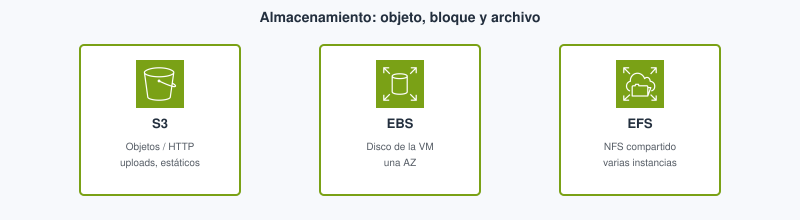
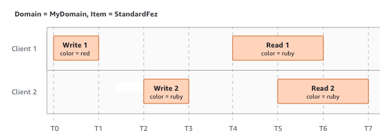
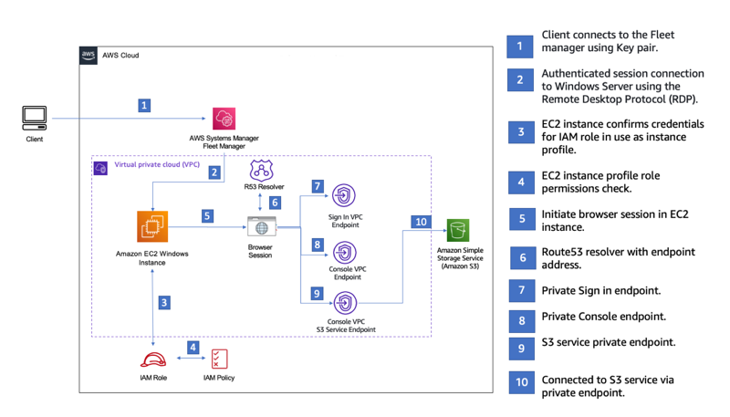

# Tema 5. Almacenamiento

En una app web hay **tres** estilos de almacenamiento que la gente mezcla: el disco de la VM, una carpeta de red compartida y un **objeto** al que se llega por HTTP. Subir el `uploads/` de Express a [S3](#s3) no es lo mismo que montar un [EBS](#ebs). **Foundations M7.** Ver [glosario](#glosario).

## Propuesta didáctica

> **RA4.** *Gestiona servicios de almacenamiento y bases de datos en la nube, seleccionando tecnologías adecuadas para casos específicos, y diseña arquitecturas escalables y resilientes utilizando herramientas de monitoreo y optimización para mejorar el rendimiento.*

### Criterios de evaluación (RA4)

* **a)** Se ha realizado la diferenciación entre tecnologías de almacenamiento en la nube.
* **c)** Se ha trabajado en la resolución de problemas prácticos sobre almacenamiento y bases de datos.

Bases de datos: Tema 6.

### Contenidos

* Objeto (S3), bloque (EBS), fichero (EFS / FSx).
* Clases S3, lifecycle, versionado, *block public access*.
* Snapshots, instance store, backup y movimiento de datos (Snow, Gateway).

---

## Bloque Foundations (M7)

Antes de memorizar logos, fija el **estilo de acceso**. En desarrollo web decides: ¿guardo un fichero con una URL/API (foto de perfil, ZIP, front estático)? ¿necesito un disco que el SO vea como `/dev/xvdf` (sistema de la VM)? ¿varias instancias deben montar la **misma** carpeta a la vez (`uploads/` compartido)? Esas tres preguntas apuntan a objeto, bloque o fichero —y casi nunca al mismo servicio.

| Estilo | Unidad | Servicio | ¿Se monta en el SO? | Caso web |
| --- | --- | --- | --- | --- |
| **Objeto** | Objeto + metadatos, HTTP | **S3** | No (API / SDK) | Imágenes, zips, front estático |
| **Bloque** | Volumen | **EBS** | Sí (disco de EC2) | Disco del sistema, datos de una sola VM |
| **Fichero** | NFS/SMB | **EFS**, **FSx** | Sí (carpeta de red) | Varias instancias leyendo el mismo `uploads/` |

<figure markdown="span">
{ width="800" }
<figcaption>Tres estilos de acceso: API de objetos, disco de la VM o carpeta NFS compartida.</figcaption>
</figure>

**Antes / después.** Antes: fotos de perfil en `public/uploads` dentro de la EC2 (se pierden al terminar la instancia; no escalan a dos nodos). Después: subida con SDK a S3 y URL firmada o CloudFront. El código deja de tratar el disco local como almacén duradero de usuario.

### Amazon S3

**[Amazon S3](#s3)** (*Simple Storage Service*) es almacenamiento de **objetos**: guardas bytes con una clave dentro de un *bucket*, y hablas con él por API/SDK (o URL firmada), no como si fuera la unidad `C:`. Buckets (nombre globalmente único), objetos, prefijos. **Clases** (Standard, IA, Glacier…): precio frente a tiempo de acceso. **Lifecycle** para enfriar lo que nadie pide. Versionado. *Block public access* por defecto: un 403 en la URL es el resultado **correcto** si el objeto no debe ser público.

En código DAW suele verse así: el controlador recibe el multipart, el SDK hace `PutObject`, y la base solo guarda la clave o la URL. El navegador no necesita NFS. Si mañana hay dos instancias detrás del ALB, **ambas** hablan con el mismo bucket: no hay divergencia de `uploads/` locales.

Tras un `PutObject` correcto, una lectura inmediata del mismo objeto debe ver los datos nuevos: S3 ofrece consistencia fuerte de lectura tras escritura. En clase: no inventes «espera unos segundos» como si fuera 2015.

<figure markdown="span">
{ width="800" }
<figcaption>Lectura tras escritura en el mismo objeto. Fuente: Amazon S3 User Guide (AWS).</figcaption>
</figure>

Web estática en S3 (HTML/JS): patrón útil para un SPA. El API sigue en otro sitio (Gateway + Lambda, o EC2). No es un CMS.

**Cuándo NO usar S3 como «disco».** No montes S3 como si fuera `/var/lib/mysql` ni esperes bloqueos POSIX de fichero para una base embebida. Tampoco abras el bucket al mundo para «que se vea el lab»: usa URLs firmadas o un origen CloudFront con política clara.

Si el acceso a S3 sale «por internet» desde una EC2 en VPC privada, en arquitecturas avanzadas aparece el endpoint/PrivateLink. Nivel Foundations: entiende que S3 es un servicio *regional* con API, no un disco montado.

<figure markdown="span">
{ width="800" }
<figcaption>Acceso a S3 desde una VPC (patrón de la guía de consola). Fuente: AWS Management Console Getting Started Guide (AWS).</figcaption>
</figure>

### Amazon EBS

**[Amazon EBS](#ebs)** (*Elastic Block Store*) es el **disco de bloque** de una instancia EC2: se monta en el sistema operativo como un volumen. Vive en **una** AZ. Snapshots hacia S3. Tipos gp/io (IOPS). **Instance store:** disco del host, efímero; no lo uses como única copia del TFG.

Multi-attach avanzado queda fuera. La regla Foundations: un volumen ≈ una instancia.

Si terminas la EC2 y dejas el volumen, **sigue facturando**. El snapshot es la copia durable hacia S3; el volumen huérfano es un clásico de lab caro.

### EFS / FSx y movimiento

**[Amazon EFS](#efs)** ofrece un sistema de ficheros **NFS** elástico: **varias** EC2 pueden montar el mismo directorio a la vez (incluso en AZ distintas de la región). **FSx:** Windows / Lustre / NetApp (nombres de examen).

**Storage Gateway**, familia **Snow** (dispositivo físico para muchos TB), **AWS Backup**, DataSync: reconocer *cuándo* un VPN no basta para 80 TB.

### Errores frecuentes (almacenamiento)

- Guardar uploads solo en el EBS de una instancia detrás de un ASG (cada nodo ve un disco distinto).
- Confundir Glacier «barato» con «acceso inmediato».
- Medir solo GB-mes y olvidar **egress** al servir ficheros grandes a internet.

### Relación con otros temas

S3 + CloudFront (Tema 3) para estáticos. EBS nace con EC2 (Tema 4). Las bases (Tema 6) no se sustituyen por un bucket: el bucket guarda objetos, no transacciones SQL.

---

## Bloque Ampliación Practitioner (CLF-C02)

S3 ≠ disco del SO; EBS ≠ EFS; Glacier es clase/archivo. En coste, no olvides la **salida** (egress).

**Ampliación y trucos de examen →** [Certificación § Tema 5](../99-certificacion/certificacion.md#tema-5).

---

## Videotutorial

**Principal (Foundations).** [ATTA AWS Academy 02 S3](https://www.youtube.com/watch?v=OkGNAHtVCq8) (~12 min).

<iframe src="https://www.youtube.com/embed/OkGNAHtVCq8" title="ATTA AWS Academy 02 S3 — Profe Santos Cloud" style="width:100%;max-width:840px;aspect-ratio:16/9;border:0;display:block;margin:0.8em auto" allow="accelerometer;clipboard-write;encrypted-media;gyroscope;picture-in-picture" allowfullscreen loading="lazy"></iframe>

Vídeo: Profe Santos Cloud (YouTube). Qué mirar: subida de objeto y *block public access*; el 403 es evidencia, no un fallo del lab.

**Extra (opcional).** [S3 Static Web](https://www.youtube.com/watch?v=GMsD5XIfRLc) (~8 min) — hosting estático mínimo. Vídeo: Profe Santos Cloud (YouTube).

El M7 del LMS Academy se indica en clase / Aules.

---

## Actividad / práctica

**PR501 — Objetos y bloques** (RA4 a, c)

Lab Academy M7. Completa **una** evidencia:

- Sube un fichero a S3, *block public access*, prueba la URL y explica el 403.
- O: volumen EBS, montaje, snapshot, borrar el volumen de lab.

**Checklist.** Block public access ON → prueba 403 → evidencia. Si usas EBS: snapshot → **delete** volumen e instancia. Anota clase S3 si el lab la pide.

---

### Versionado y borrados (por qué importa en un TFG)

Con versionado en S3, un `delete` no siempre destruye el objeto: puede dejar un *delete marker*. Eso salva un borrado accidental en prácticas… y también deja residuos que facturan. Lifecycle rules existen para pasar a clases frías o expirar versiones viejas. En Foundations basta reconocer el mecanismo; en un proyecto real, sin lifecycle, el bucket de «pruebas» crece sin control.

EBS: snapshot ≠ backup mágico de la aplicación. Es copia del volumen en un momento; la app debe estar en estado coherente (o aceptas el riesgo). Instance store desaparece al parar/terminar: no guardes ahí el único ZIP del TFG.

---

## Autocheck / preparación cert

1. ¿El disco del SO de EC2 se diseña como bucket S3 Standard? ¿Qué servicio es el disco?
2. ¿EFS sirve para compartir un directorio entre dos EC2 en AZ distintas (misma región)?
3. Foto a la que se accede una vez al año: ¿clase de S3 coherente (idea, no el céntimo)?
4. ¿El snapshot de EBS se queda solo en la AZ del volumen?
5. Snow Family frente a VPN para 80 TB: ¿por qué el «subir por la red del instituto» no escala?

---

## Glosario

**S3**{: #s3}
*Simple Storage Service*: almacenamiento de objetos accesible por API/HTTP. Ideal para ficheros, backups de objetos y front estático; no sustituye el disco del sistema de una VM. El acceso público es una decisión explícita (y peligrosa si se deja abierta «para la demo»).

**EBS**{: #ebs}
*Elastic Block Store*: volúmenes de bloque para instancias EC2. Se montan en el SO; suelen vivir en una sola AZ. Son el disco de la VM: sistema, swap o datos locales —no el almacén compartido de un ASG con varios nodos.

**EFS**{: #efs}
*Elastic File System*: sistema de ficheros NFS gestionado, compartible por varias instancias a la vez en la región. Encaja cuando varias EC2 necesitan la misma carpeta montada; no sustituye a S3 para objetos servidos por HTTP a escala web.
