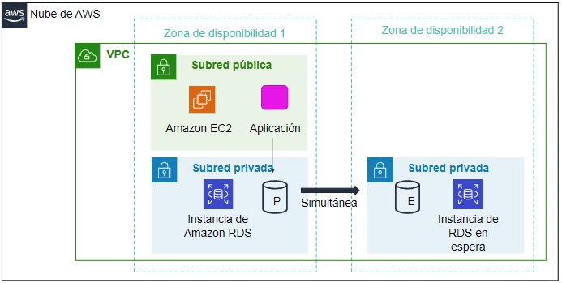
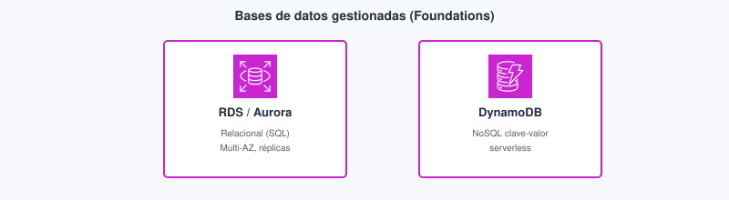
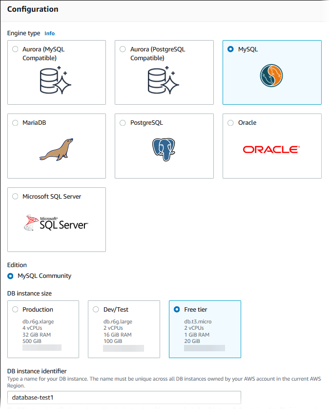
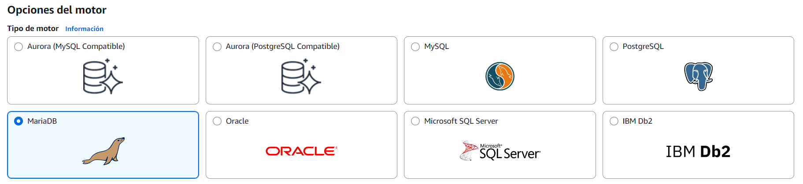
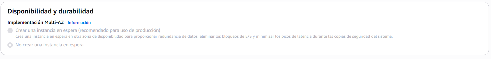
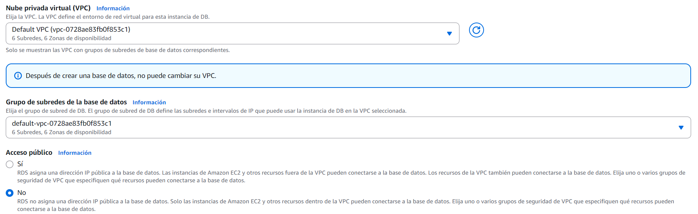
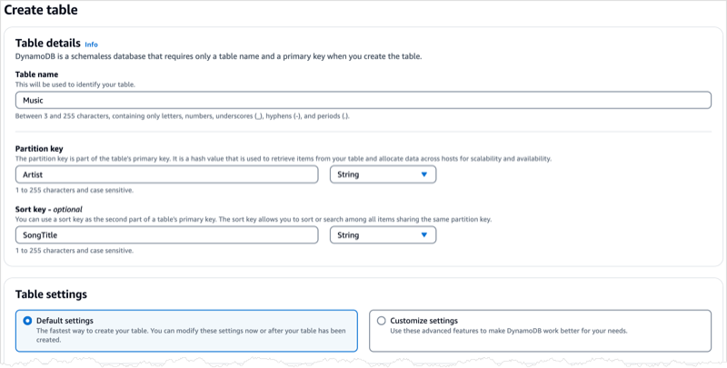
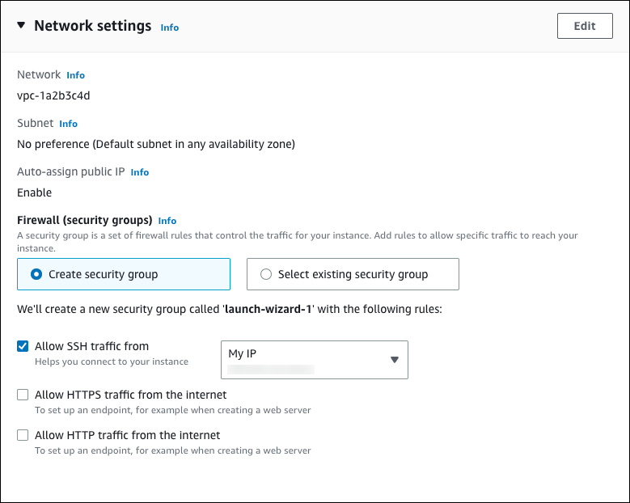
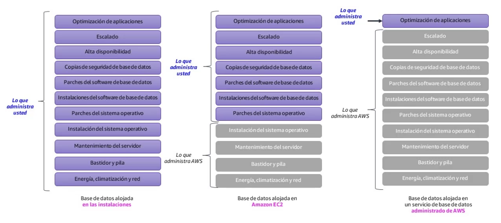
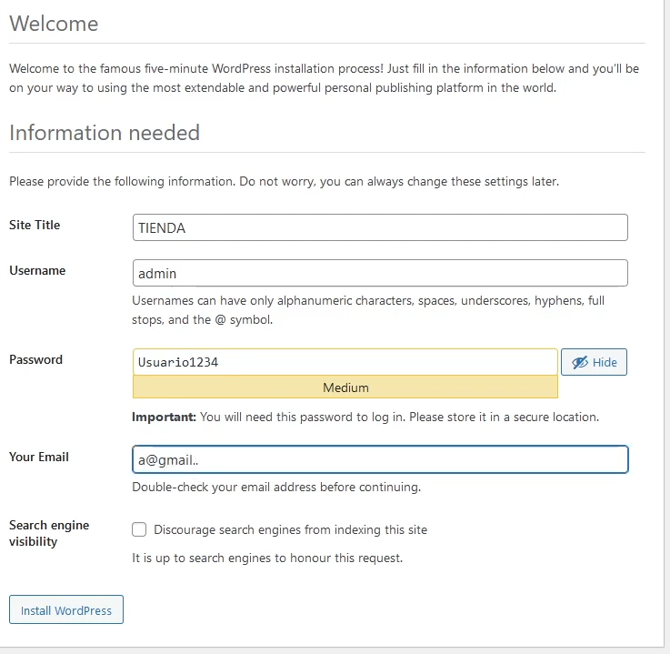

# Tema 6. Bases de datos

Instalar MySQL en la misma [EC2](../04-computo-serverless/tema4.md#ec2) (*Elastic Compute Cloud*, nube elástica de cómputo) que Express funciona en el aula y **acopla** fallo, actualizaciones y copia de seguridad: si cae la máquina, cae la API y la base de datos (**BD**). En la nube la pregunta de un proyecto de DAW es otra: ¿necesitas SQL (*Structured Query Language*, lenguaje de consulta estructurado) transaccional, un almacén de documentos, o analítica? Este tema corresponde al **Módulo 8** de *AWS Academy Cloud Foundations*. Los términos clave están en el [glosario](#glosario).

!!! tip "Al empezar"
    Empieza por el [cuestionario inicial](#cuestionario-inicial). Distingue ya el almacenamiento de objetos (Tema 5) de los **datos estructurados**: aquí eliges motor y quién mantiene y actualiza ese motor.

## Propuesta didáctica

> **RA4.** *Gestiona servicios de almacenamiento y bases de datos en la nube, seleccionando tecnologías adecuadas para casos específicos, y diseña arquitecturas escalables y resilientes utilizando herramientas de monitoreo y optimización para mejorar el rendimiento.*

### Criterios de evaluación (RA4)

* **b)** Se ha llevado a cabo la configuración y gestión de bases de datos en un entorno de nube.
* **c)** Se ha trabajado en la resolución de problemas prácticos sobre almacenamiento y bases de datos.

### Contenidos

* BD en EC2 frente a [RDS](#rds) / Aurora (quién mantiene y actualiza el motor).
* Relacional: [Multi-AZ](#multi-az) frente a [réplica de lectura](#read-replica).
* DynamoDB, ElastiCache, Redshift: cuándo no es RDS.
* DMS / SCT: migración de datos (enlace con las 7 R del Tema 1).

### Programación de aula (orientativa)

| Quincena | En tutoría | Trabajo autónomo / evidencias |
| --- | --- | --- |
| **Q8** | RDS Multi-AZ frente a réplica + DynamoDB | **PR601**; Autocheck del tema |

---

## Cuestionario inicial

!!! question "Responde con lo que sepas"
    1. MySQL en la misma EC2 que Express frente a **RDS**: ¿quién mantiene y actualiza el **motor** en cada caso?
    2. ¿**Multi-AZ** responde sobre todo al *failover* de escritura o a escalar lecturas de reporting?
    3. ¿Para qué sirve una **réplica de lectura** que Multi-AZ no cubre igual?
    4. ¿Cuándo tendría sentido **DynamoDB** *además* de un checkout SQL, y cuándo es un error sustituirlo «por moda»?
    5. ¿Por qué abrir **3306** al mundo desde RDS es una mala práctica aunque «así conectas el cliente SQL del portátil»?

Este cuestionario es solo para ti: te ayuda a ver qué dominas ya y qué te falta antes o mientras lees el tema. No se entrega en Aules; respóndelo con lo que sepas y, cuando quieras contrastar, abre el bloque **Soluciones (autoevaluación)** debajo o el índice en [Soluciones](../90-soluciones/soluciones.md).

Soluciones (autoevaluación)

1. MySQL en EC2: **tú** mantienes y actualizas el motor (y aplicas los parches del **SO**, sistema operativo). En **RDS**, **AWS** mantiene y actualiza el motor.

2. **Multi-AZ** responde sobre todo al ***failover*** de la escritura (otra AZ), no a escalar SELECT de reporting.

3. La **réplica de lectura** escala lecturas / reporting de forma asíncrona; no es el mismo mecanismo que el *failover* Multi-AZ.

4. **Además:** por ejemplo un catálogo o sesión NoSQL junto a un checkout SQL. **Error:** tirar el dominio relacional y transaccional «porque DynamoDB escala» sin necesidad.

5. Expone el motor a internet entero; el **SG** (grupo de seguridad, *security group*) debe aceptar el SG de la API (o un bastión), no `0.0.0.0/0` en 3306.

---

## Bloque Foundations (Módulo 8)

### ¿Gestionada o en la máquina virtual?

Un **SGBD** (sistema de gestión de bases de datos) en EC2 te da control total: tú diseñas la alta disponibilidad (**HA**, *high availability*), aplicas los parches del SO, mantienes y actualizas el motor y montas las copias. **[Amazon RDS](#rds)** (*Relational Database Service*, servicio de bases de datos relacionales) es una base de datos **relacional gestionada**: AWS asume mantener y actualizar el motor, las [instantáneas](#instantanea-rds) y el despliegue **[Multi-AZ](#multi-az)** opcional. El examen **CLF** (*AWS Certified Cloud Practitioner*, CLF-C02) y una app de clase bien hecha premian el servicio gestionado salvo motor raro o licencia que lo impida. Para un desarrollador web: sigues hablando SQL; dejas de ser el **DBA** (*database administrator*, administrador de bases de datos) del SO.

<figure markdown="span">
{ width="640" }
<figcaption>RDS: motor gestionado (plataforma de datos), no solo una EC2 con MySQL.</figcaption>
</figure>

!!! note "Por qué RDS y no MySQL «a pelo» en EC2"
    Puedes instalar el SGBD en EC2, sí. Con RDS te ahorras mantener y actualizar el motor, buena parte de las copias y de la HA. A cambio, menos control del SO. Por seguridad suele ir en **subredes privadas** y solo acepta el SG de la API.

<figure markdown="span">
{ width="800" }
<figcaption>Relacional gestionado frente a NoSQL serverless: elige por el modelo de datos, no por el logo.</figcaption>
</figure>

Al crear RDS, mira motor, plantilla (*Free tier* / Dev) e identificador **antes** de pulsar *Create*: ahí se decide buena parte de la factura del lab.

<figure markdown="span">
{ width="800" }
<figcaption>Create database: motor MySQL y plantilla Free tier. Fuente: Amazon RDS User Guide (AWS).</figcaption>
</figure>

Cuando MySQL vive en la misma EC2 que Express, un *terminate* se lleva API y datos, y el parche del SO afecta a ambos a la vez. En un buen diseño la API corre en cómputo (EC2, contenedor o función) y la BD en RDS dentro de una subred privada: las instantáneas y Multi-AZ los activa el servicio gestionado, pero **tú** sigues diseñando el esquema, los usuarios de la base y el SG.

| Examen CLF | Clase DAW / empresa |
| --- | --- |
| Hay que distinguir MySQL en EC2 de RDS gestionado. | En el proyecto intermodular la BD no debería vivir en la misma máquina que la API si puedes evitarlo. |
| En RDS, AWS mantiene y actualiza el motor; tú gestionas datos y accesos. | En el `.md` del lab explica quién aplica los parches del SO y quién mantiene el motor. |
| La BD gestionada suele ir en subred privada. | El puerto del motor solo acepta el SG de la aplicación. |

### Relacionales: RDS y Aurora

**Qué es en este caso — RDS.** Una **[instancia de BD](#instancia-de-bd)** en RDS es el recurso gestionado que ejecuta un motor relacional (MySQL, PostgreSQL, MariaDB, SQL Server, Oracle…). Eliges la **[clase de instancia](#clase-de-instancia)** (CPU y memoria de plantilla), el almacenamiento, la **[VPC](../03-redes-entrega-contenido/tema3.md#vpc)** (*Virtual Private Cloud*, nube virtual privada), el **[grupo de subredes de BD](#db-subnet-group)** (*DB subnet group*) y el SG. El **[endpoint](#endpoint-rds)** es el nombre DNS (*Domain Name System*, sistema de nombres de dominio) al que se conecta la aplicación: no es la IP de tu portátil.

**En la práctica — RDS.** En el proyecto de DAW la **API** (interfaz de programación de aplicaciones) Node o PHP abre una conexión al endpoint (JDBC, `DATABASE_URL`, Sequelize u otro ORM —*object-relational mapper*, mapeador objeto-relacional—). El esquema, las migraciones de tablas y los usuarios de la app siguen siendo tuyos. AWS mantiene y actualiza el motor según la ventana de mantenimiento; tú no entras por **SSH** (*Secure Shell*, acceso remoto cifrado) al host de la BD para aplicar actualizaciones del motor. Si cambias la clase de instancia o el almacenamiento, lo haces desde la consola o la API de AWS, no reinstalando MySQL a mano en un disco EBS.

El **grupo de subredes de BD** agrupa subredes (casi siempre privadas) en al menos dos AZ. RDS elige en qué subredes coloca el primario y, si hay Multi-AZ, el *standby*. Si metes solo subredes públicas «porque así conecto desde casa», estás diseñando al revés: la app debería vivir cerca de la BD en la VPC, y tú acercarte con bastión o **VPN** (red privada virtual, *virtual private network*) cuando haga falta administrar.

**Qué es en este caso — Aurora.** **[Amazon Aurora](#aurora)** es un motor relacional compatible con MySQL o PostgreSQL, con almacenamiento distribuido y réplicas pensadas para más margen de HA y rendimiento dentro del ecosistema RDS.

**En la práctica — Aurora.** Nivel Foundations: «RDS con más margen de HA y rendimiento». Si tu *framework* ya habla PostgreSQL, Aurora compatible con PostgreSQL encaja sin reescribir el dominio: eso es **replatform** (cambiar de plataforma manteniendo el modelo) ligero, no **refactor** (rediseñar la aplicación). En el lab del Módulo 8 trabajas con **RDS for MySQL**; Aurora aparece sobre todo en el discurso del CLF y en ampliaciones.

#### Multi-AZ frente a réplica de lectura

Dos mecanismos que se confunden y que el CLF premia distinguir.

**[Multi-AZ](#multi-az)** (*Multi–Availability Zone*, varias zonas de disponibilidad) replica de forma síncrona hacia un *standby* en otra AZ. Si falla la AZ primaria, el servicio hace *failover* y el endpoint pasa a apuntar al *standby*. La aplicación suele reintentar la conexión al mismo nombre DNS; no reescribes el SQL. Responde a **disponibilidad de la escritura**, no a acelerar SELECT de reporting. Cuesta más que una sola AZ porque hay capacidad reservada en la segunda zona; en el lab lo activas porque el enunciado lo pide y porque quieres ver el patrón, no porque «más caro = mejor nota» sin más.

Una **[réplica de lectura](#read-replica)** (*read replica*) copia de forma **asíncrona** para repartir consultas de solo lectura. Escala reporting o *dashboards*; puede ir un poco por detrás del primario (retraso de replicación). No es el mismo mecanismo que el *failover* Multi-AZ: si caes el primario, una réplica no se promociona sola salvo que configures y ejecutes ese proceso aparte.

<figure markdown="span">
{ width="640" }
<figcaption>Multi-AZ: copia síncrona para failover.</figcaption>
</figure>

!!! tip "Multi-AZ frente a réplica de lectura"
    - **Multi-AZ:** escritura síncrona al *standby*; ante fallo, el *standby* toma el relevo (comercio, finanzas…).
    - **Réplica de lectura:** replicación asíncrona; escala SELECT / reporting; el *failover* manual no es el mismo mecanismo.

<figure markdown="span">
{ width="640" }
<figcaption>Réplica de lectura: escala SELECT; no es el mismo mecanismo que Multi-AZ.</figcaption>
</figure>

#### Instantáneas y red

Las **[instantáneas automáticas](#instantanea-rds)** las programa RDS (ventana de copia); las **manuales** las lanzas tú antes de un cambio arriesgado. Sirven para recuperar un punto en el tiempo; no sustituyen un buen diseño de esquema ni el control de quién puede conectar.

El SG del motor **no** se abre a `0.0.0.0/0`. La API en subred privada habla con RDS; no expones 3306 a internet «para DBeaver desde casa» si hay alternativas (bastión, VPN).

<figure markdown="span">
{ width="720" }
<figcaption>Conectividad: VPC + grupo de subredes; acceso público desactivado en un lab serio.</figcaption>
</figure>

| Examen CLF | Clase DAW / empresa |
| --- | --- |
| Multi-AZ sirve para el *failover* de la escritura. | En el lab del Módulo 8 activas Multi-AZ cuando el enunciado lo pide y lo explicas en el `.md`. |
| La réplica de lectura escala SELECT, no sustituye Multi-AZ. | Si el cuello de botella es reporting, valora una réplica; si es caída de AZ, Multi-AZ. |
| El puerto del motor no va abierto a internet. | El SG de RDS solo acepta el SG de la aplicación web. |

### NoSQL y analítica

**NoSQL** agrupa modelos que no se centran en tablas relacionales con claves foráneas (FK) clásicas (documentos, clave-valor, grafos…). No todo dato de una app web es «tablas normalizadas». A veces el dominio es un documento JSON con picos imprevisibles; a veces necesitas caché; a veces informes analíticos. La tabla sitúa servicios: no elijas DynamoDB solo porque «suena a nube».

En un mismo producto puedes combinar: RDS para pedidos (transacciones, stock, integridad referencial), ElastiCache para sesiones calientes, S3 para facturas PDF. Eso no es «multicloud»: es usar el servicio adecuado por patrón de acceso. El examen premia reconocer el patrón; el proyecto de DAW premia no meterlo todo en una sola EC2 con un MySQL olvidado en el disco raíz.

| Servicio | Modelo | Caso del proyecto de DAW |
| --- | --- | --- |
| **[DynamoDB](#dynamodb)** | Clave-valor / documentos, *serverless* | Sesiones, catálogo simple, picos imprevisibles |
| **[ElastiCache](#elasticache)** | Caché en memoria | Acelerar lecturas calientes; no es el sistema de registro |
| **[Redshift](#redshift)** | Analítica columnar | Informes; no el [OLTP](#oltp) de la tienda |
| DocumentDB / Neptune / Keyspaces | Nombres de examen | Reconocer el logo en el CLF |

**Qué es en este caso — DynamoDB.** Servicio NoSQL gestionado: trabajas con una **[tabla](#tabla-dynamodb)** de **[elementos](#elemento-dynamodb)** (*items*), cada uno identificado por una **[clave de partición](#clave-de-particion)** (*partition key*) y, si hace falta, una clave de ordenación (*sort key*). No es «MySQL más rápido».

**En la práctica — DynamoDB.** Encaja cuando el acceso es por clave conocida y el modelo no exige *joins* complejos. Al crear una tabla, lo primero que pide la consola es la *partition key* (y opcionalmente *sort key*). Sin eso no hay tabla: no es un `CREATE TABLE` SQL libre. Piensa el acceso antes de modelar: «dado el `userId`, dame la sesión» encaja; «dame todos los pedidos del mes pasado con el nombre del cliente y el stock» suele ser territorio SQL o un diseño NoSQL mucho más trabajado (y fácil de hacer mal en Foundations).

<figure markdown="span">
{ width="800" }
<figcaption>Create table: partition key (y sort key opcional). Fuente: Amazon DynamoDB Developer Guide (AWS).</figcaption>
</figure>

**Cuándo no usar DynamoDB.** Pedidos con *joins* y transacciones clásicas, reporting *ad hoc* con SQL libre, o un equipo que solo conoce Sequelize/JPA sobre tablas normalizadas. Forzar NoSQL «porque es serverless» suele acabar en un modelo a medias y consultas dolorosas.

**Qué es en este caso — ElastiCache.** Caché en memoria (Redis o Memcached gestionados) delante de la BD o de la API.

**En la práctica — ElastiCache.** Sirve para sesiones o resultados calientes. Si apagas la caché, los datos duraderos deben seguir en RDS (o en el almacén que hayas elegido como sistema de registro).

**Qué es en este caso — Redshift.** Almacén de datos (*data warehouse*) columnar para analítica.

**En la práctica — Redshift.** Encaja en informes y agregaciones grandes. No es la BD del checkout de la tienda (**OLTP**, *Online Transaction Processing*, procesamiento de transacciones en línea).

### Migración

**[DMS](#dms)** (*Database Migration Service*, servicio de migración de bases de datos) replica datos entre orígenes y destinos. **SCT** (*Schema Conversion Tool*, herramienta de conversión de esquemas) ayuda a convertir esquemas cuando cambias de motor. Encaja con las 7 R del Tema 1:

- **Replatform:** mueves la BD a un servicio gestionado (por ejemplo Oracle en tus propias instalaciones hacia Aurora) manteniendo el modelo de datos con cambios acotados.
- **Refactor:** rediseñas la aplicación o el modelo (por ejemplo pasar parte del dominio a DynamoDB).

En Foundations no montas un proyecto DMS completo: reconoces la herramienta cuando el escenario es «mover datos con poco tiempo de parada (*downtime*)» frente a «rediseñar la app». El CLF no te pide el asistente paso a paso; te pide elegir DMS/SCT frente a copiar un *dump* a mano sin herramienta de migración.

### Conectar la aplicación con la base de datos

La URL JDBC / `DATABASE_URL` apunta al **endpoint** de RDS, no a una base en tu portátil. El host suele parecerse a `xxx.region.rds.amazonaws.com`; el puerto es el del motor (3306 en MySQL). El SG de RDS acepta el SG de la API (o un bastión), no tu IP pública del instituto de forma permanente: las IP del aula cambian y, además, dejan el hábito de abrir el motor a trozos de internet.

Los secretos (usuario, contraseña, cadena completa) no van al repositorio ni al `PR601.md` público. En el discurso Practitioner aparecen Parameter Store y Secrets Manager; en el lab, anótalos fuera del entregable y en el `.md` deja constancia de que la app apunta al endpoint sin pegar la contraseña.

En el asistente verás la opción de conectar EC2 con RDS ajustando los SG: úsala como lista de comprobación, no como excusa para abrir 3306 al mundo. Si la web «no conecta», mira en este orden: ¿misma VPC?, ¿grupo de subredes correcto?, ¿SG de la BD admite el SG de la EC2?, ¿la app usa el endpoint y no `localhost`?, ¿la instancia RDS está *Available*?

<figure markdown="span">
{ width="800" }
<figcaption>Conexión EC2–RDS: SG y subredes, no IP pública del aula. Fuente: Amazon RDS User Guide (AWS).</figcaption>
</figure>

Si usas un ORM (Sequelize, JPA, Entity Framework), Multi-AZ no cambia tu código SQL: cambia la disponibilidad del endpoint. Las réplicas de lectura sí pueden exigir una cadena de conexión de solo lectura para reporting.

### Errores frecuentes (datos)

Si abres 3306 o 5432 a `0.0.0.0/0` «para probar desde el portátil», el motor queda expuesto a todo internet: escaneo, fuerza bruta e incidentes. En su lugar deja que el SG de RDS acepte solo el SG de la aplicación web (o un bastión) y usa VPN o túnel cuando necesites un cliente SQL desde casa.

Confundir Multi-AZ con réplica de lectura lleva a activar lo uno esperando lo otro: Multi-AZ no acelera los SELECT de reporting, y una réplica no es el mecanismo principal de *failover*. En el `.md` escribe para qué sirve cada uno con el caso de tu API.

Dejar la instancia RDS del lab encendida tras la entrega sigue facturando almacenamiento y horas de instancia aunque nadie conecte. Al cerrar, elimina la instancia y las instantáneas de práctica según el enunciado, y deja captura de limpieza.

Pegar la contraseña del usuario *master* en el README o en el `PR601.md` público filtra el secreto del lab (y el hábito pasa al repo del proyecto intermodular). Anota credenciales fuera del entregable; en el `.md` basta el endpoint y la explicación de red.

### Relación con otros temas

El disco y los objetos del Tema 5 no sustituyen una base transaccional: S3 guarda ficheros; aquí eliges motor y quién mantiene y actualiza ese motor. Un *dump* de MySQL en un *bucket* es un objeto; la BD en marcha que atiende el checkout es otra cosa. La API sigue viviendo en el cómputo del Tema 4, idealmente en subred privada (Tema 3). IAM (Tema 2) decide quién puede crear instancias RDS o asumir roles; el SG decide qué tráfico **TCP** (*Transmission Control Protocol*, protocolo de control de transmisión) llega al puerto del motor. Multi-AZ y réplicas se entienden mejor cuando el Tema 7 pide justificar el equilibrio entre disponibilidad, coste y complejidad: no actives Multi-AZ «por costumbre» en un lab de media hora si el enunciado no lo pide —en el **Ejercicio de laboratorio 5** sí lo pide, y entonces lo documentas.

### El lab del Módulo 8: Ejercicio de laboratorio 5 - Creación de un servidor de bases de datos

En tu clase de *Cloud Foundations*, el lab del **Módulo 8** se llama **Ejercicio de laboratorio 5 - Creación de un servidor de bases de datos**. Trabajas en la **región que indique el lab**. El hilo es de **RDS for MySQL** con red privada y Multi-AZ, no de DynamoDB.

Primero creas un **grupo de seguridad para la BD** cuyas reglas de entrada admitan el puerto del motor **solo** desde el SG de la aplicación web (la EC2 del lab). Así la API puede hablar con MySQL y el resto de internet no.

Después creas un **grupo de subredes de BD** (*DB subnet group*) con subredes **privadas** en **dos AZ**. RDS necesita al menos dos subredes en AZ distintas para desplegar Multi-AZ; sin ese grupo, el asistente no puede colocar primario y *standby* como toca.

Luego **lanzas una instancia de Amazon RDS for MySQL** con **Multi-AZ** activado, clase y almacenamiento según el enunciado, acceso público desactivado y el SG de la BD que acabas de definir. Esperas a que quede *Available* y anotas el **endpoint** (sin pegar la contraseña en el entregable).

Por último **conectas la aplicación web de la EC2** a ese endpoint: la configuración de la app (la que indique el enunciado) apunta al host de RDS con el usuario y la contraseña que hayas definido en el asistente. Compruebas que la web usa la BD gestionada y no un MySQL local en el disco de la EC2. Si el lab trae una aplicación ya preparada, tu trabajo es dejar bien la red y la cadena de conexión; si hay que editar un fichero de configuración, sigue el enunciado y no dejes secretos en capturas del entregable.

Respecto al mapa del proyecto de DAW (API en cómputo, BD gestionada, fotos en S3), este lab **practica** RDS, Multi-AZ, grupo de subredes y SG. **Simplifica** el resto del producto (no montas DynamoDB ni Redshift). En **PR601** deja claro qué es **IaaS** (*Infrastructure as a Service*, infraestructura como servicio: la EC2, donde **tú** aplicas los parches del SO) y qué es gestionado (RDS, donde AWS mantiene y actualiza el motor), y limpia la instancia al terminar.

---

## Bloque Ampliación Practitioner (CLF-C02)

Aquí el examen contrapone base **gestionada** frente a MySQL en la EC2, relacional frente a NoSQL, y Multi-AZ frente a réplica de lectura: no son sinónimos. DMS y SCT aparecen cuando el escenario describe migración con poco tiempo de parada frente a un rediseño completo.

!!! tip "Para el CLF"
    Multi-AZ responde al **failover** de la escritura; la réplica de lectura escala SELECT o reporting. DynamoDB puede ir *además* de un checkout SQL si el dominio sigue siendo relacional; no lo sustituyas «por moda». Ampliación y **autocheck certificación** en [Certificación § Tema 6](../99-certificacion/certificacion.md#tema-6).

**Videotutorial (Practitioner / NoSQL).** [DynamoDB](https://www.youtube.com/watch?v=j1VL7ctuerw) (~10 min). Vídeo: Profe Santos Cloud (YouTube).

---

## Videotutorial

**Principal (Foundations).** [ATTA AWS Academy RDS 05](https://www.youtube.com/watch?v=43jYEiZvOsw) (~19 min).

<iframe src="https://www.youtube.com/embed/43jYEiZvOsw" title="ATTA AWS Academy RDS 05 — Profe Santos Cloud" style="width:100%;max-width:840px;aspect-ratio:16/9;border:0;display:block;margin:0.8em auto" allow="accelerometer;clipboard-write;encrypted-media;gyroscope;picture-in-picture" allowfullscreen loading="lazy"></iframe>

Vídeo: Profe Santos Cloud (YouTube). Qué mirar: clase pequeña, SG del motor y eliminar la instancia al acabar.

**Extra (opcional).** [RDSPrivateSubnet EC2Linux](https://www.youtube.com/watch?v=4X1f23RpBG0) (~21 min) — RDS en privada con EC2; refuerza el Tema 3. Vídeo: Profe Santos Cloud (YouTube).

**Extra.** [WordPress con RDS](https://www.youtube.com/watch?v=WUHzjhrS8tg) — app web en EC2 y base MySQL gestionada en RDS.

<iframe src="https://www.youtube.com/embed/WUHzjhrS8tg" title="WordPress con RDS" style="width:100%;max-width:840px;aspect-ratio:16/9;border:0;display:block;margin:0.8em auto" allow="accelerometer;clipboard-write;encrypted-media;gyroscope;picture-in-picture" allowfullscreen loading="lazy"></iframe>

<figure markdown="span">
{ width="640" }
<figcaption>App + RDS: la BD fuera de la EC2.</figcaption>
</figure>

<figure markdown="span">
{ width="640" }
<figcaption>Práctica: app en cómputo y credenciales apuntando al endpoint RDS.</figcaption>
</figure>

---

## Actividad / práctica

### PR601 — RDS mínimo

* :simple-neutralinojs: **PR601**. (RA4 // b, c // **PR 0–10**). Completas el lab Academy del Módulo 8 (**Ejercicio de laboratorio 5 - Creación de un servidor de bases de datos**): SG de la BD, grupo de subredes, RDS for MySQL con Multi-AZ, conexión desde la app en EC2, secretos fuera del markdown público y limpieza al acabar.

  **Tareas:** crea el SG de la BD (puerto del motor solo desde el SG de la app); crea el grupo de subredes de BD en subredes privadas de dos AZ; lanza RDS for MySQL con Multi-AZ según el enunciado; conecta la aplicación web al endpoint; documenta IaaS (EC2) frente a gestionado (RDS) en unas líneas; deja secretos fuera del `.md`; elimina la instancia RDS (e instantáneas de lab si el enunciado lo pide) y deja evidencia de limpieza.

  **Entrega:** según [Cómo entregar las prácticas](../index.md#entrega) — fichero `PR601.md` (o ZIP + `img/` si hay capturas).

  Guía de apoyo (no sustituye el enunciado): [Soluciones · PR601](../90-soluciones/pr/PR601.md).

| Criterio | Descripción | Puntos |
| --- | --- | --- |
| Lab RDS (SG, subredes, Multi-AZ) | Flujo del Ejercicio de laboratorio 5 | 0–3 |
| Seguridad de red | SG sin motor abierto al mundo | 0–3 |
| Secretos y claridad | Fuera del markdown; IaaS frente a gestionado | 0–2 |
| Limpieza | Instancia RDS eliminada / evidencia | 0–2 |
| **Total** | | **/10** |

---

## Autocheck del tema

Comprueba bases de datos de este tema. CLF: [Certificación § Tema 6](../99-certificacion/certificacion.md#tema-6).

1. **Multi-AZ** en RDS sirve sobre todo para…  
   a) acelerar SELECT de reporting · b) ***failover*** si cae una AZ · c) sustituir copias de seguridad
2. Checkout con transacciones SQL: primera hipótesis…  
   a) DynamoDB · b) **RDS/Aurora** · c) Redshift
3. ¿Quién mantiene y actualiza el **motor** en RDS?
4. **V/F.** Redshift es la opción típica de OLTP de la tienda online.
5. Empareja: **DynamoDB** · **ElastiCache** · **réplica de lectura** con: (a) NoSQL clave-valor · (b) caché en memoria · (c) escala de lectura

Soluciones

1. **b**.

2. **b**.

3. **AWS** (servicio gestionado); tú esquemas, datos y accesos.

4. **Falso** — Redshift es analítica / *warehouse*; OLTP → RDS/Aurora.

5. **DynamoDB** encaja con (a) NoSQL clave-valor; **ElastiCache**, con (b) caché en memoria; la **réplica de lectura**, con (c) escala de lectura.

---

## Glosario

**RDS**{: #rds}
*Relational Database Service* (servicio de bases de datos relacionales): bases relacionales gestionadas (MySQL, PostgreSQL…). AWS mantiene y actualiza el motor y la infraestructura; tú gestionas esquemas, datos y accesos.

**instancia de BD**{: #instancia-de-bd}
Recurso RDS que ejecuta un motor concreto con una clase, almacenamiento y red asociados.

**clase de instancia**{: #clase-de-instancia}
Plantilla de CPU y memoria de la instancia de BD (p. ej. clases pequeñas en labs).

**endpoint RDS**{: #endpoint-rds}
Nombre DNS al que se conecta la aplicación para hablar con la instancia de BD.

**grupo de subredes de BD**{: #db-subnet-group}
*DB subnet group*: conjunto de subredes (en AZ distintas) donde RDS puede colocar la instancia y el *standby* Multi-AZ.

**Multi-AZ**{: #multi-az}
Despliegue en más de una zona de disponibilidad con *failover* de escritura. No sustituye a las réplicas de lectura ni acelera por sí solo los SELECT de reporting.

**read replica**{: #read-replica}
Réplica de lectura: copia de solo lectura para repartir consultas SELECT. No es el mecanismo principal de *failover* Multi-AZ.

**instantánea RDS**{: #instantanea-rds}
Copia de la BD en un momento (automática o manual) para recuperación o restauración.

**Aurora**{: #aurora}
Motor relacional de AWS compatible con MySQL o PostgreSQL, con almacenamiento distribuido y más margen de HA dentro de RDS.

**DynamoDB**{: #dynamodb}
Base NoSQL gestionada (clave-valor / documentos), *serverless* y de baja latencia. No es un sustituto automático de SQL transaccional con *joins* y claves foráneas.

**tabla DynamoDB**{: #tabla-dynamodb}
Contenedor de elementos en DynamoDB; se define al crear la tabla con su clave de partición.

**elemento DynamoDB**{: #elemento-dynamodb}
*Item*: registro individual en una tabla DynamoDB.

**clave de partición**{: #clave-de-particion}
*Partition key*: atributo obligatorio que reparte los elementos entre particiones; sin ella no hay tabla.

**ElastiCache**{: #elasticache}
Caché en memoria gestionada (Redis / Memcached). Acelera lecturas; no sustituye a la BD de registro.

**Redshift**{: #redshift}
Almacén de datos columnar para analítica e informes, no para el OLTP de la tienda.

**OLTP**{: #oltp}
*Online Transaction Processing* (procesamiento de transacciones en línea): cargas del día a día (pedidos, stock). Se distingue de la analítica.

**DMS**{: #dms}
*Database Migration Service* (servicio de migración de bases de datos): replica datos entre orígenes y destinos con poco tiempo de parada cuando el escenario lo permite.

**replatform**{: #replatform}
Migración que cambia de plataforma (p. ej. SGBD en servidor propio hacia RDS/Aurora) manteniendo el modelo con cambios acotados.

**refactor**{: #refactor}
Migración que rediseña la aplicación o el modelo de datos (más cambio que un *replatform*).
