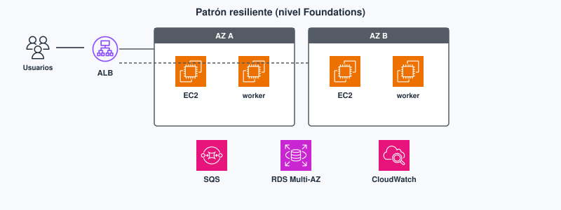
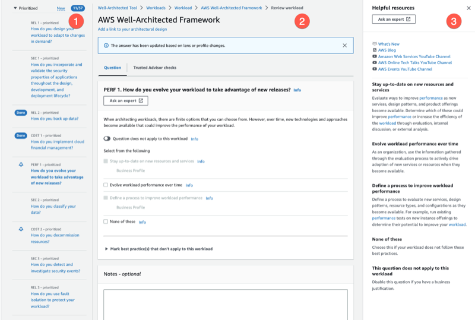
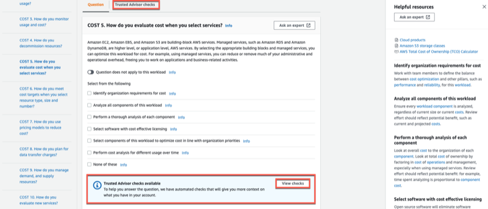

# Tema 7. Arquitectura Well-Architected

Una sola EC2 con MySQL local, AMI hecha a mano y el puerto 3306 abierto al mundo **funciona** hasta el primer pico o el primer disco lleno. El **[Well-Architected Framework](#well-architected)** no es un poster: es un vocabulario para **discutir trade-offs** (coste vs AZ extra, seguridad vs comodidad). **Foundations M9.** Nivel Practitioner: pilares y patrones cortos. Ver [glosario](#glosario).

!!! tip "Al empezar"
    Empieza por el [cuestionario inicial](#cuestionario-inicial). Antes de escalar (Tema 8), nombra **por qué** una AZ sola o un disco lleno te tumba el servicio: aquí justificas el trade-off.

## Propuesta didáctica

> **RA4.** *Gestiona servicios de almacenamiento y bases de datos en la nube, seleccionando tecnologías adecuadas para casos específicos, y diseña arquitecturas escalables y resilientes utilizando herramientas de monitoreo y optimización para mejorar el rendimiento.*

### Criterios de evaluación (RA4)

* **d)** Se ha diseñado arquitecturas escalables y resilientes basadas en las mejores prácticas.
* **f)** Se ha participado en actividades que simulen el análisis y mejora de arquitecturas existentes.

La monitorización fina es el Tema 8. Aquí CloudWatch aparece como práctica de **excelencia operativa**.

### Contenidos

* Seis pilares y tensiones entre ellos.
* Varias AZ, desacoplo ([SNS](#sns)/[SQS](#sqs)), [IaC](#iac) como idea.
* Well-Architected Tool: existe; no es un entregable de producción del instituto.

### Programación de aula (orientativa)

| Quincena | En tutoría | Trabajo autónomo / evidencias |
| --- | --- | --- |
| **Q9** | Pilares WA + trade-offs Multi-AZ | **PR701**; Autocheck del tema |

---

## Cuestionario inicial

!!! question "Responde con lo que sepas"
    1. ¿Para qué sirve el **Well-Architected Framework** si no vas a dibujar Netflix: etiquetar **trade-offs** o memorizar logos?
    2. Poner la API en **dos AZ** mejora un pilar y suele empeorar otro: ¿cuáles?
    3. ¿**SQS** o **SNS** si un worker debe procesar «generar PDF» cuando pueda?
    4. Da un ejemplo de cambio en una app DAW y el **pilar** que mejora (una frase).
    5. ¿Este módulo te pide diseñar un *landing zone* multi-cuenta completo?

Este cuestionario es solo para ti: te ayuda a ver qué dominas ya y qué te falta antes o mientras lees el tema. No se entrega en Aules; respóndelo con lo que sepas y, cuando quieras contrastar, abre el bloque **Soluciones (autoevaluación)** debajo o el índice en [Soluciones](../90-soluciones/soluciones.md).

Soluciones (autoevaluación)

1. Sirve para **etiquetar trade-offs** con pilares (argumentar cambios), no para memorizar logos ni dibujar Netflix.

2. Mejora **fiabilidad**; suele empeorar **coste** (y a veces complejidad/operación).

3. **SQS**: cola de trabajo para que el worker procese cuando pueda. SNS sería pub/sub a varios suscriptores.

4. Ejemplo: pasar MySQL local a **RDS Multi-AZ** → pilar **fiabilidad** (aceptas más coste).

5. **No.** Este módulo no pide un *landing zone* multi-cuenta.

---

## Bloque Foundations (M9)

Los **seis pilares** del Well-Architected Framework son preguntas sistemáticas sobre una carga: ¿cómo operamos?, ¿quién accede a los datos?, ¿qué pasa si cae una AZ?, ¿el tamaño del recurso encaja?, ¿pagamos ociosidad?, ¿usamos energía con sentido? Para una API DAW sirven para **argumentar** un cambio («paso a Multi-AZ») sin dibujar un diagrama de cuarenta cajas.

| Pilar | Pregunta | Ejemplo en una API DAW |
| --- | --- | --- |
| **Excelencia operativa** | ¿Cómo desplegamos y qué aprendemos del incidente? | CloudFormation, alarmas, runbooks |
| **Seguridad** | ¿Datos, identidad, detección? | IAM de mínimo privilegio, TLS, SG |
| **Fiabilidad** | ¿Qué pasa si se cae una AZ? | ALB + dos AZ + RDS Multi-AZ |
| **Eficiencia de rendimiento** | ¿El tipo de recurso encaja? | Familia de instancia, caché |
| **Optimización de costes** | ¿Pagamos ociosidad? | Apagar dev de noche, Spot en batch |
| **Sostenibilidad** | ¿Energía y uso útil? | Rightsizing, regiones, menos idle |

Multi-AZ **mejora fiabilidad** y **sube coste**. Eso es evaluable. El diagrama de cuarenta cajas no.

Los pilares **se tensan** entre sí. Más AZ y más alarmas mejoran fiabilidad y operaciones; también suman factura y complejidad. Rightsizing mejora coste y sostenibilidad; mal hecho, empeora rendimiento. En el entregable no busques el diagrama perfecto: busca **justificar** el trade-off que aceptas.

**Antes / después.** Antes: una EC2 con MySQL local, AMI manual y SG abierto. Después: ALB, dos AZ, RDS Multi-AZ, cola para trabajos largos y alarmas. Cada cambio se puede etiquetar con un **pilar**; ese es el ejercicio del CE f, no redibujar Netflix.

### Patrones de resiliencia

- Varias AZ en el plano de aplicación.
- **Desacoplar** con **[SQS](#sqs)** (cola: el productor no exige que el worker esté vivo) y **[SNS](#sns)** (pub/sub: varios suscriptores). Un pico de pedidos no tiene que tumbar el proceso que genera PDF.
- **[IaC](#iac)** (CloudFormation / CDK): repetible. En este módulo *conoces* la idea; no escribes plantillas de trescientas líneas.
- Sustituir instancias enfermas (puente al Tema 8) en vez de «cuidar» una mascota.

**Mini-caso.** El endpoint `POST /pedidos` responde 201 en milisegundos y encola «generar factura PDF». Si el worker cae, los mensajes esperan en SQS; el usuario ya tiene el pedido. Sin cola, el HTTP espera al PDF y el timeout tumba la UX en el pico de la demo.

<figure markdown="span">
{ width="800" }
<figcaption>Varias AZ, desacoplo con cola SQS y base gestionada Multi-AZ.</figcaption>
</figure>

El lab de Foundations puede ser más simple. El análisis (CE f) es decir **qué pilar mejora** si pasas de una EC2+MySQL local a ALB + varias AZ + RDS.

La **Well-Architected Tool** es un cuestionario por pilares. Saber que existe basta. En la consola verás preguntas (PERF, COST, SEC…) y, en muchas, el enlace a comprobaciones de **Trusted Advisor**.

<figure markdown="span">
{ width="800" }
<figcaption>Pregunta de un pilar en la Well-Architected Tool. Fuente: AWS Well-Architected Tool User Guide (AWS).</figcaption>
</figure>

<figure markdown="span">
{ width="800" }
<figcaption>Trusted Advisor integrado en la revisión de coste. Fuente: AWS Well-Architected Tool User Guide (AWS).</figcaption>
</figure>

### Errores frecuentes (diseño)

- Mejorar «todo» a la vez sin decir qué pilar priorizas (el entregable pide cinco cambios argumentados).
- Usar SNS cuando necesitabas una cola de trabajo (o al revés): pub/sub ≠ «el worker procesará cuando pueda».
- Declarar sostenibilidad sin rightsizing (apagar idle cuenta más que un párrafo verde).

### Relación con Temas 3–6 y 8

Sin VPC multi-AZ (T3), RDS Multi-AZ (T6) y ALB/ASG (T8), el discurso Well-Architected se queda en carteles. Este tema **nombra** el trade-off; los anteriores dan las piezas.

---

## Bloque Ampliación Practitioner (CLF-C02)

El Practitioner no pide un diagrama de cuarenta cajas: pide **etiquetar** el escenario con un pilar y no confundir una cola de trabajo (SQS) con un pub/sub (SNS). Tampoco diseñas *landing zones* multi-cuenta en este módulo.

!!! tip "Para el CLF"
    Cifrar datos apunta a seguridad; las alarmas, a operaciones; Spot o rightsizing, a coste; varias AZ, a fiabilidad. SQS encaja cuando un worker procesará el mensaje; SNS, cuando varios suscriptores reaccionan al mismo evento. Ampliación y **autocheck certificación** en [Certificación § Tema 7](../99-certificacion/certificacion.md#tema-7).

**Videotutorial (Practitioner).** [AWS Well Architecting Framework](https://www.youtube.com/watch?v=S9NTua9mg9k) (~1 h 52 min) — pilares del Well-Architected Framework. Vídeo: Profe Santos Cloud (YouTube).

---

## Videotutorial

**Principal (Foundations).** [AWS Architectura Discussions](https://www.youtube.com/watch?v=M2Diq9qCi4s) (~34 min).

<iframe src="https://www.youtube.com/embed/M2Diq9qCi4s" title="AWS Architectura Discussions — Profe Santos Cloud" style="width:100%;max-width:840px;aspect-ratio:16/9;border:0;display:block;margin:0.8em auto" allow="accelerometer;clipboard-write;encrypted-media;gyroscope;picture-in-picture" allowfullscreen loading="lazy"></iframe>

Vídeo: Profe Santos Cloud (YouTube). Qué mirar: trade-offs (AZ, estado, coste); úsalo como vocabulario para PR701.

El M9 del LMS Academy se indica en clase / Aules.

---

## Actividad / práctica

### PR701 — Mejorar un diagrama frágil

* :simple-neutralinojs: **PR701**. (RA4 // d, f // **PR 0–10**). Partes de un anti-patrón (una EC2 `t3.large` en una AZ, MySQL en la misma instancia, AMI manual, SG `0.0.0.0/0` en 3306, backups en `/home`) y propones mejoras etiquetadas por pilar, sin montar el diagrama completo.

  **Tareas:** escribe **cinco** cambios; cada uno en formato `Problema → servicio/práctica Foundations → pilar → por qué mejora / qué empeora (coste, complejidad)`; opcional: knowledge check Academy M9.

  **Entrega:** según [Cómo entregar las prácticas](../index.md#entrega) — fichero `PR701.md`.

  Guía de apoyo (no sustituye el enunciado): [Soluciones · PR701](../90-soluciones/pr/PR701.md).

| Criterio | Descripción | Puntos |
| --- | --- | --- |
| Cinco cambios | Completos y distintos | 0–4 |
| Pilares | Etiqueta correcta por cambio | 0–3 |
| Trade-off | Qué mejora / qué empeora | 0–2 |
| Claridad | Formato legible | 0–1 |
| **Total** | | **/10** |

---

### Cómo leer un anti-patrón en cinco minutos

1. Inventaría: ¿una AZ? ¿estado en el disco local? ¿secretos en la AMI? ¿SG abierto? ¿sin alarmas?
2. Prioriza **seguridad** y **fiabilidad** antes que adornos de rendimiento.
3. Propón el cambio mínimo Foundations (RDS, Multi-AZ, ALB, S3, IAM, CloudWatch).
4. Declara el coste o la complejidad que aceptas a cambio.

Eso es exactamente el espíritu de PR701 y de muchas preguntas CLF del dominio de conceptos/arquitectura ligera.

---

## Autocheck del tema

Comprueba pilares y desacoplo de este tema. CLF: [Certificación § Tema 7](../99-certificacion/certificacion.md#tema-7).

1. Cifrar EBS y forzar HTTPS: pilar que etiquetas primero…  
   a) sostenibilidad · b) **seguridad** · c) coste
2. Pasar de una AZ a dos con ALB: efecto *principal*…  
   a) **fiabilidad** · b) sostenibilidad · c) «más barato siempre»
3. **V/F.** SQS encaja para que un pico de pedidos no tumbe al worker que genera PDFs.
4. CloudFormation es…  
   a) un pilar Well-Architected · b) una **práctica/IaC** que ayuda a operaciones
5. **V/F.** Este módulo exige montar un *landing zone* multi-cuenta.

Soluciones

1. **b**.

2. **a**.

3. **Verdadero** (cola de trabajo).

4. **b**.

5. **Falso**.

---

## Glosario

**Well-Architected**{: #well-architected}
Marco de AWS con seis pilares para revisar cargas en la nube (operaciones, seguridad, fiabilidad, rendimiento, coste, sostenibilidad). Nivel Practitioner: reconocer el pilar ante un escenario, sin exigir un diagrama de cuarenta cajas.

**SQS**{: #sqs}
*Simple Queue Service*: cola de mensajes. Desacopla productor y consumidor: el productor encola aunque el worker esté caído o saturado. Encaja en «generar PDF / enviar mail» sin tumbar el checkout HTTP.

**SNS**{: #sns}
*Simple Notification Service*: publicación/suscripción. Un mensaje puede llegar a varios destinos (email, cola, Lambda…). Útil para avisos fan-out; no es la misma semántica que una cola de trabajo única.

**IaC**{: #iac}
*Infrastructure as Code*: definir infraestructura en ficheros (p. ej. CloudFormation) para desplegar de forma repetible, no solo a base de clics. En este módulo conoces la idea; no entregas plantillas de producción del instituto.
