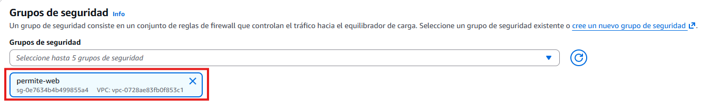
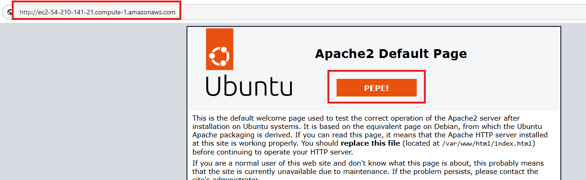

# Tema 8. Escalado, monitorización y cierre CLF-C02

Si el Tema 7 dice *por qué* varias zonas de disponibilidad (**AZ**, *Availability Zone*), este dice *cómo* reparte el tráfico un **[ALB](#alb)** (*Application Load Balancer*, balanceador de carga de aplicaciones), *cómo* un **[ASG](#asg)** (*Auto Scaling group*, grupo de autoescalado) sigue la demanda y *cómo* te enteras ([CloudWatch](#cloudwatch)) antes que el usuario. Cierra **RA3** y **RA4**, y cierra la **2.ª evaluación** del módulo con la preparación **CLF-C02** (*AWS Certified Cloud Practitioner*). Núcleo **Foundations Módulo 10**, más el catálogo corto de servicios que el examen nombra y Foundations apenas toca. Los términos clave están en el [glosario](#glosario).

Piensa este tema como la capa que mantiene viva la materia ya vista: la [VPC](../03-redes-entrega-contenido/tema3.md#vpc) (*Virtual Private Cloud*, nube virtual privada, Tema 3) y el cómputo (Tema 4) son la base; **ELB** (*Elastic Load Balancing*, balanceo de carga elástico), el ASG y CloudWatch son cómo reparte, escala y observas bajo carga. El catálogo CLF del final es reconocimiento rápido de servicios: una frase de *cuándo sí* basta más que un listado de nombres.

!!! tip "Al empezar"
    Empieza por el [cuestionario inicial](#cuestionario-inicial). Si ya justificaste Multi-AZ en el Tema 7, aquí lo **montas**: tráfico, capacidad y alarmas en la consola del lab.

## Propuesta didáctica

> **RA3.** *Diseña y configura redes virtuales y servicios de cómputo en la nube, aplicando buenas prácticas de seguridad, estrategias de balanceo de carga, escalado automático y aprovechando tecnologías serverless, contenedores y máquinas virtuales según casos de uso específicos.*

> **RA4.** *Gestiona servicios de almacenamiento y bases de datos en la nube, seleccionando tecnologías adecuadas para casos específicos, y diseña arquitecturas escalables y resilientes utilizando herramientas de monitoreo y optimización para mejorar el rendimiento.*

### Criterios de evaluación

**RA3**

* **e)** Se ha llevado a cabo la configuración y gestión de balanceo de carga y escalado automático.
* **f)** Se han desarrollado prácticas relacionadas con la optimización de recursos computacionales.

**RA4**

* **e)** Se ha hecho uso de herramientas de monitoreo y recomendaciones de optimización.
* **f)** Se ha participado en actividades que simulen el análisis y mejora de arquitecturas existentes.

### Contenidos

* [ELB](#elb) (ALB / NLB), comprobaciones de estado (*health checks*).
* Auto Scaling: mínimo, deseado y máximo; métricas; apagar entornos de desarrollo.
* CloudWatch, CloudTrail, Config, Trusted Advisor, Health.
* Repaso CLF-C02: IA/ML, analítica, integración (reconocer el servicio).

### Programación de aula (orientativa)

| Quincena | En tutoría | Trabajo autónomo / evidencias |
| --- | --- | --- |
| **Q10** | ELB + ASG + CloudWatch | **PR801**, **AC802**; Autocheck del tema |
| **Q11** | Repaso CLF-C02 y cierre de la 2.ª evaluación | Hub [Certificación](../99-certificacion/certificacion.md); prueba objetiva según Aules |

---

## Cuestionario inicial

!!! question "Responde con lo que sepas"
    1. ¿Qué problema resuelve un **ALB** delante de varias instancias de tu **API** (interfaz de programación de aplicaciones)?
    2. ¿Para qué sirve la **comprobación de estado** (*health check*) del balanceador?
    3. En un **ASG**, ¿qué significan mínimo, deseado y máximo en una frase cada uno?
    4. ¿**CloudWatch** o **CloudTrail** si quieres alarmar CPU al 80 %?
    5. Al acabar el lab, ¿por qué dejar **mínimo = 0** o terminar las instancias evita sorpresas en la factura?

Este cuestionario es solo para ti: te ayuda a ver qué dominas ya y qué te falta antes o mientras lees el tema. No se entrega en Aules; respóndelo con lo que sepas y, cuando quieras contrastar, abre el bloque **Soluciones (autoevaluación)** debajo o el índice en [Soluciones](../90-soluciones/soluciones.md).

Soluciones (autoevaluación)

1. Reparte el tráfico **HTTP** / **HTTPS** (*Hypertext Transfer Protocol* / *Secure*) entre varias instancias y deja de mandar a las que fallan; evita una sola instancia como punto único de fallo.

2. La **comprobación de estado** comprueba si el destino responde (p. ej. `/health`); si no, el ALB no le envía tráfico.

3. **Mínimo:** suelo que no baja; **deseado:** cuántas quieres ahora; **máximo:** techo al escalar.

4. **CloudWatch** (métricas y alarmas). CloudTrail audita llamadas a la API de AWS.

5. Con **mínimo = 0** o al terminar las instancias dejas de pagar capacidad ociosa del lab; si no, el ASG o las instancias siguen facturando.

---

## Bloque Foundations (Módulo 10)

### Elastic Load Balancing

**Qué es en este caso.** Un **[balanceador de carga](#elb)** reparte peticiones entre varios destinos (instancias, contenedores…) y deja de enviar tráfico a los que fallan la **[comprobación de estado](#health-check)** (*health check*). Sin esa comprobación, sigues mandando al proceso que ya no responde `/health`. La familia de servicios se llama **ELB**. Para una API HTTP el tipo habitual es el **[ALB](#alb)** (capa 7: host, path). El **[NLB](#nlb)** (*Network Load Balancer*, balanceador de carga de red) trabaja en capa 4 (TCP/UDP) cuando necesitas muy alto rendimiento o protocolos que no son HTTP. El *Gateway Load Balancer* (**GWLB**) aparece en catálogos y en el examen como opción para *appliances* de red; en Foundations apenas lo usas. El *Classic Load Balancer* (**CLB**) es legado: no es la respuesta moderna en el CLF-C02.

**En la práctica.** En un proyecto de DAW el ALB permite reglas del estilo «`/api/*` hacia el grupo de la API» y «`/` hacia el front». No sustituye a nginx en todos los casos, pero en Foundations es el punto de entrada gestionado que encaja con varias AZ y con el ASG. El cliente (navegador o app) habla con el nombre **DNS** (*Domain Name System*, sistema de nombres de dominio) del ALB, no con la IP de una EC2 concreta. Si apuntas un registro A de DNS a la IP pública de una sola instancia, ese registro se queda obsoleto en cuanto la máquina se sustituye o cae; el nombre DNS del ALB se mantiene aunque cambien los destinos detrás.

<figure markdown="span">
{ width="640" }
<figcaption>ELB: reparte tráfico y deja fuera lo que falla la comprobación de estado.</figcaption>
</figure>

!!! tip "Características ELB (Foundations)"
    - Distribuye la carga entre varias instancias (o destinos).
    - Detecta destinos no sanos (*unhealthy*) y deja de mandarles tráfico.
    - Encaja con varias AZ: si cae una zona, el resto sigue sirviendo.

| Tipo | Uso típico |
| --- | --- |
| **ALB** | HTTP/HTTPS (capa 7): host, path y APIs REST de un proyecto de DAW. |
| **NLB** | TCP/UDP o cargas que piden muy alto rendimiento en capa 4. |
| **GWLB** | *Appliances* de red; en el CLF basta reconocer el nombre. |
| **CLB** clásico | Legado; no es la respuesta moderna en el examen. |

<figure markdown="span">
{ width="640" }
<figcaption>ALB frente a otros tipos (reconocer en examen).</figcaption>
</figure>

#### Grupo de destino y comprobación de estado

El **[grupo de destino](#target-group)** (*target group*) es la lista de destinos (instancias, IPs…) a los que el ALB envía el tráfico de un *listener* (el puerto y protocolo por los que el balanceador escucha, por ejemplo 80/HTTP o 443/HTTPS). La **comprobación de estado** pregunta periódicamente a una ruta (por ejemplo `/` o `/health`): si la respuesta no es la esperada, el destino pasa a *unhealthy* y el ALB deja de mandarle peticiones nuevas. Un buen diseño de comprobación mira una ruta que diga «la app está lista», no solo «el puerto TCP está abierto».

El ALB en **varias AZ** complementa el ASG: si una AZ cae, el balanceador deja de mandar a esa zona y sigue sirviendo con las demás. Para eso necesitas el ALB asociado a subredes en al menos dos AZ; una sola subred no te da alta disponibilidad real aunque tengas dos instancias en la misma zona.

<figure markdown="span">
{ width="640" }
<figcaption>Balanceador multi-AZ con comprobaciones de estado.</figcaption>
</figure>

!!! tip "Práctica ALB (pasos que verás en consola)"
    - Elige **al menos dos AZ** (y una subred en cada una): si no, no hay alta disponibilidad real.
    - Crea el grupo de destino y registra las instancias; la comprobación de estado debe apuntar a una ruta que tu app responda (p. ej. `/` o `/health`).
    - Asocia un **[SG](../03-redes-entrega-contenido/tema3.md#security-group)** (grupo de seguridad) al ALB que permita el tráfico web (80/443) según el enunciado; las instancias suelen aceptar tráfico desde el SG del balanceador, no desde todo internet.
    - El DNS del ALB es el punto de entrada; deja de apuntar registros A de DNS a una sola EC2.

<figure markdown="span">
{ width="720" }
<figcaption>Mapeo de red del ALB: VPC + mínimo dos AZ y subredes.</figcaption>
</figure>

<figure markdown="span">
{ width="720" }
<figcaption>Al crear el ALB eliges el grupo de seguridad que controla el tráfico hacia el balanceador.</figcaption>
</figure>

<figure markdown="span">
{ width="720" }
<figcaption>Target group: dónde manda el balanceador el tráfico sano.</figcaption>
</figure>

Cuando solo tienes una EC2 con IP pública y un registro A de DNS apuntando a ella, si cae la máquina cae el servicio. Con un ALB delante, comprobación de estado a `/health` y dos instancias en AZ distintas, el usuario sigue usando el mismo nombre DNS y tú dejas de depender de una sola instancia. En el lab, a veces compruebas primero que cada instancia sirve la página (por ejemplo una marca personalizada en el HTML) y después pasas el tráfico por el DNS del ALB: así ves que el balanceador reparte y no que «una sola máquina responde por casualidad».

<figure markdown="span">
{ width="720" }
<figcaption>Comprobación previa: la instancia responde en HTTP antes de colgarla detrás del ALB.</figcaption>
</figure>

| Examen CLF | Clase DAW / empresa |
| --- | --- |
| El ALB reparte HTTP/HTTPS y usa comprobaciones de estado. | En el lab documentas al menos un destino *healthy*. |
| El NLB no es el ALB: capa 4 frente a capa 7. | Para una API REST eliges ALB salvo que el enunciado diga otra cosa. |
| El DNS del ALB sustituye el registro A a una sola EC2. | Deja de pegar la IP pública de la instancia en el front. |

### Auto Scaling

**Qué es en este caso.** Un **[Auto Scaling Group](#asg)** mantiene un conjunto de instancias EC2 con tres números: **mínimo** (suelo: el grupo no baja de ahí), **deseado** (cuántas quieres ahora) y **máximo** (techo: no escala por encima aunque la métrica diga «más»). Escala según una **[política de escalado](#politica-de-escalado)** ligada a métricas (CPU, peticiones) o a un horario (entorno de desarrollo a cero por la noche). La elasticidad significa que la capacidad **sigue** a la demanda, no una máquina virtual eterna «por si acaso».

**En la práctica.** En una API de prácticas un buen diseño es: mínimo bajo en el lab, deseado acorde a la demo, máximo con techo consciente. Programar un horario que baje a cero por la noche evita la factura del fin de semana. En producción el mínimo suele ser ≥ 2 si quieres sobrevivir a una AZ; en el instituto un mínimo = 2 sin apagar es un error de coste. Optimizar (CE f del RA3) no es poner máximo = 20 «por si acaso» en la cuenta del learner: es ajustar el tamaño de la instancia, mantener y actualizar la AMI y la app, y dejar un techo que no te arruine el mes.

**Cuándo no subir el máximo del ASG.** Si la base de datos o el ALB no aguantan, o si el lab no tiene presupuesto, subir el máximo solo multiplica la factura. Primero ajusta el tamaño de los recursos y las comprobaciones de estado; después la elasticidad. Una política que escala por CPU al 70 % no arregla una app que responde 500 en `/health`: el ASG lanzará más instancias no sanas y el ALB seguirá sin mandarles tráfico útil. La política de escalado no sustituye mantener y actualizar la aplicación ni la AMI: solo mueve el número de instancias.

<figure markdown="span">
{ width="640" }
<figcaption>Capacidad que sigue a la demanda (ASG + ELB).</figcaption>
</figure>

El ASG suele lanzar instancias a partir de una plantilla de lanzamiento (*launch template*) con una [AMI](../04-computo-serverless/tema4.md#ami) (*Amazon Machine Image*), un tipo de instancia y un SG. La AMI es la foto del disco desde la que nace cada instancia nueva: si no tiene la app lista (o el *user data* no la deja lista), el ASG crea máquinas que el ALB marca como no sanas. En ese caso escalas problemas, no capacidad útil. Mientras pruebas, deja el mínimo ≥ 1 según el enunciado; al cerrar **PR801**, baja el mínimo (y el deseado) a **0** o termina las instancias para no dejar factura.

| Examen CLF | Clase DAW / empresa |
| --- | --- |
| Mínimo, deseado y máximo definen el ASG. | En el lab anotas los tres valores mientras pruebas. |
| El ASG no sustituye elegir bien el tipo de instancia. | Ajusta el tamaño antes de subir el máximo. |
| Bajar a mínimo = 0 deja de pagar capacidad ociosa. | Al cerrar PR801, mínimo = 0 o termina los recursos. |

### Monitorización

**Qué es en este caso.** Observar es cómo detectas CPU al 10 % en un `m5.2xlarge` (coste) o una instancia no sana (fiabilidad). Cada servicio responde a una pregunta distinta: no uses CloudTrail para mirar la CPU ni Trusted Advisor para auditar quién borró un SG ayer.

| Servicio | Pregunta que responde |
| --- | --- |
| **[CloudWatch](#cloudwatch)** | ¿Qué métricas y logs tiene el recurso? ¿Cuándo disparo una alarma? |
| **[CloudTrail](#cloudtrail)** | ¿Quién llamó a la API de AWS y cuándo? (auditoría; Tema 2) |
| **[Config](#config)** | ¿La configuración del recurso sigue cumpliendo la regla (p. ej. SG abierto)? |
| **[Trusted Advisor](#trusted-advisor)** | ¿Hay comprobaciones de coste, seguridad o cuotas que deba mirar? |
| **[AWS Health](#aws-health)** | ¿AWS tiene un incidente en la región o en un servicio que uso? |

**CloudWatch** trabaja con **métricas** (números en el tiempo: CPU, latencia, *UnHealthyHostCount*), **alarmas** (umbral + acción: notificar, escalar, etc.) y **logs** (texto de aplicación o servicio). Una alarma útil en lab: CPU alta sostenida, o *UnHealthyHostCount* mayor que 0. Una alarma ruidosa cada minuto sin umbral ni acción no te ayuda a estudiar ni a operar. CloudWatch sin ALB/ASG igual sirve (métricas de una EC2), pero el valor didáctico del Módulo 10 es ver las **tres** piezas juntas.

**CloudTrail** registra llamadas a la API de AWS: quién creó el ALB, quién cambió el ASG. No es el sitio donde miras `CPUUtilization`. **Config** evalúa reglas de configuración (por ejemplo «¿hay un SG con 22 abierto a internet?»). **Trusted Advisor** resume recomendaciones según tu plan de Support (coste, seguridad, cuotas…). **AWS Health** te dice si hay un incidente de AWS en la región o en un servicio que usas: útil para no perder media hora depurando tu app cuando el problema es del proveedor.

CPU al 10 % un mes en `m5.2xlarge` es un hallazgo de **coste** (y de sostenibilidad del Tema 7), no de «el servidor va fino». En el lab: captura un destino sano y una alarma o una métrica, no solo el diagrama.

<figure markdown="span">
{ width="800" }
<figcaption>Reparto de tráfico, elasticidad de capacidad y observación: tres piezas que van juntas en Foundations Módulo 10.</figcaption>
</figure>

El ALB reparte en capa 7 (host/path); CloudWatch te enseña el *log stream* o la métrica cuando algo falla. Los logs de una función Lambda del Tema 4 también viven en CloudWatch Logs, pero en **PR801** la evidencia pedida es una alarma o métrica de EC2, ALB o grupo de destino, no un volcado de logs de Lambda «porque también es CloudWatch».

<figure markdown="span">
{ width="800" }
<figcaption>Piezas del ALB (listeners, target groups…). Fuente: Elastic Load Balancing Application Guide (AWS).</figcaption>
</figure>

<figure markdown="span">
{ width="800" }
<figcaption>Log stream en CloudWatch Logs. Fuente: AWS Lambda Developer Guide (AWS).</figcaption>
</figure>

Para el repaso CLF, Skill Builder concentra cursos y materiales oficiales de preparación (p. ej. *Cloud Practitioner Essentials*): no confundas ese portal con la consola del lab ni con el LMS de Academy.

<figure markdown="span">
{ width="800" }
<figcaption>Portal Skill Builder para la preparación CLF. Fuente: skillbuilder.aws (AWS).</figcaption>
</figure>

### Cómo encajan ALB, ASG y la alarma

El ASG lanza instancias en varias AZ según el mínimo, el deseado y el máximo. El ALB solo envía tráfico a las que pasan la comprobación de estado del grupo de destino. CloudWatch alarma si el número de destinos no sanos sube o si la CPU se dispara. Si escalas sin comprobación de estado útil, multiplicas instancias que no sirven. Si pones una alarma sin ALB ni ASG, solo miras una instancia suelta: útil para un lab corto, pero no es el diseño que estudias en el Módulo 10.

En un proyecto intermodular el flujo mental es: el usuario llega al DNS del ALB; el ALB elige un destino sano; el ASG mantiene suficientes destinos; la alarma te avisa cuando eso se rompe. Si terminas una instancia a propósito (o el lab te pide simular una caída), el ASG debería acercarse otra vez al deseado y el ALB debería dejar de mandar a la caída en cuanto falle la comprobación de estado. PR801 te pide evidencia de las tres piezas y, al cerrar, bajar el mínimo a 0 o terminar recursos para no dejar factura.

### Relación con otros temas

La VPC y las subredes del Tema 3 son el suelo donde colocas el ALB y las instancias del ASG: sin dos AZ y sin SG coherentes, el balanceador no te da la alta disponibilidad que dibujaste en el Tema 7. El cómputo del Tema 4 (EC2, AMI, tipo de instancia) es lo que el ASG lanza; si la AMI o el *user data* no dejan la app lista, el ALB marca *unhealthy*. IAM (Tema 2) decide quién puede crear el ALB o cambiar el ASG; CloudTrail registra esas llamadas. RDS Multi-AZ del Tema 6 y el ALB + ASG de este tema responden a preguntas distintas: la BD escribe con conmutación; el front reparte lecturas HTTP. El Well-Architected del Tema 7 te pide justificar el equilibrio entre fiabilidad, coste y complejidad; aquí **ejecutas** ese equilibrio con mínimo, deseado, máximo y una alarma que no sea ruido.

### El lab del Módulo 10: Ejercicio de laboratorio 6 - Escalado y balanceo de la carga de su arquitectura

En tu clase de *Cloud Foundations*, el lab del **Módulo 10** se llama **Ejercicio de laboratorio 6 - Escalado y balanceo de la carga de su arquitectura**. Trabajas en la **región que indique el lab**. No confundas este laboratorio del módulo con el *Learner Lab* genérico: aquí sigues el enunciado del Módulo 10 paso a paso.

Primero creas un **balanceador** (ALB) con un grupo de destino y destinos en **varias AZ**, según el enunciado. Configuras la comprobación de estado hacia una ruta que la aplicación responda. Asocias el SG del balanceador y el de las instancias como indique el lab (el tráfico web suele entrar por el ALB).

Después **compruebas el estado** de las instancias en el grupo de destino: al menos un destino debe aparecer sano (*healthy*). Sin eso, el ALB no está repartiendo de verdad. Si el enunciado te pide probar la página de cada instancia o del DNS del ALB, hazlo y deja captura.

Luego configuras un **grupo de Auto Scaling** con **mínimo**, **deseado** y **máximo** coherentes con el enunciado, vinculado al mismo diseño (plantilla de lanzamiento y grupo de destino). Compruebas que el tráfico se reparte entre destinos sanos y que el grupo **reacciona** a la carga o a una instancia caída, según indique el enunciado (más instancias, sustitución, etc.). Añades o documentas una **alarma** de CloudWatch (CPU o destinos no sanos) o una captura de métrica: esa es la señal de observación del IE.

Al terminar, **bajas el mínimo a 0** o terminas los recursos del lab para no dejar capacidad facturando. En **PR801** dejas capturas del destino sano, de los valores del ASG, de la alarma o métrica y de la limpieza. Respecto al mapa del proyecto de DAW (API detrás de ALB, capacidad elástica, observación), este lab **practica** balanceo, Auto Scaling y una alarma. **Simplifica** el resto del producto (no montas RDS ni el front completo).

### Errores frecuentes (escala y observación)

Si el ALB tiene una comprobación de estado que siempre marca *healthy* aunque la app devuelva 500, sigues enviando tráfico a un proceso roto. Apunta la comprobación a una ruta real y mira el código de respuesta esperado.

Dejar el ASG con mínimo = 2 al acabar el lab es la forma más habitual de llevarse un susto en la factura del learner: la capacidad sigue facturando el fin de semana. Baja a mínimo = 0 o termina instancias y deja captura de limpieza.

Mirar la CPU en **CloudTrail** te deja en la herramienta equivocada: CloudTrail audita llamadas a la API de AWS; la CPU es métrica de CloudWatch. Pegar logs de una Lambda como «observabilidad» de este IE tampoco cumple: aquí quieres alarma o métrica de EC2, ALB o grupo de destino.

Si confundes «aprobar CLF-C02» con «compensar un RA suspendido» en este módulo, el +1 de certificación no te salva un resultado de aprendizaje suspenso: los RA no se compensan.

### Cierre del módulo (sin 3.ª evaluación)

La **2.ª evaluación** cierra Temas 5–8. Este tema concentra ELB, ASG, CloudWatch y el repaso de catálogo CLF. No hay «cierre» aparte ni 3.ª evaluación en 2.º GS: el módulo acaba antes de la FE.

Para el cierre CLF: [Certificación](../99-certificacion/certificacion.md) (serie, tests, Skill Builder). Ocho tarjetas bien hechas (AC802) superan un listado largo de nombres sin frase de uso. Antes del examen, repasa también los dominios del CLF-C02 en el hub: no hace falta memorizar cada servicio de analítica o IA, sí reconocer el nombre cuando el enunciado describe el caso.

Si llegas a la prueba objetiva de la 2.ª evaluación con el lab hecho y con las capturas de PR801 ordenadas, el tema te habrá servido dos veces: como práctica de consola y como vocabulario del examen. Si solo memorizas siglas sin haber visto un destino *healthy*, en el CLF te confundirán NLB y ALB en cuanto el enunciado hable de path o de TCP.

---

## Bloque Ampliación Practitioner (CLF-C02)

Con ALB, Auto Scaling y CloudWatch cierras el núcleo Foundations de este tema. El catálogo corto de servicios (IA, analítica, colas, integración de eventos…) y el tono de examen viven en el hub de Certificación. En el examen, una pregunta típica contrapone CloudWatch (métrica/alarma) frente a CloudTrail (auditoría de API), o ALB (HTTP) frente a NLB (TCP). Otra te pide el servicio de recomendaciones (Trusted Advisor) o el panel de incidentes del proveedor (AWS Health). No hace falta profundidad de ML o de *data lakes*: basta la frase de reconocimiento.

!!! tip "Para el CLF"
    La comprobación de estado deja fuera lo que falla; el ASG se entiende con mínimo, deseado y máximo. CloudWatch mira métricas y alarmas; CloudTrail audita la API. En el catálogo basta reconocer el servicio con una frase de *cuándo sí* y *cuándo no*. Detalle y **autocheck certificación** en [Certificación § Tema 8](../99-certificacion/certificacion.md#tema-8).

Para seguir hacia el examen, en [Certificación](../99-certificacion/certificacion.md) tienes la [serie Santos](../99-certificacion/certificacion.md#serie-santos), los [tests de práctica](../99-certificacion/certificacion.md#tests) y el [orden sugerido](../99-certificacion/certificacion.md#orden).

---

## Videotutorial

**Principal (Foundations).** [ALB ASG PublicSubnet](https://www.youtube.com/watch?v=GqRMAwo6QRA) (~27 min).

<iframe src="https://www.youtube.com/embed/GqRMAwo6QRA" title="ALB ASG PublicSubnet — Profe Santos Cloud" style="width:100%;max-width:840px;aspect-ratio:16/9;border:0;display:block;margin:0.8em auto" allow="accelerometer;clipboard-write;encrypted-media;gyroscope;picture-in-picture" allowfullscreen loading="lazy"></iframe>

Vídeo: Profe Santos Cloud (YouTube). Qué mirar: comprobación de estado del ALB y mínimo / deseado / máximo del ASG; al acabar, mínimo = 0 o terminar recursos.

**Extra (opcional).** [CloudWatch - CloudTrail - EventBridge](https://www.youtube.com/watch?v=T_Pz1ksb9ng) (~22 min) — métrica y alarma frente a auditoría de API. Vídeo: Profe Santos Cloud (YouTube).

---

## Actividad / práctica

### PR801 — Escalar y observar

* :simple-neutralinojs: **PR801**. (RA3 // e, f // RA4 // e // **PR 0–10**). Completas el lab Academy del Módulo 10 (**Ejercicio de laboratorio 6 - Escalado y balanceo de la carga de su arquitectura**): ALB, ASG y una señal en CloudWatch, sin dejar el lab facturando.

  **Tareas:** crea o completa el ALB con destinos en varias AZ; documenta al menos un destino sano; configura el ASG (mínimo, deseado, máximo) según el enunciado; comprueba que el tráfico se reparte y que el grupo reacciona a la carga o a una instancia caída según el lab; deja una alarma CloudWatch (CPU o destinos no sanos) o captura de métrica; al acabar, **mínimo = 0** o termina recursos y deja captura de limpieza.

  **Entrega:** según [Cómo entregar las prácticas](../index.md#entrega) — fichero `PR801.md` (o ZIP + `img/` si hay capturas).

  Guía de apoyo (no sustituye el enunciado): [Soluciones · PR801](../90-soluciones/pr/PR801.md).

| Criterio | Descripción | Puntos |
| --- | --- | --- |
| ALB | Destino sano documentado | 0–3 |
| ASG | Mínimo / deseado / máximo coherentes en el lab | 0–3 |
| CloudWatch | Alarma o métrica | 0–2 |
| Limpieza | Mínimo = 0 o recursos terminados | 0–2 |
| **Total** | | **/10** |

### AC802 — Mapa de servicios CLF

* :simple-readdotcv: **AC802**. (RA3 // f // RA4 // f // **AC 0–1**). Preparas ocho tarjetas de reconocimiento (servicio, una frase, dominio CLF-C02). Sin dumps de examen: calidad frente a cantidad.

  **Tareas:** elige ocho servicios del catálogo visto en el tema / hub; una frase de *cuándo sí*; dominio aproximado del CLF-C02.

  **Entrega:** según [Cómo entregar las prácticas](../index.md#entrega) — fichero `AC802.md`.

  Guía de apoyo (no sustituye el enunciado): [Soluciones · AC802](../90-soluciones/pr/AC802.md).

| Criterio | Descripción | Puntos |
| --- | --- | --- |
| Ocho tarjetas útiles | Servicio + frase + dominio; sin dump | 0–1 |
| **Total** | | **/1** |

---

## Autocheck del tema

Cierre Foundations (ELB/ASG/CloudWatch). El catálogo CLF largo y el estilo examen están en [Certificación § Tema 8](../99-certificacion/certificacion.md#tema-8).

1. Un **ALB** trabaja sobre todo en…  
   a) capa 3 (IP) · b) **capa 7 (HTTP/HTTPS)** · c) solo como NAT de VPC
2. ASG con mínimo = 2 en **dos** AZ: si cae una AZ, ¿qué esperas a alto nivel?
3. **V/F.** Miras la CPU de la instancia en **CloudTrail**.
4. Empareja: **ALB** · **ASG** · **CloudWatch** con: (a) reparte a destinos sanos · (b) mínimo / deseado / máximo · (c) métricas y alarmas
5. **V/F.** Aprobar CLF-C02 te aprueba automáticamente un RA suspendido en este módulo.

Soluciones

1. **b**.

2. Que el ASG y el ALB sigan sirviendo con capacidad en la AZ viva (si el diseño es multi-AZ); no «todo caído».

3. **Falso** — la CPU se mira en CloudWatch; CloudTrail audita la API.

4. El **ALB** encaja con (a) repartir a destinos sanos; el **ASG**, con (b) mínimo / deseado / máximo; **CloudWatch**, con (c) métricas y alarmas.

5. **Falso** — los RA no se compensan; el +1 no aprueba un RA.

---

## Glosario

**ELB**{: #elb}
*Elastic Load Balancing* (balanceo de carga elástico): familia de balanceadores de AWS que reparte tráfico entre destinos sanos (ALB, NLB, GWLB…). Sin comprobaciones de estado, puede seguir enviando a un proceso que ya no responde.

**ALB**{: #alb}
*Application Load Balancer* (balanceador de carga de aplicaciones): balanceador de capa 7 (HTTP/HTTPS), con reglas por host y path. Habitual delante de APIs web. Encaja con varias AZ y con un ASG detrás.

**NLB**{: #nlb}
*Network Load Balancer* (balanceador de carga de red): balanceador de capa 4 (TCP/UDP) para alto rendimiento o protocolos que no son HTTP.

**target group**{: #target-group}
Grupo de destino: conjunto de destinos registrados al que un *listener* del ALB envía el tráfico.

**health check**{: #health-check}
Comprobación de estado: petición periódica del balanceador (o del ASG) para saber si un destino está sano.

**ASG**{: #asg}
*Auto Scaling Group* (grupo de autoescalado): conjunto de instancias EC2 con mínimo, deseado y máximo, que crece o decrece según métricas o horarios.

**política de escalado**{: #politica-de-escalado}
Regla que dice cuándo y cómo cambia el deseado del ASG (por métrica, por escalones o por horario).

**CloudWatch**{: #cloudwatch}
Servicio de métricas, logs y alarmas. Responde a «¿qué está pasando ahora en el recurso?». No sustituye a CloudTrail.

**CloudTrail**{: #cloudtrail}
Registro de llamadas a la API de AWS (quién hizo qué y cuándo). Auditoría, no métrica de CPU.

**Config**{: #config}
Servicio que evalúa si la configuración de los recursos cumple reglas (p. ej. SG demasiado abierto).

**Trusted Advisor**{: #trusted-advisor}
Comprobaciones recomendadas de coste, seguridad, tolerancia a fallos, rendimiento y cuotas según el plan de Support.

**AWS Health**{: #aws-health}
Panel de eventos e incidentes que afectan a servicios o regiones de tu cuenta.
