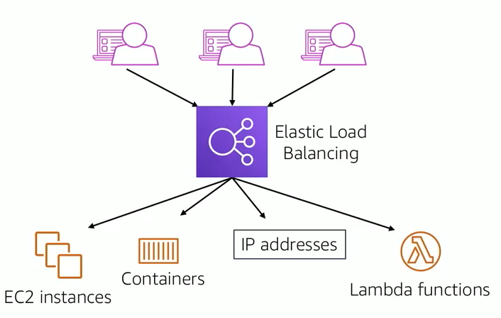
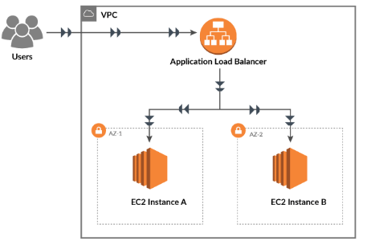
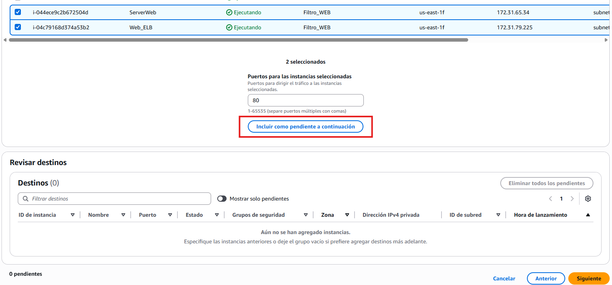
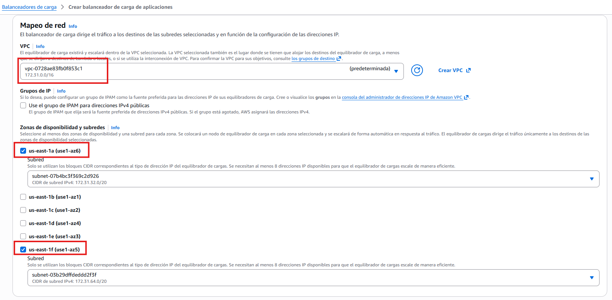
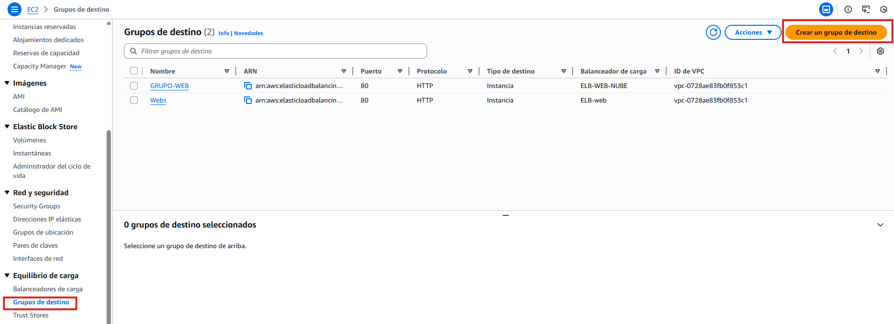
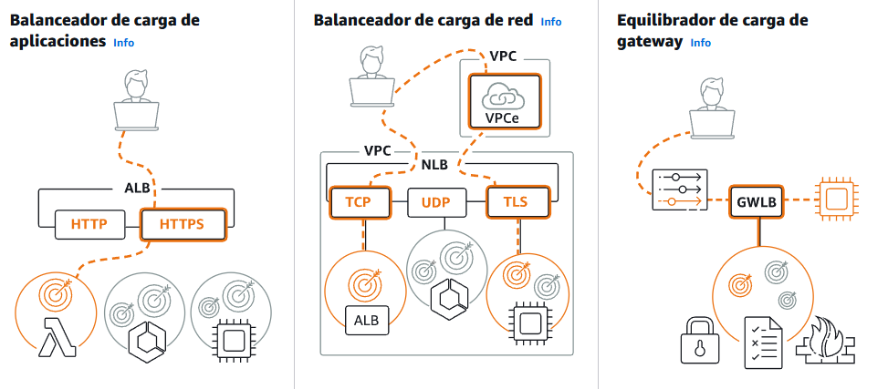
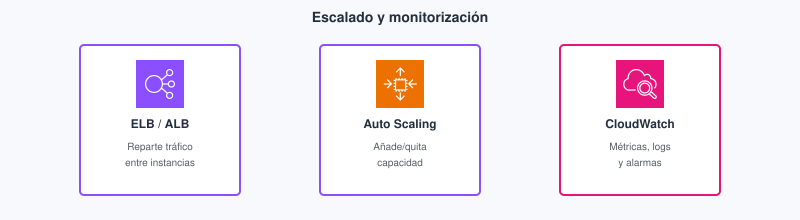

# Tema 8. Escalado, monitorización y cierre CLF-C02

Si el Tema 7 dice *por qué* varias AZ, este dice *cómo* reparte el tráfico un **[ALB](#alb)**, *cómo* un **[ASG](#asg)** sigue la demanda y *cómo* te enteras ([CloudWatch](#cloudwatch)) antes que el usuario. Cierra **RA3** y **RA4**, y cierra la **2.ª evaluación** del módulo con la preparación **CLF-C02**. Núcleo **Foundations M10**, más el catálogo corto de servicios que el examen nombra y Foundations apenas toca. Ver [glosario](#glosario).

Piensa este tema como el «tablero de control» de lo ya visto: la VPC (T3) y el cómputo (T4) son la materia; ELB/ASG/CloudWatch son cómo la mantienes viva bajo carga y cómo demuestras (con métricas) que no estás a ciegas. El catálogo CLF del final es reconocimiento rápido de logos.

## Propuesta didáctica

> **RA3.** *Diseña y configura redes virtuales y servicios de cómputo en la nube, aplicando buenas prácticas de seguridad, estrategias de balanceo de carga, escalado automático y aprovechando tecnologías serverless, contenedores y máquinas virtuales según casos de uso específicos.*

> **RA4.** *Gestiona servicios de almacenamiento y bases de datos en la nube, seleccionando tecnologías adecuadas para casos específicos, y diseña arquitecturas escalables y resilientes utilizando herramientas de monitoreo y optimización para mejorar el rendimiento.*

### Criterios de evaluación

**RA3**

* **e)** Se ha llevado a cabo la configuración y gestión de balanceo de carga y escalado automático.
* **f)** Se han desarrollado prácticas relacionadas con la optimización de recursos computacionales.

**RA4**

* **e)** Se ha hecho uso de herramientas de monitoreo y recomendaciones de optimización.
* **f)** Se ha participado en actividades que simulen el análisis y mejora de arquitecturas existentes.

### Contenidos

* [ELB](#elb) (ALB / NLB), health checks.
* Auto Scaling: min / desired / max; métricas; apagar entornos de desarrollo.
* CloudWatch, CloudTrail, Config, Trusted Advisor, Health.
* Repaso CLF-C02: IA/ML, analítica, integración (reconocer el servicio).

---

## Bloque Foundations (M10)

### Elastic Load Balancing

Un **[balanceador de carga](#elb)** reparte peticiones entre varios destinos (instancias, contenedores…) y deja de enviar tráfico a los que fallan el *health check*. Sin comprobación de salud, sigues mandando al proceso que ya no responde `/health`. Para una API HTTP el tipo habitual es el **[ALB](#alb)** (capa 7: host, path).

En desarrollo web el ALB permite reglas del estilo «`/api/*` → grupo de la API» y «`/` → front». No sustituye a nginx en todos los casos, pero en Foundations es el punto de entrada gestionado que encaja con varias AZ y con el ASG.

<figure markdown="span">
{ width="640" }
<figcaption>ELB: reparte tráfico y deja fuera lo que falla el health check.</figcaption>
</figure>

!!! tip "Características ELB (Foundations)"
    - Distribuye la carga entre varias instancias (o destinos).
    - Detecta destinos *unhealthy* y deja de mandarles tráfico.
    - Encaja con varias AZ: si cae una zona, el resto sigue sirviendo.

| Tipo | Uso típico |
| --- | --- |
| **ALB** | HTTP/HTTPS (capa 7): host, path, tu API REST |
| **NLB** | TCP/UDP, muy alto rendimiento |
| **GWLB** | *Appliances*; reconocer el nombre |
| CLB clásico | Legado; no es la respuesta moderna |

<figure markdown="span">
{ width="640" }
<figcaption>ALB frente a otros tipos (reconocer en examen).</figcaption>
</figure>

El ALB en **varias AZ** complementa el ASG: si una AZ cae, el balanceador deja de mandar a esa zona.

<figure markdown="span">
{ width="640" }
<figcaption>Balanceador multi-AZ con health checks.</figcaption>
</figure>

!!! tip "Práctica ALB (pasos que verás en consola)"
    - Elige **al menos dos AZ** (y una subnet en cada una): si no, no hay HA real.
    - Crea el *target group* y registra las instancias; el health check debe apuntar a una ruta que tu app responda (p. ej. `/` o `/health`).
    - El DNS del ALB es el punto de entrada; deja de apuntar A records a una sola EC2.

<figure markdown="span">
{ width="720" }
<figcaption>Mapeo de red del ALB: VPC + mínimo dos AZ/subnets.</figcaption>
</figure>

<figure markdown="span">
{ width="720" }
<figcaption>Target group: dónde manda el balanceador el tráfico sano.</figcaption>
</figure>

**Antes / después.** Antes: una sola EC2 con IP pública y DNS A record; si cae, cae el servicio. Después: ALB delante, health check a `/health`, dos instancias en AZ distintas. El usuario sigue usando el mismo nombre DNS; tú dejas de apuntar a una mascota.

### Auto Scaling

Un **[Auto Scaling Group (ASG)](#asg)** mantiene un conjunto de instancias con mínimo, deseado y máximo. Escala con CPU, peticiones o horario (dev a cero por la noche). Elasticidad = la capacidad **sigue** a la demanda, no una VM eterna «por si acaso».

<figure markdown="span">
{ width="640" }
<figcaption>Capacidad que sigue a la demanda (ASG + ELB).</figcaption>
</figure>

En una API de prácticas el patrón sano es: min bajo en lab, desired acorde a la demo, max con techo consciente. Programar un horario que baje a cero por la noche evita la factura del fin de semana. En producción real el min suele ser ≥ 2 si quieres sobrevivir a una AZ; en el instituto el min=2 sin apagar es un error de coste.

Optimizar (CE f): máximo 20 en la cuenta del instituto no es un plan. Min=1 en lab; **terminar** al acabar.

**Cuándo NO subir el máximo del ASG.** Si la base o el ALB no aguantan, o si el lab no tiene presupuesto, subir `max` solo multiplica la factura. Primero rightsizing y health checks; después elasticidad.

### Monitorización

Observar no es un lujo: es cómo detectas CPU al 10 % en un `m5.2xlarge` (coste) o una instancia *unhealthy* (fiabilidad). Cada servicio responde a una pregunta distinta —no uses CloudTrail para mirar la CPU:

| Servicio | Pregunta |
| --- | --- |
| **[CloudWatch](#cloudwatch)** | ¿CPU, latencia, logs? Alarmas |
| **CloudTrail** | ¿Quién llamó a la API? (Tema 2) |
| **Config** | ¿El SG sigue abierto? |
| **Trusted Advisor** | ¿Checks de coste/seguridad/cuotas? |
| **Health** | ¿AWS tiene un incidente en la región? |

CPU al 10 % un mes en `m5.2xlarge` es un hallazgo de **coste** (y de sostenibilidad), no de «el servidor va fino».

Una alarma útil en lab: CPU alta sostenida, o *UnHealthyHostCount* > 0. Una alarma inútil: ruido cada minuto sin umbral ni acción. CloudWatch sin ALB/ASG igual sirve (métricas de una EC2), pero el valor didáctico de M10 es ver las **tres** piezas juntas.

<figure markdown="span">
{ width="800" }
<figcaption>Reparto de tráfico, elasticidad de capacidad y observación: tres piezas que van juntas en Foundations M10.</figcaption>
</figure>

El ALB reparte en capa 7 (host/path); CloudWatch te enseña el *log stream* o la métrica cuando algo falla. En el lab: captura un destino sano y una alarma o un log, no solo el diagrama.

<figure markdown="span">
{ width="800" }
<figcaption>Piezas del ALB (listeners, target groups…). Fuente: Elastic Load Balancing Application Guide (AWS).</figcaption>
</figure>

<figure markdown="span">
{ width="800" }
<figcaption>Log stream en CloudWatch Logs. Fuente: AWS Lambda Developer Guide (AWS).</figcaption>
</figure>

Para el repaso CLF, Skill Builder concentra cursos y prep oficiales (p. ej. *Cloud Practitioner Essentials*): no confundas ese portal con la consola del lab.

<figure markdown="span">
{ width="800" }
<figcaption>Portal Skill Builder para prep. CLF. Fuente: skillbuilder.aws (AWS).</figcaption>
</figure>

### Errores frecuentes (escala y observación)

- ALB sin health check útil (siempre «healthy» aunque la app devuelva 500).
- ASG con min=2 en lab y olvidar bajarlo → factura.
- Mirar CloudTrail para ver la CPU (herramienta equivocada).
- Confundir «aprobar CLF-C02» con «compensar un RA suspendido» en este módulo.

### Cierre del módulo (sin 3.ª evaluación)

La **2.ª evaluación** cierra Temas 5–8. Este tema concentra ELB/ASG/CloudWatch y el repaso de catálogo CLF. No hay «cierre» aparte ni 3.ª evaluación en 2.º GS: el módulo acaba antes de la FE.

---

## Bloque Ampliación Practitioner (CLF-C02)

ALB / ASG / CloudWatch cierran Foundations. El catálogo CLF (IA, analítica, colas…) y el estilo examen viven en el hub.

!!! tip "Para el CLF"
    Health check + min/desired/max. CloudWatch ≠ CloudTrail. Reconoce el servicio de una frase (*cuándo sí / cuándo no*).

    Catálogo, mapa de dominios y **autocheck certificación** → [Certificación § Tema 8](../99-certificacion/certificacion.md#tema-8).

**Serie / tests / orden** → [serie](../99-certificacion/certificacion.md#serie-santos) · [tests](../99-certificacion/certificacion.md#tests) · [orden](../99-certificacion/certificacion.md#orden).

---

## Videotutorial

**Principal (Foundations).** [ALB ASG PublicSubnet](https://www.youtube.com/watch?v=GqRMAwo6QRA) (~27 min).

<iframe src="https://www.youtube.com/embed/GqRMAwo6QRA" title="ALB ASG PublicSubnet — Profe Santos Cloud" style="width:100%;max-width:840px;aspect-ratio:16/9;border:0;display:block;margin:0.8em auto" allow="accelerometer;clipboard-write;encrypted-media;gyroscope;picture-in-picture" allowfullscreen loading="lazy"></iframe>

Vídeo: Profe Santos Cloud (YouTube). Qué mirar: health check del ALB + min/desired/max del ASG; al acabar, min=0 o terminate.

**Extra (opcional).** [CloudWatch - CloudTrail - EventBridge](https://www.youtube.com/watch?v=T_Pz1ksb9ng) (~22 min) — métrica/alarma frente a auditoría de API. Vídeo: Profe Santos Cloud (YouTube).

El M10 del LMS Academy se indica en clase / Aules.

---

## Actividad / práctica

**PR801 — Escalar y observar** (RA3 e, f; RA4 e)

Lab Academy M10. Evidencias: ALB con un destino sano; ASG con min ≥ 1 en lab y **min = 0 o terminate** al acabar; una alarma CloudWatch (CPU o *unhealthy host*) o captura de métrica.

**AC802 — Mapa de servicios:** ocho tarjetas (servicio → una frase → dominio CLF-C02). Sin dumps de examen.

**Checklist de lab M10.** Destino sano en el ALB → ASG con min coherente → alarma o métrica capturada → **min=0 o terminate** al acabar. Sin captura de recursos vivos, la práctica no cierra.

---

### Encaje ALB + ASG + alarma (historia corta)

El ASG lanza instancias en varias AZ; el ALB solo envía a las que pasan el health check; CloudWatch alarma si el número de *unhealthy hosts* sube o si la CPU se dispara. Si escalas sin health check, multiplicas instancias rotas. Si alarmas sin ASG/ALB, solo miras una mascota.

Para el cierre CLF: [Certificación](../99-certificacion/certificacion.md) (serie, tests, Skill Builder). Ocho tarjetas bien hechas (AC802) superan un dump de 200 nombres.

---

## Autocheck del tema

Cierre Foundations (ELB/ASG/CloudWatch). El catálogo CLF largo y el estilo examen están en [Certificación § Tema 8](../99-certificacion/certificacion.md#tema-8).

1. Un **ALB** opera sobre todo en…  
   a) capa 3 (IP) · b) **capa 7 (HTTP/HTTPS)** · c) solo como NAT de VPC
2. ASG con min=2 en **dos** AZ: si cae una AZ, ¿qué esperas a alto nivel?
3. **V/F.** Miras la CPU de la instancia en **CloudTrail**.
4. Empareja: **ALB** · **ASG** · **CloudWatch** con: (a) reparte a destinos sanos · (b) min/desired/max · (c) métricas y alarmas
5. **V/F.** Aprobar CLF-C02 te aprueba automáticamente un RA suspendido en este módulo.

Soluciones

1. **b**.

2. Que el ASG/ALB sigan sirviendo con capacidad en la AZ viva (si el diseño es multi-AZ); no «todo caído».

3. **Falso** — CPU → CloudWatch; CloudTrail = API.

4. ALB→(a); ASG→(b); CloudWatch→(c).

5. **Falso** — los RA no se compensan; el +1 no aprueba un RA.

---

## Glosario

**ELB**{: #elb}
*Elastic Load Balancing*: familia de balanceadores de AWS que reparte tráfico entre destinos sanos (ALB, NLB, GWLB…). Sin health checks, el balanceador puede seguir enviando a un proceso muerto.

**ALB**{: #alb}
*Application Load Balancer*: balanceador de capa 7 (HTTP/HTTPS), con reglas por host y path. Habitual delante de APIs web REST. Encaja con varias AZ y con un ASG detrás.

**ASG**{: #asg}
*Auto Scaling Group*: conjunto de instancias EC2 con mínimo, deseado y máximo, que crece o decrece según métricas o horarios. Es la elasticidad «con máquinas»; no sustituye elegir bien el tipo de instancia.

**CloudWatch**{: #cloudwatch}
Servicio de métricas, logs y alarmas. Responde a «¿qué está pasando ahora en el recurso?» (CPU, latencia, *unhealthy hosts*…). No sustituye a CloudTrail (auditoría de API) ni aprueba un RA por arte de magia.

