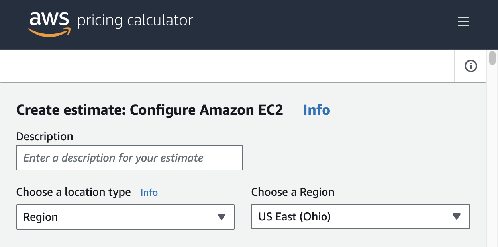

# PR103 — Estimación

!!! note "Qué es esto"
    Guía de apoyo al lab. No sustituye el enunciado ni la rúbrica del [Tema 1](../../01-fundamentos-nube-aws/tema1.md#pr103-estimacion).
    Entrega: [Cómo entregar](../../index.md#entrega) → `PR103.md` (capturas de la calculadora dentro del desarrollo si las usas).

## Antes de empezar

- Herramienta: [AWS Pricing Calculator](https://calculator.aws/) (estimación pública; no hace falta cuenta de pago).
- Guía: [Create and configure an estimate](https://docs.aws.amazon.com/pricing-calculator/latest/userguide/create-configure-estimate.html) y [Amazon EC2 estimates](https://docs.aws.amazon.com/pricing-calculator/latest/userguide/ec2-estimates.html).
- Región europea en los supuestos (la del enunciado o una EU coherente, p. ej. *Europe (Ireland)* / `eu-west-1`).
- **No** lances EC2 reales «para ver el precio»: la Calculator basta.
- Lab Academy **M2** (costes) si está activo: evidéncialo o anota que no estaba disponible.
- En el `.md`, los **supuestos** pesan más que el céntimo exacto.

## Recorrido orientativo

1. **Abre la Calculator.** Entra en [calculator.aws](https://calculator.aws/). Deberías ver la portada con el botón **Create estimate** (crear estimación). No firmes sesión salvo que quieras; la estimación pública vale.

2. **Create estimate.** Pulsa **Create estimate**. Entras en el lienzo de *My Estimate* / estimación vacía, listo para añadir servicios.

3. **Configure Amazon EC2 (escenario 24/7).** Añade **Amazon EC2** (*Add service* / *Configure*). Elige la **región europea** del enunciado. Tipo de instancia **pequeño** (p. ej. familia `t3` / tamaño micro o small según lo que liste la UI). En utilización, modela **730 horas/mes** (24×7≈730). Deberías ver el desglose de coste de cómputo actualizarse al guardar los campos.

4. **Almacenamiento de objetos y salida.** Según el enunciado: **50 GB** de objetos (añade **Amazon S3** o el bloque de almacenamiento que indique la Calculator) y **10 GB** de **data transfer / egress** (salida). Guarda cada servicio (**Save** / *Save and add service*). Comprueba que en la estimación aparecen al menos cómputo + objetos + transferencia.

5. **View summary del escenario A.** Abre el resumen (*View summary* / totales por servicio). Anota en el `.md` región, tipo, 730 h/mes, 50 GB, 10 GB egress y el total estimado. Captura ese resumen (sin datos personales).

6. **Segundo escenario (~40 h/semana).** Vuelve a la configuración de EC2 (edita el servicio o duplica la estimación). Cambia la utilización a **≈160–173 h/mes** (40 h/semana × 4–4,3 semanas) **sin** cambiar a la ligera región ni tipo. Deja objetos y egress comparables. Guarda.

7. **View summary del escenario B.** Captura el nuevo resumen. En el `.md`, pon los dos totales lado a lado.

8. **Lectura de coste.** Escribe qué partida dispara más la factura (cómputo encendido, egress, almacenamiento…) y por qué el 24/7 sube respecto a 40 h/sem. Eso es el criterio de «lectura», no un pantallazo mudo.

9. **Lab M2 (si aplica).** Si Academy M2 está activo, añade evidencia breve o la nota de no disponible.

## Evidencia ↔ rúbrica

| Criterio | Qué dejar en el `.md` |
| --- | --- |
| Escenario 24/7 | Supuestos (región, tipo, 730 h, 50 GB, 10 GB) + desglose/total; captura del *summary* A |
| Escenario 40 h/sem | Mismos supuestos salvo horas; *summary* B comparable |
| Lectura de coste | 3–6 frases: qué partida pesa y por qué cambia al bajar horas |
| Lab M2 / claridad | Evidencia M2 o «no disponible»; `.md` ordenado |

## Capturas

Las figuras de esta página son de apoyo. En tu .md del lab usa capturas propias del mismo paso; sin Account ID, claves ni contraseñas.

<figure markdown="span">
{ width="800" }
<figcaption>Configure Amazon EC2 en Pricing Calculator (ubicación/región). Fuente: AWS Pricing Calculator (AWS).</figcaption>
</figure>

## Errores frecuentes

- Cambiar región o tipo entre A y B sin decirlo.
- Olvidar el **egress**: el precio «de la VM» no es toda la factura.
- Pegar solo el total sin supuestos.
- Confundir Free Tier con «0 € ilimitado».
- Usar un gráfico de Reserved/On-Demand del apunte como evidencia principal.

## Limpieza

La Calculator no deja recursos en tu cuenta. Si abriste el lab M2, termina lo que pida el enunciado y **End Lab**. No lances EC2 fuera del lab «de prueba».
