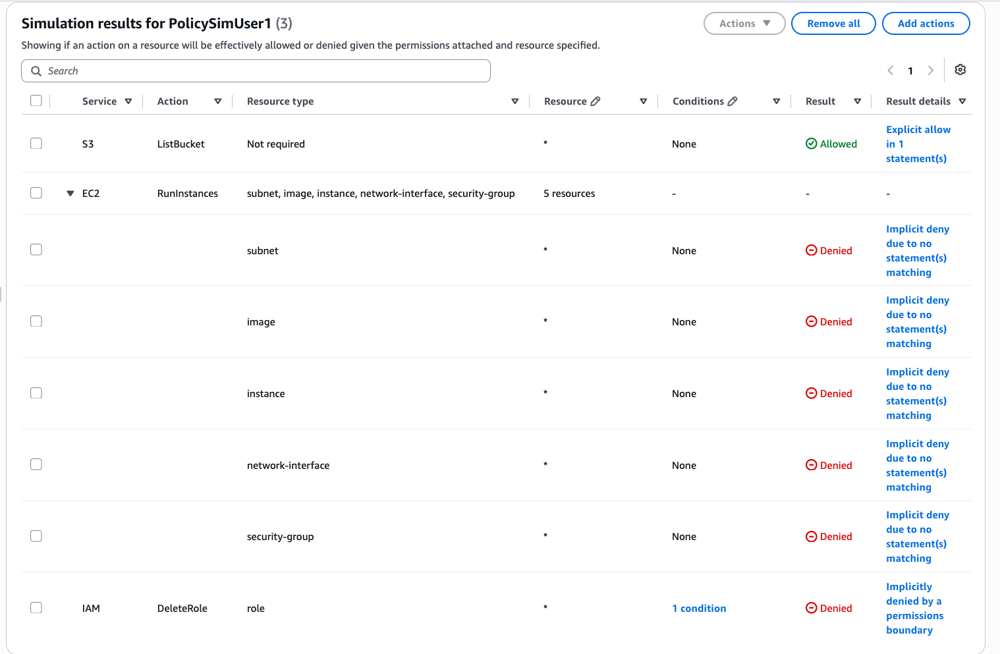

# PR201 — Usuarios y políticas

!!! note "Qué es esto"
    Guía de apoyo al lab. No sustituye el enunciado ni la rúbrica del [Tema 2](../../02-seguridad-iam/tema2.md#pr201-usuarios-y-politicas).
    Entrega: [Cómo entregar](../../index.md#entrega) → `PR201.md` (o ZIP + img/).

## Antes de empezar

- Preferente: lab Academy **M4**. Alternativa: cuenta learner con supervisión, según enunciado.
- Región: la del lab. IAM es global, pero anota en qué región miras el resto de servicios.
- Entra con un usuario/rol de trabajo: **no root**.
- **No** crees usuarios con facturación, `AdministratorAccess` «para que funcione» ni access keys que no vayas a borrar.
- Docs: [Create an IAM user](https://docs.aws.amazon.com/IAM/latest/UserGuide/id_users_create.html) y políticas en consola ([Create IAM policies](https://docs.aws.amazon.com/IAM/latest/UserGuide/access_policies_create-console.html)).
- Este IE pide **usuario/grupo + policy + denegación**, no un rol de servicio.

## Recorrido orientativo

1. **Consola IAM sin root.** Abre **IAM** en la consola. Comprueba (esquina superior / identidad) que no eres **root**. Anótalo en el `.md`.

2. **Users → Create user.** En el menú **Users**, pulsa **Create user**. Introduce un nombre de lab (sin datos personales raros). Sigue el asistente: acceso a consola solo si el lab lo pide; **no** generes access keys salvo que el enunciado lo exija (y entonces bórralas al final).

3. **Grupo opcional.** Si el lab habla de grupo: **User groups** → crea o elige un grupo y añade el usuario. Si el enunciado solo pide usuario + policy, puedes adjuntar la policy al usuario. Anota el nombre exacto.

4. **Attach policies.** En el usuario (o grupo): **Add permissions** → **Attach policies**. Elige la *managed policy* del enunciado (p. ej. `ReadOnlyAccess`) o la policy del lab. Deberías ver la policy listada en **Permissions**.

5. **Acción denegada (AccessDenied).** Con esa identidad (o *Switch role* / login del usuario de lab), intenta una acción **fuera** de lo permitido (p. ej. crear un bucket si solo tienes lectura). Deberías ver un error **AccessDenied** / *not authorized*. Captura el mensaje (sin Account ID completo si molesta; basta con acción + denegación).

6. **MFA si el lab lo permite.** En el usuario: **Security credentials** → **Assign MFA device**. Si el learner no lo permite, escribe una línea en el `.md`. No pegues códigos QR ni secretos TOTP.

7. **Revisión de evidencias.** En el `.md`: identidad de trabajo, nombres de usuario/grupo/policy, captura de denegación, MFA o nota.

8. **Borrado.** Elimina usuario (y access keys), grupo vacío y policies de lab que hayas creado. Lista vacía = evidencia de limpieza.

Si el lab Academy te da un guion distinto (nombres prefijados, policy ya creada), sigue el guion: esta guía nombra los botones de la consola IAM para que sepas **dónde** mirar cuando el enunciado diga «crea un usuario con mínimo privilegio». Un `AccessDenied` bien capturado vale más que tres pantallas del asistente sin denegación.

## Evidencia ↔ rúbrica

| Criterio | Qué dejar en el `.md` |
| --- | --- |
| Lab / usuario | Nombre de usuario/grupo creado; identidad ≠ root |
| Mínimo privilegio | Captura o texto del **AccessDenied** (acción + recurso) |
| MFA / buenas prácticas | MFA activado o «no disponible en el lab»; sin root diario |
| Limpieza | Constancia de borrado (lista vacía / recursos eliminados) |

## Capturas

Las figuras de esta página son de apoyo. En tu .md del lab usa capturas propias del mismo paso; sin Account ID, claves ni contraseñas.

<figure markdown="span">
{ width="800" }
<figcaption>Policy Simulator con resultados Denied. Fuente: IAM User Guide (AWS).</figcaption>
</figure>

## Errores frecuentes

- Trabajar como **root**.
- Pegar **access keys** o capturas con secretos en el `.md` o en el chat.
- Dar `AdministratorAccess` y no retirarlo.
- Entregar el JSON de un rol como si fuera la práctica de usuario.
- Olvidar borrar keys temporales.

## Limpieza

Borra usuario, access keys, grupo y policies de lab. Comprueba **Users** / **Access keys**. **End Lab** al cerrar Academy.
