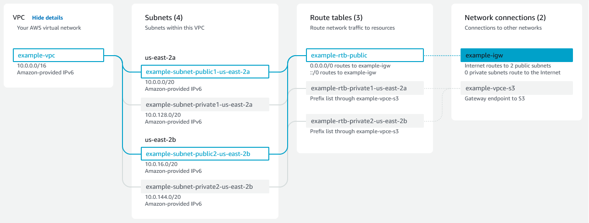

# PR301 — VPC y servidor web

!!! note "Qué es esto"
    Guía de apoyo al lab. No sustituye el enunciado ni la rúbrica del [Tema 3](../../03-redes-entrega-contenido/tema3.md#pr301-vpc-y-servidor-web).
    Entrega: [Cómo entregar](../../index.md#entrega) → `PR301.md` (o ZIP + img/).

## Antes de empezar

- Lab Academy **M5** (VPC y servidor web) o el equivalente del enunciado.
- Región fija del lab; no mezcles recursos entre regiones.
- Docs: [Create a VPC](https://docs.aws.amazon.com/vpc/latest/userguide/create-vpc.html) y [Configure security group rules](https://docs.aws.amazon.com/vpc/latest/userguide/working-with-security-group-rules.html).
- **No** abras SSH/RDP ni motores de BD a `0.0.0.0/0` «para probar».
- El teardown ordenado **puntúa**.

## Recorrido orientativo

1. **Create VPC (CIDR).** En la consola **VPC** → **Your VPCs** → **Create VPC** (o el asistente *VPC and more* del lab). Fija el **IPv4 CIDR** (p. ej. `10.0.0.0/16` si el lab lo marca). Deberías ver la VPC en estado *Available*.

2. **Subnets + AZ (tabla).** Crea al menos una subnet **pública** y una **privada** (o las que pida el lab), cada una en **una** AZ. En el `.md`, tabla: nombre · CIDR · AZ · pública/privada. Recuerda: una subnet no cruza dos AZ.

3. **Internet Gateway.** **Internet gateways** → **Create internet gateway** → **Attach to VPC**. Deberías ver el IGW *Attached*.

4. **Route table pública.** En la route table de la subnet pública: ruta `0.0.0.0/0` → **target** el IGW. La privada **no** debe tener esa ruta al IGW (salvo que el lab diga lo contrario; entonces explícalo). Verifica en **Subnet** → *Route table*.

5. **Security group.** **Security groups** → crea/edita el SG del servidor web: **Inbound rules** con **80/443** hacia quien deba (internet o el balanceador del lab). Administración (**22**/3389) **restringida** si el lab lo permite (tu IP / SG bastion), no `0.0.0.0/0` innecesario. Captura las reglas.

6. **Instancia / servidor web del lab.** Completa el flujo Academy (lanzar instancia en la subnet correcta, asociar SG). Comprueba que respondes HTTP según el enunciado.

7. **Revisión en el `.md`.** CIDR/AZ, coherencia pública vs privada, captura SG, nota de qué simplificaste respecto a un diseño «de producción».

8. **Teardown ordenado.** Instancia → volúmenes/ENI → IGW (detach/delete) → subnets → VPC (o el orden exacto del lab). Deja evidencia de que no quedan restos.

En Foundations el lab a veces simplifica (una sola AZ, SG más permisivo de lo ideal). En el `.md` debes **saber** qué simplificaste: la rúbrica premia CIDR/AZ coherentes, ruta al IGW solo donde toca, y un SG que no abra administración al mundo. Si el asistente *VPC and more* crea varias piezas de golpe, anota igual la tabla de subnets: el nombre del asistente no sustituye los datos.

## Evidencia ↔ rúbrica

| Criterio | Qué dejar en el `.md` |
| --- | --- |
| VPC / subnets | Tabla CIDR + AZ (+ captura VPC/subnets si ayuda) |
| Rutas e IGW | Frase o captura: ruta `0.0.0.0/0` → IGW solo en pública |
| Security group | Captura de **Inbound rules** (80/443 vs admin) |
| Limpieza | Orden de borrado + constancia de recursos eliminados |

## Capturas

Las figuras de esta página son de apoyo. En tu .md del lab usa capturas propias del mismo paso; sin Account ID, claves ni contraseñas.

<figure markdown="span">
{ width="800" }
<figcaption>Resource map del asistente Create VPC (VPC and more). Fuente: Amazon VPC User Guide (AWS).</figcaption>
</figure>

## Errores frecuentes

- Una sola subnet «para HA».
- Ruta al IGW en la subnet privada sin explicarlo.
- `0.0.0.0/0` en 22/3306 «temporal».
- Borrar la VPC antes que la instancia.
- Diagrama bonito sin CIDR/AZ.

## Limpieza

Sigue el orden del lab (típicamente instancia → ENI/volúmenes → IGW → subnets → VPC). Comprueba la región. **End Lab**.
