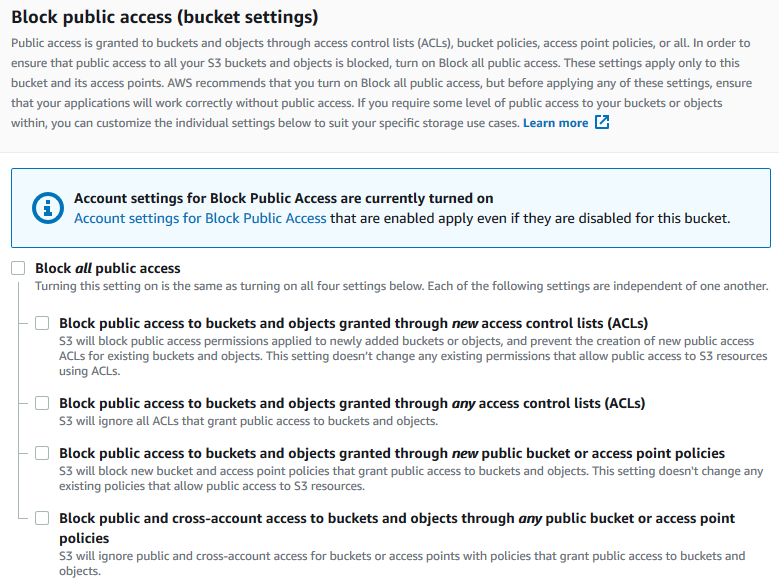

# PR501 — Objetos y bloques

!!! note "Qué es esto"
    Guía de apoyo al lab. No sustituye el enunciado ni la rúbrica del [Tema 5](../../05-almacenamiento/tema5.md#pr501-objetos-y-bloques).
    Entrega: [Cómo entregar](../../index.md#entrega) → `PR501.md` (o ZIP + img/).

## Antes de empezar

- Lab Academy **M7**. Elige **una** vía: **S3** *o* **EBS**. Declártala en la primera línea del desarrollo.
- Región del lab.
- Docs S3: [Block public access](https://docs.aws.amazon.com/AmazonS3/latest/userguide/access-control-block-public-access.html). Docs EBS: [Create an Amazon EBS volume](https://docs.aws.amazon.com/AWSEC2/latest/UserGuide/ebs-creating-volume.html).
- **No** abras el bucket al mundo «para que se vea la foto».
- *Delete* de lo creado = parte de la nota.

## Recorrido orientativo

### Vía A — S3 (objeto)

1. **Declare la vía.** Primera frase: «Vía S3».

2. **Create bucket.** Consola **S3** → **Create bucket**. Nombre único; región del lab. Deja **Block Public Access** activado (los cuatro *Block* / settings on).

3. **Upload.** Sube un fichero de prueba (**Upload**). Deberías ver el objeto en la lista del bucket.

4. **Probar la URL.** Copia la URL del objeto (o *Object URL*) e intenta abrirla en el navegador. Con BPA activo, lo esperable es **403 Access Denied** (o equivalente). Captura el 403 y el panel BPA / *Permissions*.

5. **Concepto.** En el `.md`: S3 = objeto por API/HTTP; no es el disco del SO de la VM. Anota la clase si el lab la pide.

6. **Delete.** Borra objeto → bucket (vacío). Evidencia de limpieza.

### Vía B — EBS (bloque)

1. **Declare la vía.** Primera frase: «Vía EBS».

2. **Create volume.** Consola **EC2** → **Elastic Block Store** → **Volumes** → **Create volume**. Tipo (p. ej. `gp3`), tamaño mínimo, **misma AZ** que la instancia del lab.

3. **Attach.** **Actions** → **Attach volume** a la instancia. Estado *in-use*. Monta en el SO solo si el lab lo pide.

4. **Snapshot (si el enunciado lo pide).** **Actions** → **Create snapshot**. Anota que el snapshot es copia del volumen en un momento, no backup «mágico» de la app.

5. **Concepto.** EBS = bloque para una instancia; no sustituye S3 para ficheros servidos por HTTP a escala.

6. **Delete.** Desasocia/borra volumen; *terminate* instancia de lab si aplica; snapshots solo si el enunciado lo pide.

No hace falta completar las dos vías: una bien documentada supera dos a medias. Si el lab Academy ya te deja un bucket o un volumen a medio crear, retoma desde el paso que falte (BPA/403 o attach/snapshot) y cierra con *delete*. La frase de concepto (objeto vs bloque) es lo que separa un pantallazo vacío de una evidencia de DAW.

## Evidencia ↔ rúbrica

| Criterio | Qué dejar en el `.md` |
| --- | --- |
| Evidencia S3 o EBS | Una vía completa: capturas de BPA+403 **o** volume *in-use*/attach (+ snapshot si aplica) |
| Concepto objeto/bloque | Frase clara (403 / snapshot vs disco de VM) |
| Limpieza | *Delete* documentado |
| Claridad | Leyendas; `.md` ordenado |

## Capturas

Las figuras de esta página son de apoyo. En tu .md del lab usa capturas propias del mismo paso; sin Account ID, claves ni contraseñas.

<figure markdown="span">
{ width="800" }
<figcaption>Block public access (bucket settings), cuatro controles. Fuente: Amazon S3 User Guide (AWS).</figcaption>
</figure>

## Errores frecuentes

- Hacer las dos vías a medias.
- Bucket público «para la demo».
- Confundir S3 con el disco del sistema.
- Olvidar *delete* (objetos, volumen, snapshot de lab).

## Limpieza

S3: objetos → bucket. EBS: detach/delete volume; instancia/snapshots según lab. **End Lab**.
