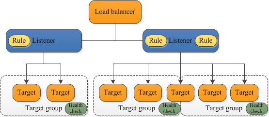
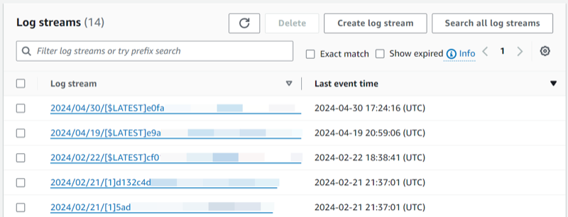

# PR801 — Escalar y observar

!!! note "Qué es esto"
    Guía de apoyo al lab. No sustituye el enunciado ni la rúbrica del [Tema 8](../../08-escalado-monitoreo-cierre/tema8.md#pr801-escalar-y-observar).
    Entrega: [Cómo entregar](../../index.md#entrega) → `PR801.md` (o ZIP + img/).

## Antes de empezar

- Lab Academy del **Módulo 10** en *Cloud Foundations*: **Ejercicio de laboratorio 6 - Escalado y balanceo de la carga de su arquitectura**.
- Región fija del lab (la que indique el enunciado).
- Durante el lab: ASG con **mínimo ≥ 1** (según enunciado) para poder probar.
- Al acabar: **mínimo = 0** (y deseado = 0) o termina las instancias — si no, facturas.
- La alarma debe ser de **EC2 / ALB / grupo de destino** (CPU o *UnHealthyHostCount*), no logs de una función Lambda.
- Docs: [Create an Application Load Balancer](https://docs.aws.amazon.com/elasticloadbalancing/latest/application/create-application-load-balancer.html), [Create an Auto Scaling group](https://docs.aws.amazon.com/autoscaling/ec2/userguide/create-asg.html), [Create a CloudWatch alarm](https://docs.aws.amazon.com/AmazonCloudWatch/latest/monitoring/ConsoleAlarms.html).

## Recorrido orientativo

1. Abre la consola en la **región del lab**. Localiza (o crea, según el enunciado) las instancias o la plantilla de lanzamiento que usarás como destinos. Anota las AZ y las subredes.

2. Crea o completa el **grupo de destino** (*target group*) con el protocolo y el puerto de la comprobación de estado que marque el lab (p. ej. HTTP `/` o `/health`). Registra las instancias si el enunciado lo pide en este paso.

3. Crea el **Application Load Balancer**. Elige subredes en **al menos dos AZ** si el lab lo pide; asocia el *listener* (80/443) al grupo de destino y el grupo de seguridad del balanceador según el enunciado. Deberías ver el ALB en estado activo.

4. En el grupo de destino → destinos: al menos un destino **sano** (*healthy*). Captura ese estado (es el criterio ALB de la rúbrica). Si el enunciado pide probar la página por el DNS del ALB o por cada instancia, hazlo y deja una captura sin Account ID ni claves.

5. Crea o ajusta el **grupo de Auto Scaling**: **mínimo**, **deseado** y **máximo** coherentes (mínimo ≥ 1 mientras pruebas). Vincula la plantilla de lanzamiento y el grupo de destino según el enunciado. Anota los tres valores en el `.md`.

6. Comprueba que el tráfico se **reparte** entre destinos sanos y que el grupo **reacciona** a la carga o a una instancia caída, según indique el enunciado (más instancias, sustitución, etc.). No hace falta forzar un escenario que el lab no pida.

7. Crea una **alarma CloudWatch** (o captura una métrica) de **EC2** (p. ej. `CPUUtilization`) o del **ALB / grupo de destino** (`UnHealthyHostCount` / *HealthyHostCount*). No elijas un *log group* de Lambda como evidencia de esta práctica. Deberías ver la alarma en OK o en alarma según el umbral.

8. En el `.md`, en unas líneas: el ALB reparte a destinos sanos; el ASG mantiene la capacidad; la alarma te avisa. Una captura de alarma o métrica basta junto a la del destino sano.

9. **Limpieza:** baja **mínimo** (y deseado) a **0** o termina las instancias. Captura el ASG o las instancias al final. Borra ALB, grupos de destino, ASG y alarmas según el orden del lab. **End Lab**.

Si la comprobación de estado apunta a una ruta que no existe, el destino quedará no sano y el ASG puede sustituir instancias sin arreglar la app: mira la ruta del check antes de subir el mínimo. CloudWatch y CloudTrail no son intercambiables: aquí quieres **métrica o alarma**, no el historial de llamadas a la API. Al cerrar, un ASG con mínimo = 2 olvidado es la forma más típica de llevarse un susto en la factura del Learner Lab.

## Qué entregar para cada criterio de la rúbrica

| Criterio | Qué dejar en el `.md` |
| --- | --- |
| ALB | Captura del grupo de destino con al menos un destino sano |
| ASG | Mínimo, deseado y máximo anotados durante el lab |
| CloudWatch | Alarma o métrica de EC2, ALB o grupo de destino (no logs Lambda) |
| Limpieza | Mínimo = 0 o instancias terminadas, con captura final |

## Capturas

Las figuras de esta página son de apoyo. En tu `.md` del lab usa capturas propias del mismo paso; sin Account ID, claves ni contraseñas.

<figure markdown="span">
{ width="800" }
<figcaption>Piezas del ALB. Fuente: Elastic Load Balancing Application Guide (AWS).</figcaption>
</figure>

<figure markdown="span">
{ width="800" }
<figcaption>CloudWatch Logs (referencia de consola). En PR801 la evidencia pedida es alarma o métrica de EC2/ALB/TG, no un volcado de Lambda. Fuente: AWS Lambda Developer Guide (AWS).</figcaption>
</figure>

## Errores frecuentes

- Comprobación de estado inútil (todo sano con la app caída o ruta inexistente).
- ASG con mínimo = 2 y olvidar bajarlo al cerrar.
- Mirar la CPU en **CloudTrail** en lugar de CloudWatch.
- Pegar logs de Lambda como «observabilidad» de esta práctica.
- Diagrama sin captura de destino sano ni de alarma o métrica.
- Dejar el ALB y el ASG creados tras **End Lab** (revisa la región del lab).

## Limpieza

ASG **mínimo = 0** (y deseado = 0) o termina las instancias; borra ALB, grupo de destino y alarmas según el lab. Comprueba que no queda capacidad ociosa. **End Lab**.
