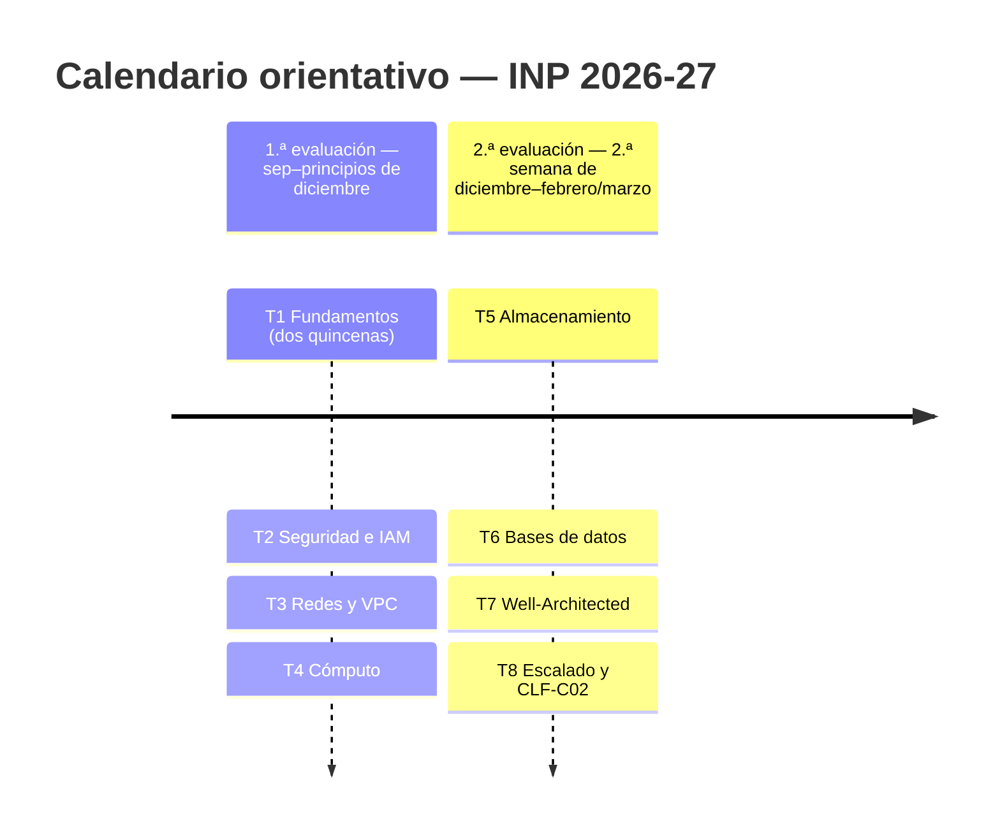
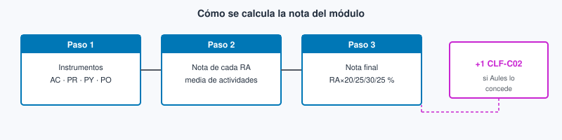
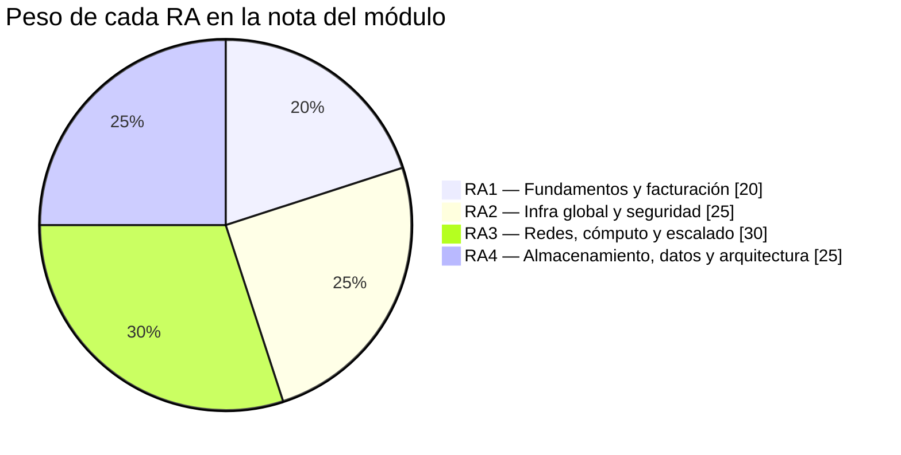

# Introducción a la Nube Pública

Apuntes y organización del módulo optativo **Introducción a la nube pública** del CFGS de *Desarrollo de Aplicaciones Web* (DAW), modalidad **semipresencial**, en el marco de la [Ley Orgánica 3/2022](https://www.boe.es/diario_boe/txt.php?id=BOE-A-2022-5139) y el [Real Decreto 659/2023](https://www.boe.es/diario_boe/txt.php?id=BOE-A-2023-16889), impartido en el [IES Macià Abela](https://portal.edu.gva.es/iesmaciaabela/) de Crevillent.

**Curso 2026-2027.** Empieza por **[Acceso](00-acceso/acceso.md)**: solo sirve para entrar en Academy, el laboratorio y Skill Builder. El **[Tema 1](01-fundamentos-nube-aws/tema1.md)** ya es contenido del módulo (mapa de Cloud Foundations). En la navegación tienes el resto de temas; la preparación del examen **Cloud Practitioner (CLF-C02)** está en **[Certificación](99-certificacion/certificacion.md)**. El hilo del curso es **AWS Academy Cloud Foundations**, con ampliación hacia ese mismo examen.

## Resultados de aprendizaje

| Código | Descripción | Peso (%) |
| ------ | ----------- | -------- |
| RA1 | Comprende los fundamentos de la computación en la nube, sus ventajas frente a sistemas tradicionales, el marco de adopción, los principios de migración y los aspectos clave de facturación, como estimación y optimización de costos. | **20** |
| RA2 | Identifica los componentes clave de la infraestructura global de la nube, diferenciando servicios principales, regiones, zonas de disponibilidad y aplicando medidas básicas de seguridad como el modelo de responsabilidad compartida, gestión de accesos y protección de datos. | **25** |
| RA3 | Diseña y configura redes virtuales y servicios de cómputo en la nube, aplicando buenas prácticas de seguridad, estrategias de balanceo de carga, escalado automático y aprovechando tecnologías serverless, contenedores y máquinas virtuales según casos de uso específicos. | **30** |
| RA4 | Gestiona servicios de almacenamiento y bases de datos en la nube, seleccionando tecnologías adecuadas para casos específicos, y diseña arquitecturas escalables y resilientes utilizando herramientas de monitoreo y optimización para mejorar el rendimiento. | **25** |

!!! note "Pesos en la nota"
    Los cuatro resultados de aprendizaje (RA) suman **100 %**: **20 / 25 / 30 / 25**. Cada RA aporta ese porcentaje a la nota final del módulo (ver [Evaluación](#evaluacion)).

## Carga horaria

!!! note "Horas del módulo"
    | Concepto | Horas |
    | --- | ---: |
    | **Total módulo** (carga curricular) | **96 h** |
    | Optativa en el currículo | ≈ **3 h/sem** |

    En el grupo **semipresencial INP** la sesión de centro es una **tutoría colectiva quincenal** (~1 h): se presenta el tema, se indican los recursos de estudio y se resuelven las dudas del bloque anterior. El **grueso del trabajo es autónomo** (apuntes, vídeos, labs de Academy). No hay 3 h lectivas presenciales cada semana.

    El módulo se imparte **antes** de la formación en empresa (FE) del ciclo. La fecha de la FE **se comunicará cuando esté fijada**. Mientras tanto, organizamos el curso de **septiembre a finales de febrero / principios de marzo**.

## Temas del curso

Antes de la teoría, pasa por **[Acceso](00-acceso/acceso.md)**: solo sirve para entrar en Academy, el laboratorio y Skill Builder. El **[Tema 1](01-fundamentos-nube-aws/tema1.md)** ya es contenido del módulo: el mapa de **Cloud Foundations** (conceptos, modelos, coste e infraestructura). Son páginas distintas; no sustituyen la una a la otra. La preparación del examen **Cloud Practitioner (CLF-C02)** está en **[Certificación](99-certificacion/certificacion.md)**.

En este sitio puedes **estudiar todos los temas** a tu ritmo. Eso no abre entregas: plazos y tareas los fijan el **calendario de evaluaciones** y **Aules**. Leer con libertad no significa entregar cuando quieras.

| Tema | Título | Qué trabajamos | Estudio | Evaluación | RA principales |
| ---: | --- | --- | --- | --- | --- |
| — | [Acceso](00-acceso/acceso.md) | Entrar a Academy, Learner Lab y Skill Builder | Disponible para estudio | — | — |
| **1** | [Fundamentos de la nube AWS](01-fundamentos-nube-aws/tema1.md) | Mapa y definiciones (módulos introductorios de Cloud Foundations), modelos, adopción, facturación, infra global y consola | Disponible para estudio | 1.ª eval. / Aules | RA1, RA2 |
| **2** | [Seguridad, IAM y responsabilidad compartida](02-seguridad-iam/tema2.md) | Shared responsibility, IAM, MFA y protección de datos | Disponible para estudio | 1.ª eval. / Aules | RA2 |
| **3** | [Redes, VPC y entrega de contenido](03-redes-entrega-contenido/tema3.md) | VPC, subredes, SG/NACL, CloudFront y Route 53 | Disponible para estudio | 1.ª eval. / Aules | RA3 |
| **4** | [Cómputo: EC2, Lambda y contenedores](04-computo-serverless/tema4.md) | Máquinas virtuales, serverless y contenedores | Disponible para estudio | 1.ª eval. / Aules | RA3 |
| **5** | [Almacenamiento](05-almacenamiento/tema5.md) | S3, EBS, EFS y clases de almacenamiento | Disponible para estudio | 2.ª eval. / Aules | RA4 |
| **6** | [Bases de datos](06-bases-de-datos/tema6.md) | RDS, Aurora, DynamoDB y elección de motor | Disponible para estudio | 2.ª eval. / Aules | RA4 |
| **7** | [Arquitectura Well-Architected](07-arquitectura-well-architected/tema7.md) | Pilares, resiliencia y desacoplo | Disponible para estudio | 2.ª eval. / Aules | RA4 |
| **8** | [Escalado, monitorización y cierre CLF-C02](08-escalado-monitoreo-cierre/tema8.md) | ELB, Auto Scaling, CloudWatch; cierre del módulo | Disponible para estudio | 2.ª eval. / Aules | RA3, RA4 |
| — | [Certificación](99-certificacion/certificacion.md) | Hub CLF-C02 (serie, apuntes, tests, Skill Builder) | Disponible para estudio | +1 según Evaluación / Aules | — |
| — | [Soluciones](90-soluciones/soluciones.md) | Cuestionario inicial y Autocheck por tema | Disponible para estudio | — | — |

El **Tema 1** concentra los módulos introductorios de *AWS Academy Cloud Foundations*. **Acceso** es solo el *cómo entrar*. Los temas **2–8** siguen un bloque Foundations cada uno; el ritmo de **tutoría y entregas** lo marcan Aules y el calendario de abajo.

### Mapa tema × RA

| Temas | RA1 | RA2 | RA3 | RA4 |
| --- | :---: | :---: | :---: | :---: |
| 1. Fundamentos de la nube AWS | X | X | | |
| 2. Seguridad, IAM y responsabilidad compartida | | X | | |
| 3. Redes, VPC y entrega de contenido | | | X | |
| 4. Cómputo: EC2, Lambda y contenedores | | | X | |
| 5. Almacenamiento | | | | X |
| 6. Bases de datos | | | | X |
| 7. Arquitectura Well-Architected | | | | X |
| 8. Escalado, monitorización y cierre CLF-C02 | | | X | X |
| **Peso** | 20 % | 25 % | 30 % | 25 % |



La **1.ª evaluación** (septiembre → principios de diciembre) cubre los Temas **1–4**. La **2.ª evaluación** (desde la 2.ª semana de diciembre → finales de febrero / principios de marzo) cubre los Temas **5–8**. El Tema 1 ocupa las dos primeras quincenas; no hay 3.ª evaluación: el módulo acaba antes de la FE.

!!! tip "Núcleo del curso"
    Cada tema tiene un **bloque Foundations** (lo que evalúa el módulo) y un apartado de **ampliación Practitioner (CLF-C02)**. El hilo es *AWS Academy Cloud Foundations*, no el curso *AWS Academy Cloud Architecting*. En semipresencial, la tutoría quincenal presenta el bloque y resuelve dudas; el estudio y los labs son trabajo autónomo. Certificar Cloud Practitioner puede sumar +1 a la nota final según las condiciones que se publiquen en Aules (ver [Evaluación](#evaluacion)).

## Evaluación

La evaluación se organiza por **resultados de aprendizaje (RA)**. Cada actividad indica qué RA trabaja. **Los RA no se compensan entre sí:** hay que superar cada uno.

**Examen CLF frente a este módulo.** En el examen **CLF-C02** la nota es global: un dominio más flojo puede compensarse con otros (reglas AWS del examen). **Aquí** no: un RA suspendido no se salva con otro. El **+1** por certificación (si se concede según Aules) **suma** a la nota del módulo, pero **no aprueba un RA suspendido**. Preparación y detalle: [Certificación](99-certificacion/certificacion.md).

### Cómo se calcula la nota

Tres pasos, en este orden:

1. En cada RA, tu nota es la **media ponderada** de las actividades de ese RA (AC, PR, PY, PO).
2. La **nota final** del módulo es la suma de (nota de cada RA × su peso: 20 %, 25 %, 30 %, 25 %).
3. Certificar **AWS Certified Cloud Practitioner (CLF-C02)** puede sumar +1 a la nota final según las condiciones que se publiquen en Aules. Ese +1 **suma**, pero **no sustituye** ni aprueba ningún RA.

<figure markdown="span">
{ width="800" }
<figcaption>Instrumentos → nota de cada RA → nota final del módulo; el +1 de Cloud Practitioner solo se suma si se concede en Aules.</figcaption>
</figure>

**Ejemplo (simplificado):** si en RA3 tienes prácticas de VPC/EC2 y un examen, se promedian (según lo que se indique en Aules) y ese resultado cuenta un **30 %** de la nota del módulo. Suspender un RA no se compensa con otro.

### Peso de cada RA



### Instrumentos de evaluación (IE)

| Instrumento | Icono | Descripción | Escala |
| --- | --- | --- | --- |
| Actividad de clase | :simple-readdotcv: **AC** | Microevidencia de aula / Academy | **0–1** |
| Práctica | :simple-neutralinojs: **PR** | Lab Academy o consola | **0–10** |
| Proyecto | :material-calendar: **PY** | Entregable mayor con rúbrica | **0–30** |
| Prueba objetiva | :material-pen: **PO** | Examen escrito o en ordenador | **0–100** |
| Cloud Practitioner | **+1** | Certificación CLF-C02 | +1 en la nota final según las condiciones que se publiquen en Aules |

### Entrega de prácticas { #entrega }

!!! note "Entrega de prácticas"

    **Cómo entregar.** Las prácticas y actividades evaluables se entregan en **Aules**, en el plazo del enunciado. Entrega un **`.md`** con los metadatos de la plantilla, el H1, el enunciado y el desarrollo. Las capturas van **dentro del desarrollo**, con ruta relativa `img/...`. Si hay imágenes, sube un **ZIP** (`PR201.md` + carpeta `img/`); si no, basta el `.md`. No uses PDF salvo que Aules lo pida. En cada tema verás el código de la práctica (por ejemplo PR201) y el nombre del fichero; la norma general está aquí para no repetirla en todos los temas. Las calificaciones se publican en Aules. La plantilla está en esta página y **la misma la tendrás adjunta en Aules**.

    #### Plantilla Markdown

    ```markdown
    ---
    title: "PR201 — Título de la práctica"
    author: "Nombre Apellidos"
    email: "usuario@edu.gva.es"
    curso: "2026-27"
    modulo: "Introducción a la nube pública"
    codigo: "PR201"
    fecha: "YYYY-MM-DD"
    ---

    # PR201 — Título de la práctica

    ## Enunciado
    …

    ## Desarrollo
    … texto …
    
    ```

    Si hay capturas, la estructura del ZIP es:

    ```text
    PR201/
      PR201.md
      img/
        ejemplo.png
    ```

    #### Markdown y VS Code

    - Guía de Markdown: [tutorialmarkdown.com/guia](https://tutorialmarkdown.com/guia)
    - Documentación de Visual Studio Code: [code.visualstudio.com/docs](https://code.visualstudio.com/docs)

**Resumen:**

- **Estudio libre ≠ entregas libres:** puedes leer todos los temas; las tareas y plazos los marca Aules y el calendario de evaluaciones.
- Cada actividad indica el **RA** que evalúa y su escala. Codificación: prefijo del IE + número de tema (ej. `AC102` = actividad 02 del Tema 1; `PR201` = práctica 01 del Tema 2).
- **AWS Academy Cloud Foundations:** trabajarás en la *class* del curso. Los labs puntúan como **PR** del tema correspondiente.
- **+1 Practitioner:** certificar **CLF-C02** puede sumar +1 a la nota final según Aules. Suma a la calificación del módulo; **no** aprueba un RA suspendido. Material: [Certificación](99-certificacion/certificacion.md).

## Materiales

- Este sitio web de apuntes (guía del módulo).
- **AWS Academy Cloud Foundations** (acceso learner según se indique en clase / Aules).
- Consola AWS de las cuentas de laboratorio.
- Ampliación: [AWS Skill Builder](https://skillbuilder.aws/) — *Cloud Practitioner Essentials*.
- Guía oficial del examen: [AWS Certified Cloud Practitioner (CLF-C02)](https://aws.amazon.com/certification/certified-cloud-practitioner/).
- Videotutoriales en cada tema (Profe Santos Cloud y otros).
- **[Certificación](99-certificacion/certificacion.md)** — hub CLF-C02 (notas por tema, **autochecks estilo examen**, serie Santos, tests, Skill Builder). Los quizzes de clase van en cada tema. El +1 se detalla en [Evaluación](#evaluacion) / Aules.
- Editor de entregas: Visual Studio Code + Markdown.

## Referencias

Fuentes utilizadas en la elaboración de estos apuntes:

- Salvador Serrano — apuntes Cloud (IES Severo Ochoa): <https://salvasevero.github.io/cloud/>
- [Profe Santos Cloud](https://www.youtube.com/@ProfeSantosCloud) (YouTube)
- Documentación y guías oficiales [AWS](https://docs.aws.amazon.com/) (incluye Architecture Icons / diagramas de servicio)
- [AWS Skill Builder](https://skillbuilder.aws/) y guía del examen [CLF-C02](https://aws.amazon.com/certification/certified-cloud-practitioner/)

## Contenidos del sitio

| Página | Contenido |
| --- | --- |
| [Inicio](index.md) | Evaluación y calendario |
| [Acceso](00-acceso/acceso.md) | Entrar a Academy, lab y Skill Builder |
| [Temas 1–8](#temas-del-curso) | Apuntes Foundations + puente Practitioner |
| [Certificación](99-certificacion/certificacion.md) | Hub CLF-C02 (notas + autocheck examen) |
| [Soluciones](90-soluciones/soluciones.md) | Cuestionario inicial + Autocheck por tema |

*[CFGS]: Ciclo Formativo de Grado Superior
*[DAW]: Desarrollo de Aplicaciones Web
*[INP]: Introducción a la Nube Pública
*[RA]: Resultado de aprendizaje
*[IE]: Instrumento de evaluación
*[FE]: Formación en empresa
*[CLF-C02]: AWS Certified Cloud Practitioner (versión C02)
